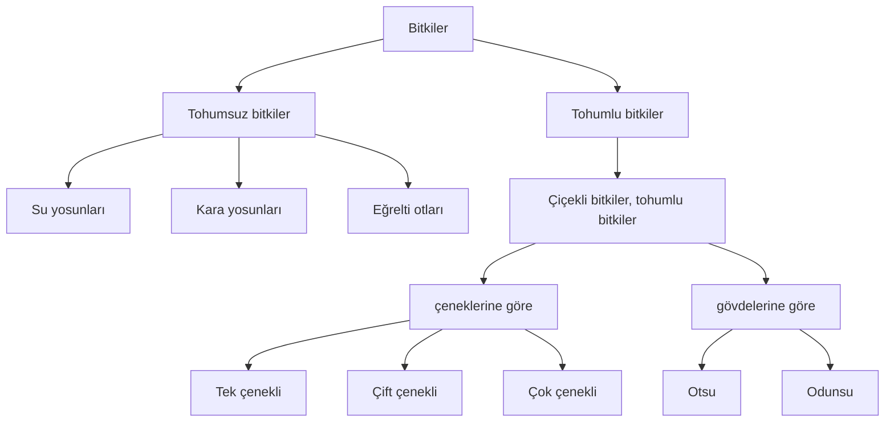

# Bitki Biyolojisi

```mermaid
flowchart TD
    t[Bitkiler]
    t --> t-1[Tohumsuz bitkiler]
    t --> t-2[Tohumlu bitkiler]
    t-1 --> a[Su yosunları]
    t-1 --> b[Kara yosunları]
    t-1 --> c[Eğrelti otları]
    t-2 --> d[Çiçekli bitkiler, tohumlu bitkiler]
    d --> d-1[çeneklerine göre]
    d-1 --> d-1-1[Tek çenekli]
    d-1 --> d-1-2[Çift çenekli]
    d-1 --> d-1-3[Çok çenekli]
    d --> d-2[gövdelerine göre]
    d-2 --> d-2-1[Otsu]
    d-2 --> d-2-2[Odunsu]
```
