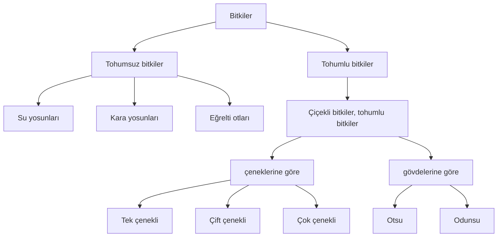
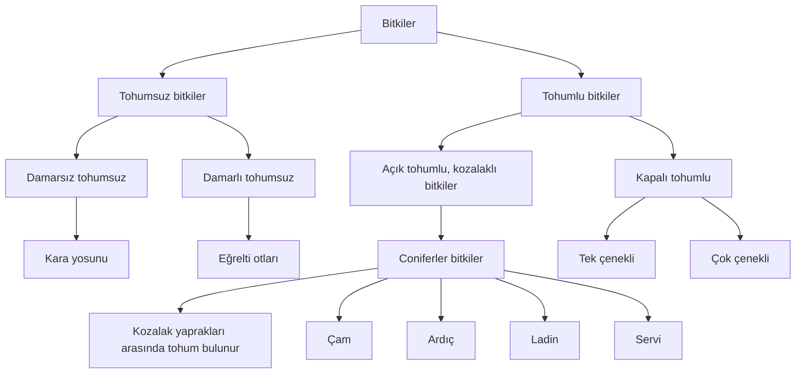
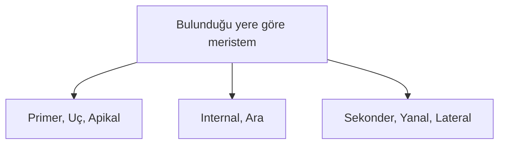
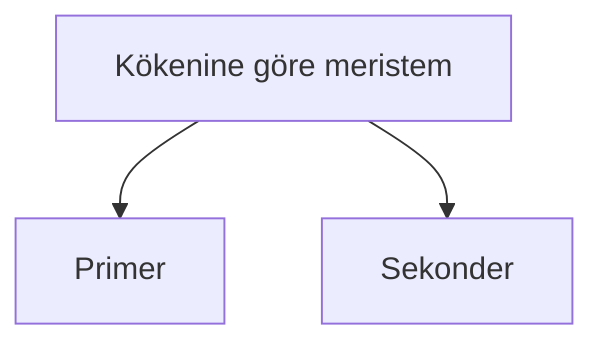
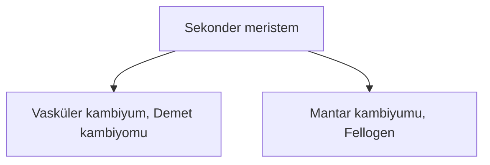
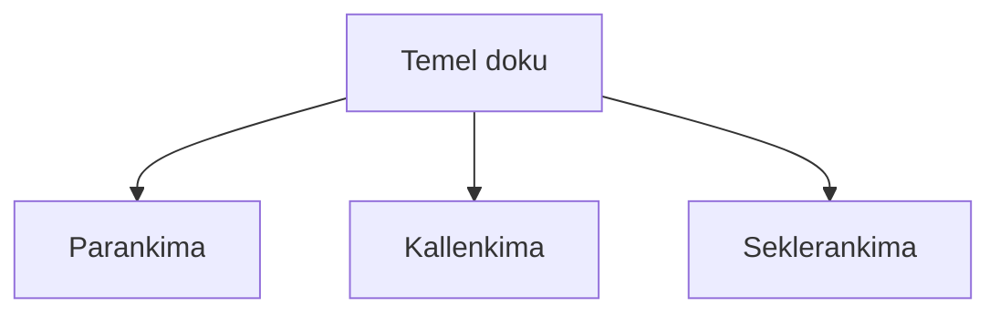
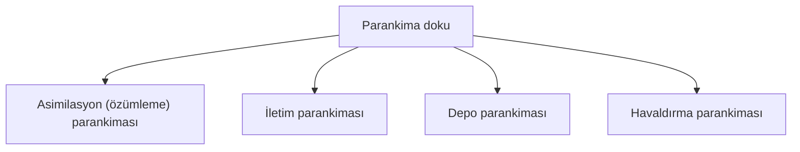
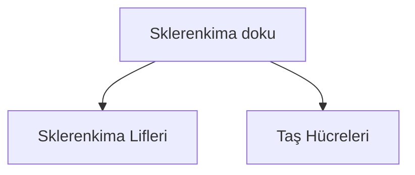

# Bitki Biyolojisi






 

## Çiçekli Bitkilerin Dokuları
### Meristem Doku
- Hücreleri bölünür.
- Bitkilerin ömrü sınırsızdır. Bitki ömrü boyunca bölünür.
- Bölünen meristem doku hücrelerinin bazıları farklılaşır ve bitkinin diğer yani *değişmez dokularını* oluşturur.
- Bazı hücreler G₁den çıkıp G₀a girer ve bir daha bölünmez. Bazı hücreler ihtiyaç olduğunda geniden G₁e döner ve bölünür.
- Bazı meristematik hücreler bazı bitki hormonlarını sentezler ve salgılar.
```
     ┌─ oksin
     │  giberellin
     │  sitokinin
     └─ filorigen
     ┌─ absisik asit
     └─ etilen
```
- Bitki yapılarında boyca büyüme ve ence kalınlaşma sağlar.
- Kök, gövde ve yaprak yapılarında bulunur.
- Meristem hücrelerinin özellikleri:
  - Hücreleri küçük ve çeperleri incedir.
  - Oransal olarak stoplazma büyüktür.
  - Kofullar küçük, sayıca azdır.
  - Çekirdek oransal olarak büyüktür.
  - Hücreler arası boşlukları yok denecek kadar azdır.
  - Metabolizmaları hızlıdır.





#### Primer Meristem
1. Bitkinin ömrü boyunca bölünme özelliğini kaybetmeyen hücrelerin meydana getirdiği dokudur.
2. Kök ve gövde uçlarında, ayrıca dal uçlarında bulunur.
3. Bulunduğu yerde boyca uzamayı sağlar. 
4. Primer meristemin kök ve göve uçalarında bulunduğu yere büyüme noktası ya da *büyüme konisi* denir.
5. Büyüme noktaları kökte kaliptrayla, gövdede koruyucu yaparaklarla korunur.
6. **Kaliptra hücreleri canlıdır. Bölünebilme özellikleri yoktur. Toprakta ilerlerken zedelendiğinde primer meristem hücreleri tarafından yenilenir.** 
7. Kaliptra, müsilaj adı verilen özel bir salgı üretir. Kökün toprak içinde rahat ilerlemesini sağlar.
8. Büyüme noktalarından alınan boyuna ya da enine kesitlerde dıştan içe doğru üç tabaka oluşur. *Histojen* adı verilen bu üç tabakalı doku bitkinin farklılaşarak diğer dokularını oluşturur.

#### Sekonder Meristem

1. Kök ve gövdede bulunur, yapraklarda bulunmaz. 
2. Kabiyum, bitkide enine büyümeyi sağlar.
3. Bitkilerde primer meristem farklılaşarak bitkinin diğer dokularını oluşturur. Bu sırada meydana gelen farklılaşma hücreleri G₀ evresine sokar. Böylece, oluşan parankimatik hücrelerin bazıları hormonların etkisiyle yeniden bölünme özelliği kazanarak sekonder meristem dekuyu oluşturur.
4. **Sekonder meristem çift çenekli bitkilerde ve açık tohumlularda bulunurken tek çenekli bitkilerde yoktur.**
5. **Sekonder meristem kök ve gövdede bulunur ancak yapraklarda yoktur.**
6. Her yıl, biri ilk bahar diğeri son baharda iki defa mitoz geçirir ve yaş halkalarını oluşturur. Her yıl yeni iletim demetlerinin oluşumunu sağlar.
7. **Mantar kambiyumu peridermis adı verilen mantar dokuyu oluşturur. Mantar doku, dıştan bitki yapılarını korur.**

 

### Temel Doku

- Hayvanlardaki bağ dokunun karşılığıdır.
- Üçe ayrılır:

#### Parankima Doku

1. Bitkinin her organında bulunur.
2. Bitkinin çevre koşullarına uyumunu sağlamak için değişime uğrayabilir.
3. Sonradan bölünme özelliği kazanarak sekonder meristemi oluşturabilir.
4. Hücreleri canlı, bol stoplazmalı ve ince çeperlidir.
5. Kofulları küçük, sayıca azdır.
6. Hücreleri arasında az ya da çok hücreler arası boşluklar bulundurur. Bu boşluklar, hücreler arası sıvı ya da gaz maddeler bulundurabilir.
7. Hücrelerinde kloroplast bulundurabilir.
8. Hücrelerinde kromoplast bulundurabilir.
9. Tüm parankima hücrelerinde lökoplast bulunur.
10. Parankimatik hücreler; ortamla bol madde alışverişi yapan, bulunduğu yere göre metabolizmaları değişen hücreler. 

##### Özümleme Parankiması
1. Yeşil bitkilerin yaparklarında, genç gövdede, genç dallarda, ham meyve kabuklarında bulunur.
2. Hücrelerinde bol kloroplast bulunur.
3. Görevi fotosentezdir.
4. **Palizat ve sünger parankimaları alt ve üst epidermis arasında bulunan mezofil dokuda yer alır.**
5. **Otsu gövdelerde genç, dal yüzeylerinde, yeşil rekli görünen ve kloroplastlı olan hücreler fotosentez yapar. Ayrıca ham meyveler de fotosentez yapar. Bunun yanında odunsu gövde ve kök hücrelerinde, yaşlı dal yüzeylerinde fotosentez yapılmaz.**
6. Epidermis hücrelerinin bir salgısı olan kütin ve mum bileşimli kimyasal epidermis hücrelerince sentezlenir ve salgılanır. Buharlaşma yoluyla su kaybını önler.

##### İletim Parankiması
1. İletim demetlerinin etrafını sarar.
2. İletim demetleriyle özümleme parankiması arasında madde taşınmasında madde taşınmasında görev alır.
3. Kloroplastsız hücrelerden oluşur.
4. Özümleme parankiması ⇄ iletim sistemi\
çift yönü su - mineral - organik madde taşır

##### Havalandırma Parankiması
1. Genellikle suda ve bataklıkta yaşayan bitkilerin kök ve gövdelerinde bulunur.
2. Çok sayıda hücreler arası boşluğa sahiptir.
3. Boşluklarında hava depo eder ve bitkinin gaz alışverişinde görev yapar.
4. **Yapraklardaki sünger parankiması boşlukları bu tür görev yapar.**

##### Depo Parankiması
1. Bitkinin türüne bağlı olarak kök, gövde, yaprak ve tohumda bulunur.
2. Hücreleri kloroplastsızdır.
3. Su ve besin depo eder.
4. patateste nişasta ⇒ amiloplast en çok\
fındık, ayçiçeği, mısırda yağ ⇒ oleoplast en çok\
baklagiller protein ⇒ proteoplast en çok\
sukkulent (kurak ortam) bitkilerinde su depe edilir

#### Destek Doku
##### Kollenkima Doku (Pek Doku)
1. Genç gövdede yaprak orta damarında, çiçek ve yaprak saplarında bulunur.
2. Eğilme, bükülme ve çarpmaya karşı mekanik destek sağlar.
3. Hücre çeperlerinde selüloz ve pektin birikimiyle kalınlaşma, destek olayını sağlar.
4. Şeftali, portakal, mandalina ve limonda varken vişne ve kirazda yoktur.
5. Canlı ve kloroplastsız hücrelerden oluşur.

 

##### Seklerankima Doku

1. Hücreleri ölüdür.
2. Hücre çeperleri, selüloz ve lignin birikimiyle kalınlaşmıştır.
3. **Tek çenekli yıllık otsu gövdeli bitkilerde destek ksilemdeki turgor basıncıyla sağlanır.**
4. Sklerenkima Lifleri: keten, kenevir bitkisinde.
5. Taş Hücreleri: Küresel ya da levha hâldedir. Elma, armut ve ayvanın meyvesine direnç kazandırır. Tohum kabuğunda bulunur.


### İletim Doku
- Üçe ayrılır:
  - Ksilem (odun) borusu
  - Floem (soymuk) borusu

### Örtü Doku
- İkiye ayrılır:
  - Epidermis doku (otsu bitkilerde yok)
  - Peridermis (mantar) doku 
