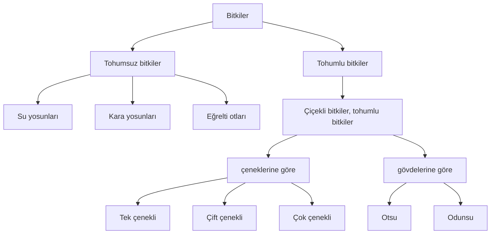
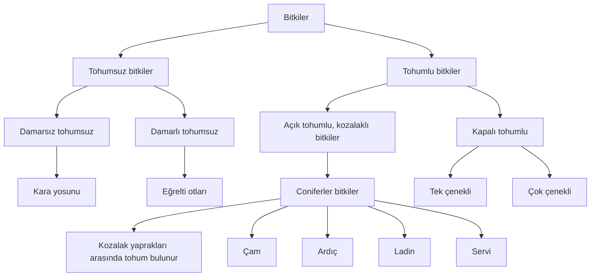
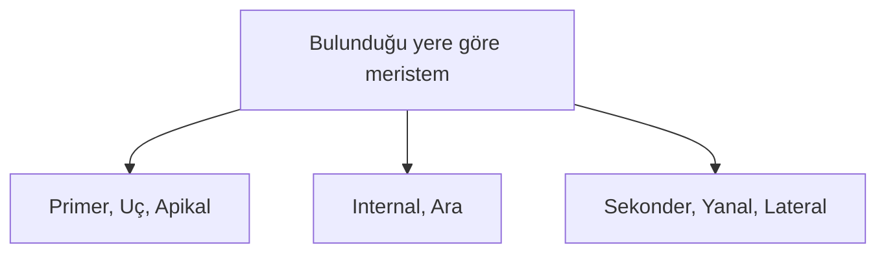
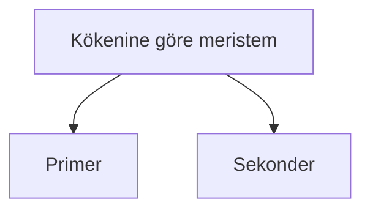
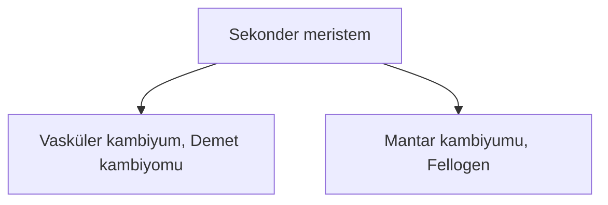

# Bitki Biyolojisi






## Çiçekli Bitkiler
 

### Çiçekli Bitkilerin Dokuları
#### Meristem Doku
- Hücreleri bölünür.
- Bitkilerin ömrü sınırsızdır. Bitki ömrü boyunca bölünür.
- Bölünen meristem doku hücrelerinin bazıları farklılaşır ve bitkinin diğer yani *değişmez dokularını* oluşturur.
- Bazı hücreler G₁den çıkıp G₀a girer ve bir daha bölünmez. Bazı hücreler ihtiyaç olduğunda geniden G₁e döner ve bölünür.
- Bazı meristematik hücreler bazı bitki hormonlarını sentezler ve salgılar.
```
     ┌─ oksin
     │  giberellin
     │  sitokinin
     └─ filorigen
     ┌─ absisik asit
     └─ etilen
```
- Bitki yapılarında boyca büyüme ve ence kalınlaşma sağlar.
- Kök, gövde ve yaprak yapılarında bulunur.
- Meristem hücrelerinin özellikleri:
  - Hücreleri küçük ve çeperleri incedir.
  - Oransal olarak stoplazma büyüktür.
  - Kofullar küçük, sayıca azdır.
  - Çekirdek oransal olarak büyüktür.
  - Hücreler arası boşlukları yok denecek kadar azdır.
  - Metabolizmaları hızlıdır.





##### Primer Meristem
1. Bitkinin ömrü boyunca bölünme özelliğini kaybetmeyen hücrelerin meydana getirdiği dokudur.
2. Kök ve gövde uçlarında, ayrıca dal uçlarında bulunur.
3. Bulunduğu yerde boyca uzamayı sağlar. 
4. Primer meristemin kök ve göve uçalarında bulunduğu yere büyüme noktası ya da *büyüme konisi* denir.
5. Büyüme noktaları kökte kaliptrayla, gövdede koruyucu yaparaklarla korunur.
6. **Kaliptra hücreleri canlıdır. Bölünebilme özellikleri yoktur. Toprakta ilerlerken zedelendiğinde primer meristem hücreleri tarafından yenilenir.** 
7. Kaliptra, müsilaj adı verilen özel bir salgı üretir. Kökün toprak içinde rahat ilerlemesini sağlar.
8. Büyüme noktalarından alınan boyuna ya da enine kesitlerde dıştan içe doğru üç tabaka oluşur. *Histojen* adı verilen bu üç tabakalı doku bitkinin farklılaşarak diğer dokularını oluşturur.

##### Sekonder Meristem

1. Kök ve gövdede bulunur, yapraklarda bulunmaz. 
2. Kabiyum, bitkide enine büyümeyi sağlar.
3. Bitkilerde primer meristem farklılaşarak bitkinin diğer dokularını oluşturur. Bu sırada meydana gelen farklılaşma hücreleri G₀ evresine sokar. Böylece, oluşan parankimatik hücrelerin bazıları hormonların etkisiyle 

 

#### Temel Doku
- Hayvanlardaki bağ dokunun karşılığıdır.
- Üçe ayrılır:
  - Parankima doku
    - Asimilasyon (özümleme) parankiması
    - İletim parankiması
    - Depo parankiması
    - Havaldırma parankiması
  - Kollenkima doku (canlı)
  - Seklerankima doku (ölü)

#### İletim Doku
- Üçe ayrılır:
  - Ksilem (odun) borusu
  - Floem (soymuk) borusu

#### Örtü Doku
- İkiye ayrılır:
  - Epidermis doku (otsu bitkilerde yok)
  - Peridermis (mantar) doku 
