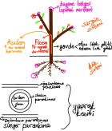

# Bitki Biyolojisi

## Çiçekli Bitkiler
 

### Çiçekli Bitkilerin Dokuları
#### Meristem Doku
- Hücreleri bölünür.
- Bitkilerin ömrü sınırsızdır. Bitki ömrü boyunca bölünür.
- Yapısına (oluşumuna) göre
  - Primer meristem (otsu bitkilerde yok)
  - Sekonder meristem
- Bulunuduğu yere göre
  - Apikal (uç) meristem
  - Lateral (yanal) meristem

#### Temel Doku
- Hayvanlardaki bağ dokunun karşılığıdır.
- Üçe ayrılır:
  - Parankima doku
    - Asimilasyon (özümleme) parankiması
    - İletim parankiması
    - Depo parankiması
    - Havaldırma parankiması
  - Kollenkima doku (canlı)
  - Seklerankima doku (ölü)

#### İletim Doku
- Üçe ayrılır:
  - Ksilem (odun) borusu
  - Floem (soymuk) borusu

#### Örtü Doku
- İkiye ayrılır:
  - Epidermis doku (otsu bitkilerde yok)
  - Peridermis (mantar) doku 
