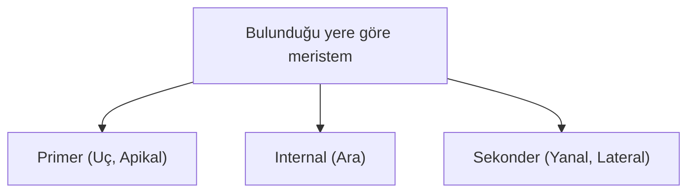
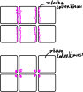
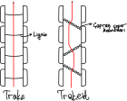
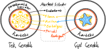
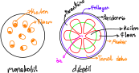
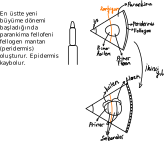
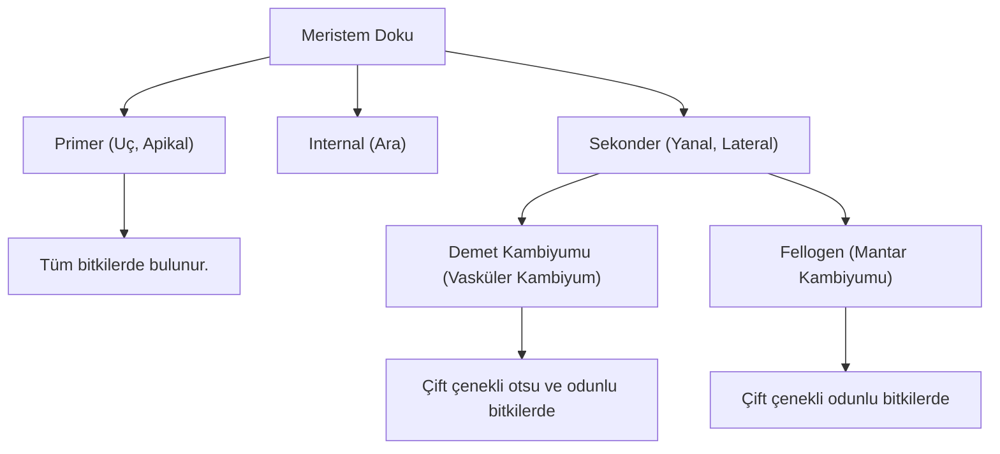
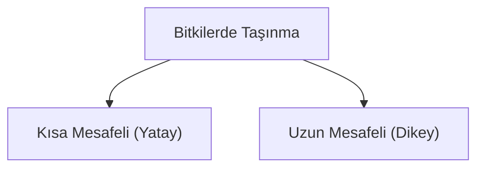
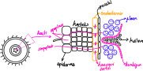
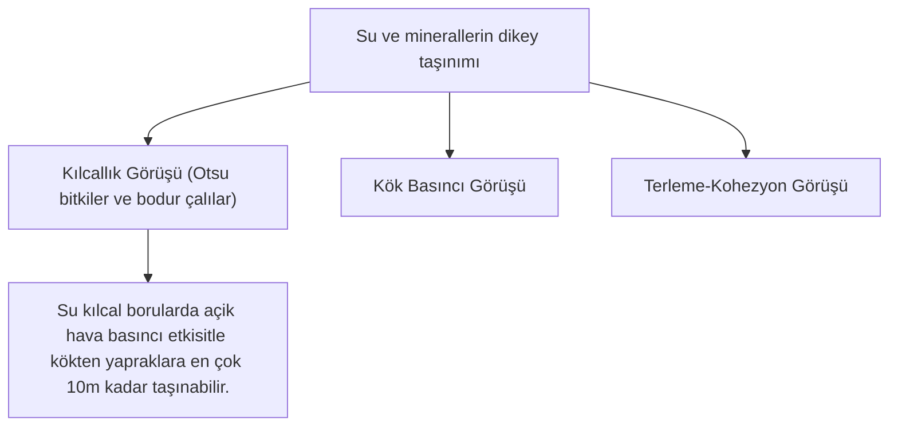

# Bitki Biyolojisi


 


# Çiçekli Bitkilerin Dokuları
## Meristem Doku
- Hücreleri bölünür.
- Bitkilerin ömrü sınırsızdır. Bitki ömrü boyunca bölünür.
- Bölünen meristem doku hücrelerinin bazıları farklılaşır ve bitkinin diğer yani *değişmez dokularını* oluşturur.
- Bazı hücreler G₁den çıkıp G₀a girer ve bir daha bölünmez. Bazı hücreler ihtiyaç olduğunda geri G₁e döner ve bölünür.
- Bazı meristematik hücreler bazı bitki hormonlarını sentezler ve salgılar.
```
  antagonist:┌─sinerjist:┌─ oksin
             │           │  giberellin
             │           │  sitokinin
             │           └─ filorigen
             └─sinerjist:┌─ absisik asit
                         └─ etilen 
```
- Bitki yapılarında boyca büyüme ve ence kalınlaşma sağlar.
- Kök, gövde ve yaprak yapılarında bulunur.
- Meristem hücrelerinin özellikleri:
  - Hücreleri küçük ve çeperleri incedir.
  - Oransal olarak stoplazma büyüktür.
  - Kofullar küçük, sayıca azdır.
  - Çekirdek oransal olarak büyüktür.
  - Hücreler arası boşlukları yok denecek kadar azdır.
  - Metabolizmaları hızlıdır.




### Primer Meristem
1. Bitkinin ömrü boyunca bölünme özelliğini kaybetmeyen hücrelerin meydana getirdiği dokudur.
2. Kök ve gövde uçlarında, ayrıca dal uçlarında bulunur.
3. Bulunduğu yerde boyca uzamayı sağlar. 
4. Primer meristemin kök ve gövde uçlarında bulunduğu yere büyüme noktası ya da *büyüme konisi* denir.
5. Büyüme noktaları kökte kaliptrayla, gövdede koruyucu yapraklarla korunur.
6. **Kaliptra hücreleri canlıdır. Bölünebilme özellikleri yoktur. Toprakta ilerlerken zedelendiğinde primer meristem hücreleri tarafından yenilenir.** 
7. Kaliptra, müsilaj adı verilen özel bir salgı üretir. Kökün toprak içinde rahat ilerlemesini sağlar.
8. Büyüme noktalarından alınan boyuna ya da enine kesitlerde dıştan içe doğru üç tabaka oluşur. *Histojen* adı verilen bu üç tabakalı doku bitkinin farklılaşarak diğer dokularını oluşturur.

### Sekonder Meristem

1. Kök ve gövdede bulunur, yapraklarda bulunmaz. 
2. Kabiyum, bitkide enine büyümeyi sağlar.
3. Bitkilerde primer meristem farklılaşarak bitkinin diğer dokularını oluşturur. Bu sırada meydana gelen farklılaşma hücreleri G₀ evresine sokar. Böylece, oluşan parankimatik hücrelerin bazıları hormonların etkisiyle yeniden bölünme özelliği kazanarak sekonder meristem dokuyu oluşturur.
4. **Sekonder meristem çift çenekli bitkilerde ve açık tohumlularda bulunurken tek çenekli bitkilerde yoktur.**
5. **Sekonder meristem kök ve gövdede bulunur ancak yapraklarda yoktur.**
6. Her yıl, biri ilk bahar diğeri son baharda iki defa mitoz geçirir ve yaş halkalarını oluşturur. Her yıl yeni iletim demetlerinin oluşumunu sağlar.
7. **Mantar kambiyumu peridermis adı verilen mantar dokuyu oluşturur. Mantar doku, dıştan bitki yapılarını korur.**

 


## Temel Doku

- Hayvanlardaki bağ dokunun karşılığıdır.
- Üçe ayrılır:

### Parankima Doku

1. Bitkinin her organında bulunur.
2. Bitkinin çevre koşullarına uyumunu sağlamak için değişime uğrayabilir.
3. Sonradan bölünme özelliği kazanarak sekonder meristemi oluşturabilir.
4. Hücreleri canlı, bol stoplazmalı ve ince çeperlidir.
5. Kofulları küçük, sayıca azdır.
6. Hücreleri arasında az ya da çok hücreler arası boşluklar bulundurur. Bu boşluklar, hücreler arası sıvı ya da gaz maddeler bulundurabilir.
7. Hücrelerinde kloroplast bulundurabilir.
8. Hücrelerinde kromoplast bulundurabilir.
9. Tüm parankima hücrelerinde lökoplast bulunur.
10. Parankimatik hücreler; ortamla bol madde alışverişi yapan, bulunduğu yere göre metabolizmaları değişen hücreler. 

#### Özümleme Parankiması
1. Yeşil bitkilerin yapraklarında, genç gövdede, genç dallarda, ham meyve kabuklarında bulunur.
2. Hücrelerinde bol kloroplast bulunur.
3. Görevi fotosentezdir.
4. **Palizat ve sünger parankimaları alt ve üst epidermis arasında bulunan mezofil dokuda yer alır.**
5. **Otsu gövdelerde genç, dal yüzeylerinde, yeşil renkli görünen ve kloroplastlı olan hücreler fotosentez yapar. Ayrıca ham meyveler de fotosentez yapar. Bunun yanında odunsu gövde ve kök hücrelerinde, yaşlı dal yüzeylerinde fotosentez yapılmaz.**
6. Epidermis hücrelerinin bir salgısı olan kütin ve mum bileşimli kimyasal epidermis hücrelerince sentezlenir ve salgılanır. Buharlaşma yoluyla su kaybını önler.

#### İletim Parankiması
1. İletim demetlerinin etrafını sarar.
2. İletim demetleriyle özümleme parankiması arasında madde taşınmasında madde taşınmasında görev alır.
3. Kloroplastsız hücrelerden oluşur.
4. Özümleme parankiması ⇄ iletim sistemi\
çift yönü su - mineral - organik madde taşır

#### Havalandırma Parankiması
1. Genellikle suda ve bataklıkta yaşayan bitkilerin kök ve gövdelerinde bulunur.
2. Çok sayıda hücreler arası boşluğa sahiptir.
3. Boşluklarında hava depo eder ve bitkinin gaz alışverişinde görev yapar.
4. **Yapraklardaki sünger parankiması boşlukları bu tür görev yapar.**

#### Depo Parankiması
1. Bitkinin türüne bağlı olarak kök, gövde, yaprak ve tohumda bulunur.
2. Hücreleri kloroplastsızdır.
3. Su ve besin depo eder.
4. patateste nişasta ⇒ amiloplast en çok\
fındık, ayçiçeği, mısırda yağ ⇒ oleoplast en çok\
baklagiller protein ⇒ proteoplast en çok\
sukkulent (kurak ortam) bitkilerinde su depo edilir

### Destek Doku
#### Kollenkima Doku (Pek Doku)
1. Genç gövdede yaprak orta damarında, çiçek ve yaprak saplarında bulunur.
2. Eğilme, bükülme ve çarpmaya karşı mekanik destek sağlar.
3. Hücre çeperlerinde selüloz ve pektin birikimiyle kalınlaşma, destek olayını sağlar.
4. Şeftali, portakal, mandalina ve limonda varken vişne ve kirazda yoktur.
5. Canlı ve kloroplastsız hücrelerden oluşur.

 

#### Seklerankima Doku

1. Hücreleri ölüdür.
2. Hücre çeperleri, selüloz ve lignin birikimiyle kalınlaşmıştır.
3. **Tek çenekli yıllık otsu gövdeli bitkilerde destek ksilemdeki turgor basıncıyla sağlanır.**
4. Sklerenkima Lifleri: keten, kenevir bitkisinde.
5. Taş Hücreleri: Küresel ya da levha hâldedir. Elma, armut ve ayvanın meyvesine direnç kazandırır. Tohum kabuğunda bulunur.

| Kollenkima | Sklerenkima |
|--|--|
| Canlı hücrelerden oluşur. | Ölü hücrelerden oluşur. |
| Stoplazma ve çekirdek vardır. | Stoplazma ve çekirdek bulunmaz. |
| Esnektir, gerilme ve kırılmalara karşı dayanıklıdır. | Esnek değildir. Kolay kırılır. |
| Hücre çeperinde selüloz ve pektin birikir. | Hücre çeperinde selüloz ve lignin birikir. |
| Bitkilerde genç kısımlarda bulunur. | Bitkilerde yaşlı (geç oluşan) yapılarda bulunur. (Meyve ve tohum kabuğu.) |
| Bulunduğu yere göre köşe ve levha kollenkiması şeklinde iki türde bulunur. | Yapılarına göre sklerenkima lifleri (keten - kenevir lifleri) ve taş hücreleri (fındık - ceviz gibi tohum kabukları) şeklinde iki türdür. |


## İletim Doku
1. Hayvanlardaki dolaşım sisteminin bitkilerdeki karşılığı iletim (taşıma) sistemidir.
2. İletim sistemi bitkilerde ksilem (odun borusu) be floem (soymuk borusu) olmak üzere iki kısımdan oluşur. Bu boruların bir arada bulunmasıyla bitkilerde iletim elemanları meydana gelir.
3. **Damarsız çiçeksiz bitkiler dışında tüm karasal bitkilerde bulunan ve madde taşınmasında etkili olan dokulardır.**
4. **Tamamen su içinde bulunan bitkilerde odun boruları, stomalar be kökler bulunmaz.**


### Ksilem (Odun Boruları)
1. Topraktan kökler aracılığıyla alınan su ve suda çözünmüş mineraller ile kökte sentezlenen bazı hormonların bitkilerin sürgün sisteminde bulunan doku ve organlara taşınmasını sağlar.
2. **Kök hücrelerinde su ozmoz ile mineraller aktif taşımayla alınır. Bu nedenle kök hücrelerine O₂li solunum yapılır. Oksijenli solunumun atığı olan CO₂, toprak boşluklarındaki O₂ ile değiştirilir.**
3. Ksilem borularının çevresinde bulunan ksilem parankima hücreleri çeşitli besin maddelerinin depolanmasında, ksilem sklerenkima hücreleri destek sağlamada görev alır.
4. Odun boruları meristem doku hücrelerinin üst üste gelerek zamanla çekirdek ve stoplazmalarını kaybetmesi sonucunda oluşur.
5. Hücre duvarları lignin birikimi ile kalınlaşır.
6. Çekirdek ve stoplazma bulundurmayan ölü hücrelerden oluşur.
7. Ksilem dokusunun en karakteristik elemanları trake be trakeitlerdir.\
Trakeler: Çeperleri kalın, çapları geniş birçok hücrenin üst üste gelmesi be ara çeperlerinin erimesiyle oluşmuş borulardır. Asıl işlevleri madde taşınmasıdır.\
Trakeitler: Çeperleri ince olan , ara çeperlerinin tam erimemesiyle iletimin yanında bitkiye desteklik sağlar. Su ve suda çözünmüş maddeler geçitler sayesinde hem yanal hem de yukarı doğru taşınır.\
 
8. **Ksilemdeki madde taşınması floemdeki madde taşınmasına göre hızlı gerçekleşir.**


### Floem (Soymuk Borusu)
1. Aynı boruda aynı anda çift yönlü madde taşınmaz.
2. Glikoz, sükroz, aminoasitler, azotlu diğer moleküller, riboz, deoksiriboz, yağ asitleri, gliserol ve suda çözünmüş mineraller taşınır.
3. Floem hücreleri ince çeperli ve canlıdır.
4. Üst üste gelen hücrelerin enine çeperleri kısmen indirgenmiş, yer yer delikler oluşmuştur. Bu delikler, kalbur görünümü sergilediğinden demete kalburlu ya da elekli boru adı verilmiştir.
5. Floem hücrelerinin stoplazması vardır, çekirdeği yoktur. Arkadaş hücrelerinin ise hem çekirdeği hem de bol stoplazması bulunur.
6. Floem hücrelerinin canlılığını arkadaş hücrelerinin çekirdeği kontrol eder.
7. İletim çift yönlüdür ancak aynı anda aynı boruda çift yönlü madde taşınması olmaz.
8. İletim hızı ksileme göre yavaştır.
9. Madde iletiminde hem aktif hem pasif taşıma etkilidir.
10. Floem sklerenkiması, bitkiye desteklik sağlar ve kambiyumu korur.
11. Floem parankiması; nişasta, yağ, tanen ve reçine depo edilen hücrelerdir.

 


## Örtü Doku
1. Kök, gövde, yaprak ve meyvelerin üzerini örten dokudur.
2. Hücrelerinde kloroplast bulunmaz, lökoplast bulunur.
3. Bulunduğu dokuyu ya da bitkiyi su kaybına ve çevresel faktörlere karşı korur.

### Epidermis
1. Histojenlerden dermatojen (protoderm) tabakan köken alır.
2. Hücreleri canlı ve klorofilsizdir.
3. Tek sıralı hücrelerden oluşur.
4. Hücreleri arasında boşluk bulunmaz.
5. Hücreleri büyük kofullu az stoplazmalıdır.
6. Bitkinin tüm yüzeyini örten en dış tabakadır.
7. Epidermis hücrelerinin salgıladığı kütin saydam ve ışığa geçirgenken suya geçirgen değildir. Nemli ortam bitkilerinde bu tabaka inceyken kurak ortam bitkilerinde kalındır.\
\
**Stoma**\
Işık var → CO₂ alır, O₂ ve H₂O<sub>(g)</sub> atar\
Işık yok → O₂ alır, CO₂ ve H₂O<sub>(g)</sub> atar\
Kloroplastları vardır, fotosentez yapar.\
Canlı, açılıp kapanabilir.\
**Hidatot**\
Yaprak kenarları ve uçlarında bulunur.\
Hava neme doygunken H₂O gaz hâlinde atılamayacağından hidatotlarla damlama (gutasyon) ile atılır.\
Kloroplastları yoktur.\
Hidatotlarda damlama ile su atılırken bir miktar çözünmüş tuz da atılır.\
Canlı, sürekli açıktır.

| stoma | hidatot |
|--|--|
| Epidermis kökenlidir. | Epidermis kökenlidir. |
| Canlıdır. | Canlıdır. |
| Açılıp kapanabilir. | Sürekli açıktır. |
| Fotosentez yapar. | Fotosentez yapamaz. |
| H₂O<sub>(g)</sub>ı tek başına atar. | Su<sub>(s)</sub> ve mineral atar. |
| Terleme yapar. | Damlama yapar. |

#### Tüyler
1. Epidermis hücrelerinin dışa doğru oluşturduğu çıkıntılardır.
2. Bazıları canlı bazıları ölü hücrelerden oluşur.
3. Örtü, savunma, salgı ve tırmanma gibi farklı işlevleri yapar.
4. Kurak ortam bitkilerinde yaprak üst yüzeyinde örtü tüyleri boldur.
5. Tropikal ya da Türkiye gibi yarı tropikal iklim bitkilerinde genellikle yaprak alt yüzeyi bol tüylüdür. Fesleğen, nane (mentol üretir) gibi bitkilerde yaprak tüyleri salgı yapar.
6. Isırgan otunda korunma ya da savunma tüyleri vardır. Bu tüyler formik asit salgılar.
7. Tırmanma tüyleri, sarmaşık bitkisinde vardır. Duvardaki çıkıntılara ya da ağacın gövdesindeki girintilere çıkıntılara tutunur.
8. **Köklerde emici tüyler su ve mineral alımında rol oynar.**
9. **Kök epidermis hücreleri kutikula ve stoma oluşturmaz.**

#### Emergensler (Dikenler)
1. Tüylerden farkı tüy yapısındaki epidermis hücreleri emergens oluşumu sırasında epidermisle parankimanın, bazen iletim dokunun birlikteliğiyle oluşmasıdır. 
2. Korunma (gül, akasya), tutunma (sarılıcı bitki, gövde sülükleri) görevlerini yapar.

### Peridermis (Mantar Doku)
1. Peridermis, çok yıllık bitkilerde büyüme ve enine kalınlaşma devam ederken epidermis dokusu parçalanır, yerini peridermis adı verilen mantar doku alır.
2. Fellogen adı verilen mantar kambiyumu, mantar dokuyu oluşturur.
3. Mantar hücreleri ölüdür.
4. Çeperlerinde süberin (mantar özü) birikir.
5. Çok yıllık bitkilerin kök ve gövdelerinde bulunur.
6. **Yaprakta peridermis yoktur. Tek çenekli bitkilerde peridermis bulunmaz.**
7. Mantar doku yaprak ile gövde arasında oluştuğunda yaprağın dökülmesine neden olur.\
 
8. Mantar doku farklılaşmasıyla lentiseller oluşur.\
 

| stoma | lentisel |
|--|--|
| Epidermis kökenli. | Peridermis kökenli. |
| Canlı. | Ölüdür. |
| Açılıp kapanır. | Sürekli açıktır. |
| Otsu gövde ve yaprakta. | Odunlu gövde ve dallarda. |
| Gaz değişimi ve terleme yapar. | Gaz değişimi yapar. Az da olsa terleme yapabilir. |

| epidermis | peridermis |
|--|--|
| Dermatogen (protoderm) kökenlidir. | Fellogen kökenlidir. |
| Hücreleri canlıdır. | Hücreleri ölüdür. |
| Otsu gövde ve yapraklarda bulunur. | Odunlu gövdede bulunur. Yapraklarda yoktur. |
| Kök, gövde, dal yapılarında bulunur. | Yalnız kök ve gövdede bulunur. |


# Bitkinin Salgı Elemanları
1. Hücreleri, hücre toplulukları, kanallar, cepler gibi yapılardan oluşur.
2. Metabolik ürünler bu yapılarda depolanır ve gerektiğinde boşaltılır.
3. Salgılar; savunma (koruma) ve tozlaşmayı destekleme, çiçeği böceğe cazip kılma görevlerini üstlenen organik maddelerdir.
4. Salgı hücreleri; canlı, bol stoplazmalı, metabolizması yüksek hücrelerdir.
5. Bol sentez yapar. Golgi'si (vezikül oluşturur) gelişmiş ve sayıca fazladır.

## Salgı Maddelerinin Bitkiye Sağladığı Yararlar
1. Böcekçil bitkilerin yaprakları tarafından salgılanan sıvılar hücre dışı sindirim enzimi bulundurur ve böcek proteinlerinin sindirilmesini sağlar.
2. Selüloz, lignin ve süberin gibi salgılar bitkiye desteklik sağlar.
3. Reçine, tanen gibi salgılar mikroorganizmalardan korur.
4. Isırgan otunun yakıcı salgıları (formik asit) korunmayı sağlar.
5. Çiçeklerden salınan esans ve bal özü (nektar) gibi salgılar çiçeği böceğe cazip kılar, tozlaşmaya aracılık eder.
6. Yaralanan bölgelerde üretilen süt benzeri (kauçuk) salgılar hızla katılaşarak yaraların çabuk kapanmasını sağlar.


# Bitkisel Organlar
## 1. Kök
1. Toprak altı organıdır.
2. Bir bitki tohumunun çimlenmesi sürecinde embriyodan oluşan ilk yapıya radiküla (kök taslağı) denir.
3. Radiküla gelişince ilk ilk kök (primer kök) oluşur.
4. Primer kök, yer çekimi doğrultusunda gelişir. Genç bitkinin toprağa bağlanmasını, topraktan su ver minerallerin alınmasını sağlar.
5. Bitki geliştikçe primer kök topraktan emilim yüzeyini artırmak için çok sayıda dallanma ve kök uçlarında da çok sayıda emici tüy oluşturur. Amaç, su ve mineral alımı için emme yüzeyini artırmaktır.\


6. Bitki kökü morfolojik olarak 4 bölümden oluşur:\
 1\. Kaliptra\
 2\. Büyüme (Hücre Bölünmesi) Bölgesi\
 3\. Uzama Bölgesi\
 4\. Emici Tüy (Olgunlaşma) Bölgesi

### a. Kaliptra
1. Kök ucu meristemini korur.
2. Musilaj salgısıyla kökün toprakta ilerlemesini kolaylaştırır.

### b. Büyüme (Hücre Bölünmesi) Bölgesi
1. Primer meristem (uç meristem) hücrelerinin bulunduğu yerdir.
2. Bu bölgenin bulunduğu kısım konik oluğu için büyüme konisi adını alır.

### c. Uzama Bölgesi
1. Buradaki hücreler dikey yönde uzayarak kökün uzamasını sağlar.

### d. Emici Tüy (Olgunlaşma) Bölgesi
1. Emici tüyler yoğun bulunur.
2. Emici tüyler, suyu ozmozla mineralleri aktif taşımayla alır.
3. **Bazı bitkilerde normal kök sistemine ek olarak gövdeden veya yapraklardan gelişen kökler bulunur. Bu köklere adventif ya da yardımcı kök denir. Asma bitkisinde ve mısır bitki gövdelerinde adventif kökler bulunur.**

### Kök Yapısı

1. Bir kökte dıştan içe üç tabaka vardır. Bunlar sırasıyla epidermis, korteks ve merkezî silinir olarak bulunur.\
Epidermis: Kökü en dıştan saran örtü dokudur.\
Korteks: Epidermis ve merkezi silindir arasında kalan dokudur. Parankima hücrelerinden oluşur.\
Endodermis: Korteksin en iç tabakasıdır. Korteks ve merkezî silindiri birbirinden ayırır. **Endodermis tabakası minerallerin korteksten iletim dokusuna seçilerek girişi için son kontrol noktasıdır.**\
Merkezî Silindir: Perisikl ile başlar. Perisikl tabakası hücreleri meristematik özellik taşıyan (bölünmesi devam eden) ve tekrardan bölünebilme özelliği olan hücrelerden oluşur. **Perisikl tabakası yan kölerin oluşumunu sağlar.**
2. Çift çenekli bitkilerin kökünde öz bölgesi bulunmaz.
3. Tek çenekli bitkilerde kambiyum bulunmaz. İletim demetleri dağınık dizilir.
4. Tek çenekli bitkilerin demet yapısına *kapalı demet*, çift çenekli bitkilerin demet yapısına  *açık demet* denir.
5. Dikotil (iki çenekli) bitkilerde kambiyum bulunur.
6. İletim demetleri düzenli dizilir.
7. Kambiyumun içinde ksilem dışında floem bulunur. Buna açık demet yapısı denir.

### Kök Çeşitleri
 
#### a. Saçak Kök
1. Ana kök gelişmemiştir.
2. Bütün kökler aynı yapıda, kalınlıkta ve uzunluktadır.
3. Aynı noktadan başlayan çok sayıda kökten oluşur.

#### b. Kazık Kök
1. Ana kök iyi gelişmiş, kalınlaşmış, toprağın içine doğru gelişmiştir.
2. Yan kökler ana kökten gelişmiş ancak ana kök yanında daha ince görünüm sergiler.
3. İki çenekli bitkilerde bulunur

### Kökün Görevleri
1. Bitkiyi sıkıca toprağa bağlar.
2. Topraktan su ve mineralleri alır.
3. Sitokinin ve giberellin hormonlarını sentezler.
4. Koruyucu özellikte sekonder bileşikleri üretir.
5. Besin maddelerini depolar.


## 2. Gövde
 
1. **Otsu tek çeneklilerde kambiyum yoktur.**
2. Otsu çift çeneklilerde ve odunlu bitkilerde kambiyum bulunur.

### Gövdede Büyüme
**Primer Büyüme**: Uç meristem etkisiyle olur. Boyca uzama olarak bilinir. Tüm bitkilerde görülür.\
**Sekonder Büyüme**: Enine kalınlaşmadır. Sekonder meristem etkisiyle olur.\
**Primer büyüme tüm bitkilerde görülürken sekonder büyüme monokotil bitkilerde görülmez.**
1. Her büyüme mevsiminde primer büyüme kök, gövde ve dalların genç sürgünlerini oluştururken sekonder büyüme bitkinin yaşlı kısımlarını kalınlaştırır.
2. Sekonder büyüme sırasında demet kambiyumu (vasküler kambiyum) yeni floem ve ksilem oluşturmasıyla korteks gerilir, epidermis basınca dayanamaz ve parçalanır. Epidermisin yerini parankimatik hücrelerden farklılaşan mantar kambiyumu alır. Mantar hücrelerini oluşturur. Mantar hücrelerinin çeperlerinde süberin (mantar özü) maddesi birikir. Zamanla hücreler ölür, içleri havayla dolar. Böylece peridermis dokusu oluşur.\

3. **Peridermis, fellogen (mantar kambiyumu) ve floem kabuğu (korteks) meydana getirir.**
4. Ilıman bölgelerde (Türkiye de dahil.) ağaçlar genellikle ilkbaharda büyümeye başlar ve büyüme sonbaharda durur. Buna büyüme mevsimi denir.
5. Büyüme sırasında oluşan ilkbahar odununun hücrelerin besin ve mineralin toprakta bol olması nedeniyle sonbahar odunun hücrelerine göre büyük ve ince çeperlidir. Sonbahar hücrelerininse çeperlerinin kalın olması nedeniyle koyu gözükür. Sonbahar ve ilkbahar odunu ağaç halkalarını oluşturur. Ağacın yıllık halka genişliği iklimle ilgilidir. Eğer iklim ağaç için uygunsa halkalar geniş, uygun değilse halkalar dardır.\
 




## 3. Yaprak
 
1. Bitkide terleme ve fotosentezin yapıldığı organdır.
2. Yaprak ayası ve yaprak sapından oluşur.
3. Yaprak ayası, fotosentezin ve gaz alışverişinin yapıldığı kısımdır.
4. Çölde yaşayan bitkilerde ve kurak ortan bitkilerde yapraklar küçülmüş, diklen şeklini almıştır. Bu bitkilerin yapraklarının görevini özümleme parankiması içeren gövdeleri üstlenmiştir.
5. Yaprak sapı, yaprak ayasını gövdeye bağlar. Yaprak sapıyla gövdenin birleştiği yerdeki yaprak yastığı yaprak ayasının ışıktan en iyi şekilde yararlanmasını sağlar.
6. Tek çenekli bitkilerde ve bazı çift çenekli bitkilerde yaprak sapı bulunmaz.
7. **Kaktüslerde gövdede stomalar bulunur. Stomalar, gece açık gündüz kapalıdır. Gece karbondioksit depo edilir, gündüz fotosentez yapılır.**
8. Yaprak; tek yaprak ayasından oluşuyorsa basit yaprak, bir sapa bağlı çok yaprakçıktan oluşuyorsa bileşik yaprak adını alır.\
 


## 4. Tohum
 


# Bitkilerde Taşıma

Su, mineraller ve bazı hormonlar: Ksilem\
Su, mineraller, fotosentez ürünleri: floem 

## Kısa Mesafeli (Yanal) Taşınma
1. Maddeler, hücrelerden hücrelere taşınır.
2. Yanal taşınım adını alır.
3. İletim demeteleriyle hücreler arasında taşınma söz konusudur.
4. **Apoplast Geçiş**: Su hücreye girmez, hücreler arasından endodermise gelir. Kaspari şeridi su geçişine izin vermez. Burada hücre stoplazmasına girer ve odun borusunda ulaşır.
5. **Simplast Geçiş**: Su; emici tüy, korteks, endodermis hücrelerinin stoplazmasına girip çıkarak merkezi silindire ve odun borusuna ulaşır.
6. **Endodermis ve kaspari şeridi su ve minerallerin seçilerek odun borusuna girmesini sağlar.**
7. *2024 AYT* **Minerallerin topraktaki derişimi, emici tüylerdeki derişiminden daha düşüktür. Bu nedenle minerallerin emici tüyler tarafından alınması aktif taşımayla olur. Oysa su bitkiye ozmozla girer.**

 

### Kısa Mesafeli Taşınmanın Sırası
1. Emici tüy (epidermis)
2. Korteks parankiması hücreleri
3. Endodermis
4. Perisikl
5. Odun boruları


## Uzun Mesafeli (Dikey) Taşınma 
1. Maddeler odun ve soymuk borularından oluşan iletim demetlerinde taşınır.



 
