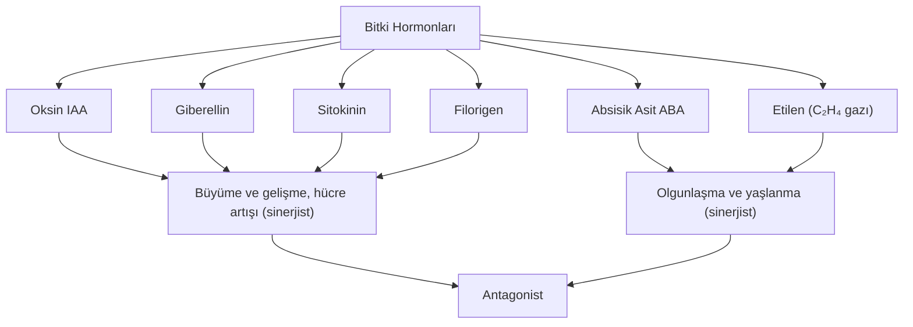
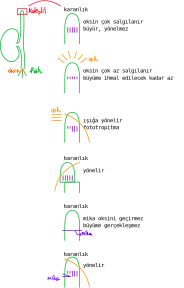

# Bitkinin Hormonları
1. Bitkide bulunan bazı hücreler tarafından üretilen, daha sonra diğer bitki bölümlerine taşınan ve oradaki özgül resepörlere bağlanarak hedef hücre ya da dokuların ilgili olaya tepki vermesini sağlayan organik moleküllere bitki hormonları denir.
2. Bitki hormonları etkinliklerini salgılanmış oldukları bölgenin az çok uzağında gösterir.
3. Hormonlar, çok düşük miktarlardayken etkilerini gösterir. Çok salgılandıklarında etkileri inhibe olabilir.
4. Bitkisel hormonları miktarları ve taşınım hızları çevresel faktörlere bağlı değişebilir.
5. Bitkisel hormonlar kök, gövde ve dal ucu meristemlerinde; tohumda, meyvede ve genç yapraklarda bulunan hücrelerde üretilir ve kullanılır.
6. **Bitkilerde bez bulunmaz, bu nedenle endokrin bez de yoktur.**
7. **Hormonlar, etkilerini optimum değerdeyken gösterir. Minimum ve maksimum değerleri anormalliklere neden olabilir.**

## Oksin

1. Salgılandığı yerde etkili olur. Kökte kısa mesafeli taşınabilir.
2. Büyüme ve gelişmeyi etkileyen en önemli hormondur.
3. Gövde, dal ve kök ucu meristemi; genç yapraklar, meyve ve tohum gibi gelişmekte olan bitki kısımlarında sentezlenir.
4. Hücrelerde büyüme, bölünme ve farklılaşma olaylarını kontrol eder.
5. Doğrudan ışık almayan bitki kısımlarında daha fazla sentezlenir. Bu durum bitkide asimetrik büyümeye neden olduğu için *yönelim* (tropizma) gerçekleşir.
6. Fazla salgılanması büyümeyi durdurur.
7. Az salgılanması, yaprak dökümüne neden olur.
8. Çekirdeksiz meyve oluşumunda etkilidir.
9. Kambiyum gelişimini düzenler.
10. Döllenmiş çiçeğin dökülmesini önler. (meyve tutma)
11. Toprağa uygulandığında yabani otların yok edilmesinde kullanılır.
12. Çiçek açmada etkilidir.
13. Bitkinin köklenmesinde ve köklerin farklılaşmasında etkilidir.
14. Yanal tomurcukların gelişimini engeller. (apikal \[uç\] dormansi \[uyku\])
15. Kök, gövde ve tomurcuk gibi değişik bitki organları farklı oksin yoğunluklarında büyüme gösterir. Oksin yoğunluğunun artması, büyümeyi engeller.

 

## Sitokinin
1. Kök ucunda sentezlenir ve ksilemle meristem dokulara, tohumlara, yapraklara ve meyvelere taşınır.
2. Hücre bölünmesini uyarır.
3. Sekonder meristemlerin aktif hâle gelmesini ve köklerin alt kısmında köklerin oluşumunu sağlar.
4. Yaprakların geç dökülmesinde ve zarar gören organların yenilenmesinde etkilidir.
5. Yaprakların yaşlanmasını geciktirir.
6. Klorofil sentezini uyarır.
7. Bitkinin özelleşmemiş genç hücrelerindeki farklılaşma, oksin/sitokinin oranıyla kontrol edilir. Oksin/sitokinin oranı dengeli olduğu doku kültürü ortamında doku hücreleri farklılaşmadan büyür ve kallus adı verilen hücre kümesi oluşur.
8. **Oksin/sitokinin oranı yüksekse kallusta kök oluşur, düşükse sürgün oluşur.**
9. **Oksinin aksine yanal tomurcukların gelişmesini sağlar.**

 

## Giberellin
1. Köklerde, genç yapraklarda ve bitki embriyosunda üretilir.
2. Hücre büyümesini ve bölünmesini uyarır. Gövdede uzamayı, yapraklarda büyümeyi sağlar.
3. Çiçeklenmeyi uyarır.
4. Hücre çeperinin esnekliğini artırarak hücreye su alınmasını kolaylaştırır; çimlenme sırasında tohumun uyku hâlini bozar, tohumun çimlenmesini uyarır.
5. Çimlenme sırasında tohum embriyosundan salınır. Endospermdeki ya da çeneklerdeki nişasta yıkımını sağlayan enzimleri aktive eder. (amilaz, dekstrinaz ve maltaz)
6. Meyve oluşmasında ve büyümede etkilidir.
7. *2024 AYT* **Giberellin, tarımda kullanılan önemli bir hormondur. Salkım seyreltmek, meyve büyümesi ve salkımlı meyvede tane iriliğini artırmak amacıyla kullanılır. İri tanecikli çekirdeksiz İzmir üzümü.**

## Etilen
1. Gaz hâlinde hormondur. (C₂H₄(g))
2. Bitkilerde kuraklık, su baskını (sel), mekanik basınç ve enfeksiyon gibi streslere yakın olarak üretilir.
3. Yalnız üretildiği bitkiyi değil diğer bitkileri de etkiler.
4. Çürümüş meyveden salınır. Bir çürük elma bir çuval elmayı çürütür.
5. Kök büyümesini engeller, yaprakların dökülmesini uyarır.
6. Meyvenin olgunlaşmasında etkilidir.
7. Meyvedeki nişastaların ve organik asitlerin fruktoza dönüşümünü sağlayarak meyvelerin tatlanmasını yani olgunlaşmasını sağlar.
8. Olgunlaşması tamamlanmış meyvelerde üretilen etilen diğer meyvelerinde önce olgunlaşmasını sonra çürümesini etkiler. 
9. Karbondioksit, etilen birikinimi ve yeni etilen sentezini önler. Sonbaharda toplanan elmalar karbondioksitçe zengin depolarda tutulur ve çürümeleri önlenir. Böylece bir önceki yılın meyvesi bir sonraki yılın yazında tüketilebilir.
10. *2024 AYT* **Genç fidanlar etilen etkisiyle 1. gövde uzamasının yavaşlaması, 2. gövdenin kalınlaşması, 3. gövdenin yatay olarak büyümesini sağlayan eğilme şeklinde gözlenen üçlü yanıt etkisi yapar. Bitkilerde programlanmış hücre ölümlerinde (apoptrosiz) neden olur. Örneğin tek yıllık bitkilerin çiçek açtıktan sonra ölmesi, sonbaharda yaprakların dökülmesi, ağaçların uç dallarında oluşan çürüyen meyvenin toprağa düşmesi.**
11. Yüksek konsantrasyondaki oksin bitkinin uzamasını önler çünkü oksinin çok artması etilen üretimini artırır. Etilen uzamayı engeller.

## Absisik Asit
1. Tohum ve tomurcuklarda uyku hâlini devam ettirir.
2. Uygun olmayan koşullarda tohumun çimlenmesini önler. 
3. Kök, gövde ve yeşil meyvelerde üretilir.
4. Susuzluk durumunda stomaların kapatılmasını ve suyun kaybedilmesini önler.

## Florijen
1. Bitkilerde çiçeklenmeyi sağlar.
2. Bu hormon bitkinin uzun ya da kısa gece bitkisi olmasına bağlı salgılanır.
3. Kısa gece bitkisinde 8 saatlik uykuda, uzun gece bitkisinde 16 saatlik uykuda salgılanır.
4. Kısa gece be uzun gece bitkileri aşılandıklarında her gece uzunluğunda bit bitkiden salınan filorijen floemde diğer bitkiye taşınacağı için aşılanmış bitkide iki farklı çiçek açar.
