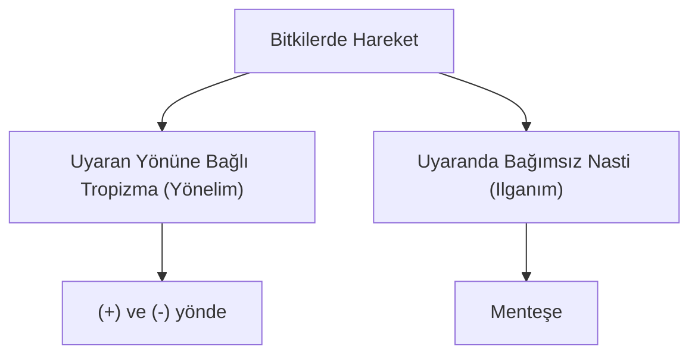
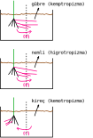

# Bitkilerde Hareket

## Tropizma
1. Uyaran yönüne bağlıdır.
2. Uyarana doğru ise pozitif, uyarandan farklı yöndeyse negatif tropizma adını alır.
3. Organların hücrelerinde asimetrik büyüme (asimetrik oksin dağılımı) yönelim nedenidir.

Uyarana göre tropizma türleri:
| uyaran | isim |
|--|--|
| ışık | fototropizma |
| yer çekimi | geotropizma (gravitropizma) |
| dokunma | haptotropizma (tigomotropizma) |
| kimyasal | kemotropizma |
| su | hidrotropizma |
| nem | higrotropizma |
| bıçak yarası | travmatropizma |

### Fotoropizmma
1. Oksin hormonu üretimine bağlı asimetrik büyüme yönelime neden olur.
2. Oksin mitozu hızlandırır. Hücrenin boyca uzaması ve bölünmesini sağlar.
3. Karanlıkta ya da kök gibi ışık almayan bölgelerde oksin üretimi kolaydır.

### Geotropizma
1. Kök yer çekimi etkisiyle pozitif, gövde yer çekimine zıt yönde negatif geotropizma yapar.

 

### Haptotropizma (Dokunma)
1. Her zaman pozitif yöndedir.
2. Asmanın tutunduğu ortanda sülüklerinin ya da kendi gövdesinin sarılması, sarmaşığın sarılması ya da emergensleriyle tutunması.

### Travmatropizma (Yaralanma)
1. Yaralanma durumunda yaranın onarımı daha fazla hücre oluşturduğu için kıvrılma görülür.

## Nasti
1. Uyaran yönünde bağlı olmaksızın gerçekleşen hareketlerdir.
2. Asimetrik ortaya çıkan turgor etkisi ile oluşur. (Menteşe hareketi)

### Fotonasti
1. Akşam sefası bitkisinin çiçeklerini gece açıp gündüz kapatması, fasulye yapraklarının gece eğik gündüz dik olması.

### Termonasti
1. Lale, gelincik çiçekleri 5 - 10 ℃de kapalı 15 - 25 ℃de açık olması.
2. Çiğdem çiçeklerinin soğukta kapanıp sıcakta açılması.

### Sismonosti
1. Uyaranı sarsıntı.
2. Küstüm otu bitkisinin dokunulduğunda yapraklarını aşağı yönlü sarkıtması,
3. Böcekçil bitkilerin kapan şeklinde yaprakların dokundurulduğunda kapanması.

- Protislerde yalancı ayak, sil, kamçı yapıların etkisiyle yaşam ortamı olan ıslak mekan ya da sularda aktif yer değiştirme hareketine taksi (göçüm) hareketi denir. Uyaran gönüne bağlıdır (+) ve (-).
- Öglena ve kloroplastlı tüm protistlerin ışığa yönelimleri (+) fototaksidir.
- Amip, öglena, paramecium gibi tek hücrelilerin besine yönelmesi (+) kemotaksidir.
- Amip, öglena, paramecium gibi protistlerin zararlı kimyasallardan kaçması (-) kemotaksidir.
- Bazı bakteri türlerinin petrol atıkları (sızıntı), plastik ve kâğıt atıklarına yönelerek parçalaması (+) kemotaksidir.
