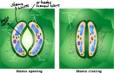

## Stoma
1. Genç dallarda, otsu gövdede ve yapraklarda bitkinin dış dünyaya açıldığı kapıdır.
2. Hücreleri bol kloroplastlı, lökoplastlı, canlı ve büyük kofulludur.
3. Açılıp kapanma özelliğine sahiptir. Gece gündüz açılır kapanır, gaz değişimi sağlar.
4. Gaz değişimi ve terleme yapar.

 

### Stomanın Gündüz Açılması
1. Stomaya ışık düşer, fotosentez yapılır.
2. Kapatma hücrelerinin glikoz derişimi artar.
3. K⁺ derişimi artar.
4. Kapatma hücrelerinin ozmotik artar.
5. Komşu hücrelerden kapatma hücrelerine su girer.
6. Kapatma hücrelerinin turgor artar.
7. Kalın çeperler zıt kavislenir. İnce çeperler dışarı itilir.

### Stomanın Gece Açılması
1. Komşu hücrelerden stoma hücrelerine K⁺ akışı olur.
2. Solunum yapan kapatma hücrelerinde CO₂ derişimi artar. Asitlik artar, pH düşer.
3. Nişastayı hidroliz eden enzimler aktif olur.
4. Glikoz derişimi ve potasyum derişimi artar.
5. Ozmotik basınç artar. Komşu hücrelerden su girer.
6. Turgor basıncı artar.
7. İnce çeperler dışa itilir, kalın çeperler zıt kavislenir. Stoma açıklığı artar.
8. *Oksijen alınır, CO₂ ve H₂O atılır.*

### Stomanın Kapanması
1. Stomalarda glikozlar nişastaya dönüştürülür.
2. K⁺ler komşu hücrelere akar.
3. Komşu hücrelerinin ozmotik basıncı kapatma hücrelerinin suyu fazladır.
4. Su komşu hücrelere geçer.
5. Kapatma hücrelerinin turgor basıncı azalır.
6. Kalın çeperler başlangıç konumlarına geri döner. Stoma açıklığı kapanır.

Lentisel: Odunlu gövde ve dallarda, ölü hücrelerin oluşturduğu açılıp kapanma özelliği olmayan, sürekli açık hâlde bulunan, bitkinin dış dünyaya açıldığı kapıdır.

Hidatot (Su Savakları): Nemli ortam bitkilerinde dallama ile fazla suyun atıldığı açıklıklardır. Yaprak kenarlarında özelleşir.
