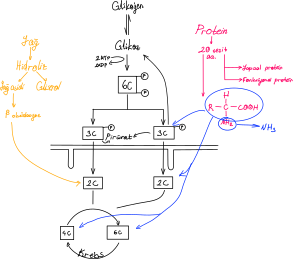

# Hücresel Solunum
Organik maddeleri parçalayarak enerji elde edilmesi olayıdır. Bütün canlı hücrelerde görülür.

## Fermantasyon
1. Organik maddenin laktik asit ya da etil alkol adlı son ürünlere enzim yardımıyla yıkılması sırasında kopan bağlardan salınan enerjinin ADP'ye aktarılması ve ATP sentezlenmesi olayıdır. 
2. Oksijen kullanılmaz.
3. Elektron taşıma sistemi yoktur.
4. Hücrenin stoplazmasında gerçekleşir.

**NOT**: Bir madde elektron alırsa indirgenir, indirgenmenin olması için bir tür elektron salmalıdır. Elektron salan tür ise yükseltgenir. Elektron transferi ile enerji değişimi olur ve sonuçta serbest enerji vardır ki bu bize pili hatırlatır. Canlılardaki indirgenme-yükseltgenme tepkimeleri hayatın pilidir.

**NOT**: Glikoz hücrelerin temel enerji kaynağıdır. Glikozun hücrelerde pürüvik asit moleküllerine kadar yıkımı enzimlerle olur. Bu yıkımda kullanılan enzimler tüm canlılarda ortaktır. Bu yıkım basamakları fermantasyon ile oksijensiz ve oksijenli solunum olaylarında ortaktır. Bu ardışık tepkimeler dizisi *glikoliz* adını alır. Glikoliz enzimlerinin sentezi için canlılarda ortak genler (DNA dizilimleri) bulunur. Bu tüm canlıların ortak atadan evrildiğine kanıttır.

Glikoliz: C₆H₁₂O₆ + 2ATP → 4ATP + 2C₃H₄O₃ + 2H₂ \
Glikoliz: C₆H₁₂O₆ + 2ATP + 2NAD⁺ → 4ATP + 2NADH⁺ + 2C₃H₄0₃ + 2H⁺ \
C₃H₄O₃ → pürivat\
C₃H₆O₃ → laktik asit\


NAD + H₂ → NADH₂ (indirgenme)

NAD: nikotinamit adenin dinükleotit
NAD⁺: nikotinamit adenin dinükleotit'in yükseltgenmiş hâli
FAD: flavin adenin dinükleotit

Glikoliz eksik tepkimedir. Bu tepkimenin hücredeki sürekliliğinin sağlanması gerekmektedir. Bu iş için son hidrojen alıcısı hücrelerde farklılık gösterir. Son H₂ alıcısı pürivat ise son ürün laktik asittir. Son H₂ alıcısı asetaldehit ise son ürün etil alkoldür.
1. Laktik asit fermantasyonu\
H₂ ⇒  laktik asit
2. Alkolik fermantasyon\
H₂ ⇒  asetaldehit asit

### Laktik Asit Fermantasyonu
1. son H₂ alıcısı: laktik asit
2. Çizgili kas hücrelerinde oksijen yetmezliğinde ortaya çıkan ATP eksiğinin bir miktar giderilmesi için gerçekleştirilir.
3. Laktik asit mayalarında (yoğurt mayası) enerji gereksiniminin karşılanması için yapılan tepkimeler dizisidir. 
4. glikoz + 2ATP → 2laktik asit + 4ATP
5. Laktik asidi karaciğer C₃H₄O₃e (pürivik asit) çevirir. Pürivik asit ters glikolizle glikojene ya da yağa dönüştürülür.
6. Kas aktivitesi yoğun olduğunda glikozun yıkım hızı, oksijeninin kandan alım hızını geçer.
7. Kaslarda oluşan laktik asidin çoğu pürivik aside çevrilir.
8. Fermantasyon ve ETS'nin kullanıldığı solunumlar düşünüldüğünde fermantasyon için eksik yanma denebilir. Glikoz yapısındaki enerjinin tamamı ortaya çıkarılmadığı için fermantasyon ürünleri yanıcıdır.
9. Eritrositler enerjilerini fermantasyon ile üretir, laktik asit fermantasyonu yapar. Enerji gereksinimi azdır. Fermantasyon enerjisi yeterlidir.
```
                laktat dehidrogenaz
   C₆H₁₂O₆ + 2ATP + 2NAD → 2NADH₂⁺ + 4ATP + 2C₃H₄O₃
  +     2NADH₂ + 2C₃H₄O₃ → 2NAD + 2C₃H₆O₃
---------------------------------------------------------------------------
          C₆H₁₂O₆ + 2ATP → 4ATP + 2C₃H₆O₃


          glikoz + 2ATP + 2NAD → 2NADH₂⁺ + 4ATP + pürivik asit
  + 2 ×  pürivik asit + 2NADH₂ → laktik asit + 2NAD
-----------------------------------------------------------
                 glikoz + 2ATP → 4ATP + 2laktik asit
```

### Alkol Fermantasyonu
1. son H₂ alıcısı: asetaldehit
2. Karbondioksit çıkışı gerçekleşir.
3. Bira mayası oksijensiz ortamda ATP sentezi için alkol fermantasyonunu kullanır. Oksijen varsa seçimli olarak oksijenli solunum yapar ve daha fazla ATP sentezler.


## Oksijensiz Solunum (Anaerob Solunum)
1. son elektron alıcısı: O₂ olmayan; NO₃⁻, SO₂²⁻, CO₃²⁻
2. *2024 yks* Denitrifikasyon bakterileri NO₃⁻ üzerinden N₂ üretirken anaerob solunum yapar.


## Oksijenli Solunum
1. ortamda asetil CoA varsa O₂li solunum yapıldığının kanıtıdır.
2. Nitrifikasyon bakterileri oksijenle solunum yaparken besinlerini kemosentezle üretir.
3. Organik besinlerin oksijen varlığında karbondioksit ve suya kadar parçalanmasına oksijenli solunum denir.
4. Bazı bakteriler ve mitokondri organeline sahip ökaryotik canlılar oksijeni solunum yapabilir.
5. ATP üretme miktarına göre vücuttaki hücreler:\
Ⅰ. *32 ATP* Beyin, böbrek, karaciğer, kalp kası, deri vb. (glikolizle oluşan H₂ NAD'a yönlendirilir)\
Ⅱ. *30 ATP* Çizgili kas (glikolizle oluşan H₂ FAD'a yönlendirilir)\
Ⅲ. *27 ATP* Kahverengi yağ doku (glikolizle oluşan H₂ ısı oluşturur)
6. Glikoz mitokondriye giremez. Glikoliz stoplazmada olur.

C₆H₁₂O₆ + 2ATP + 6O₂ + 6H₂O → nATP + 6CO₂ + 12H₂O\
n: 34, 32 ya da 29 ATP

Glikozun yanma tepkimesi: C₆H₁₂O₆ + 6O₂ → 6CO₂ + 12H₂O + enerji

### Mitokondrinin Yapısı
1. Çift katlı zarlı, dış zarı düz iç zarı kıvrımlı yapıya sahiptir.
2. Prokaryot hücrelere benzerlik gösterir. Halkasal DNA'ya sahiptir.
3. Prokaryotlardaki kıvrımlı iç zara mesozom denirken mitokondride iç zara krista denir.
4. İç zar prokaryot zarıyla özdeş, dış zarı ise ökaryotik hücre zarıyla özdeştir.
5. Mitokondriler çekirdek kontrolünde kendini eşleyebilir.
6. Krebs döngüsünde H₂O hidrojen kaynağıdır.

## Hücresel Solunumda Enerji Verimi
1. Fermantasyonda enerji verimi oksijenli solunuma göre daha azdır. Bunun sebebi son ürünlerin yanabilir hâlde kalmasıdır,
2. O₂siz solunumda son elektron alıcı farklı olduğu için buna oksidadif fosforilasyon yanında anaerob fosforilasyon denilebilir.


 
