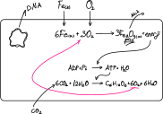

# Kemosentez
**Kemosentez**: İnorganik maddenin oksidasyonundan açığa çıkan enerjiyi önce ATP'ye, ardından ATP enerjsini organik besin sentezinde kullanma olayıdır.\
**Kemofosforilasyon**: İnorganik maddenin oksidasyonuyla ATP üretme.\
*Kemosentez yapan ökaryot organizmaya rastlanılmamıştır. Bilinen tüm kemosentetik organizmalar prokaryotur.*

1. ATP sentezinde ETS görev yapar.
2. Demir, amonyak, NO₂⁻, H₂, H₂S, S₂ gibi inorganik bileşikler oksitlenir.
3. Nitritleyici/nitratlayıcı bakteriler, arkelerin çoğu, demir ve hidrojen bakterileri örnektir.
4. Azot döngüsündeki nitrifikasyon olayı kemosentezle gerçekleşir.
5. Kemosentetik arkelerin bir çoğu yüksek pH, yüksek tuzluluk gibi eksrtem koşullarda yaşar. Bu bakterilerden elde edilmiş dayanıklı enzimler endüstride kullanılır.
6. Metanojenler selülaz ve selülobiyaz enzimlerini salgılayarak selülozu sindirir.

Kemosentezde üretilen O₂ hücre dışına verilmez. Kemosentetik organizmalar atmosferik oksijene katkı sağlamaz.\
 

# Fotosentez
1. Işık ve klorofil.
2. Prokaryotlarda
  - Klorofil stoplazmada
  - Fotosentez stoplazmada başlar ve tamamlanır
  - Bakteriler fotosentezde H₂S, H₂, H₂O ile CO₂ kullanır
3. Ökaryotlarda
  - Klorofil kloroplastta
  - Fotosentez kloroplastta başlar ve tamamlanır
  - Ökaryotlar fotosentezde H₂O ile CO₂ kullanır

## Bakteri Fotosentezi
1. Klorofil aracılığıyla gerçekleşir
2. H₂S bakterisi: 12H₂S + 6CO₂ → C₆H₁₂O₆ + 6H₂O + 12S
3. H₂ bakterisi: 12H₂ + 6CO₂ → C₆H₁₂O₆ + 6H₂O
4. Cyanobacteria fotosentezi: 12H₂O + 6CO₂ → C₆H₁₂O₆ + 6H₂O + 6O₂

 

## Ökaryot Fotosentezi
1. Kloroplastta bulunan klorofil aracılığıyla gerçekleşir.
2. Su yosunu, kara yosunu, eğrelti otu ve bitki ile öglena gibi protistler
3. 12H₂O + 6CO₂ → C₆H₁₂O₆ + 6H₂O + 6O₂

 

 
