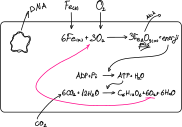

# Kemosentez
**Kemosentez**: İnorganik maddenin oksidasyonundan açığa çıkan enerjiyi önce ATP'ye, ardından ATP enerjsini organik besin sentezinde kullanma olayıdır.\
**Kemofosforilasyon**: İnorganik maddenin oksidasyonuyla ATP üretme.\
*Kemosentez yapan ökaryot organizmaya rastlanılmamıştır. Bilinen tüm kemosentetik organizmalar prokaryotur.*

Kemosentezde üretilen O₂ hücre dışına verilmez. Kemosentetik organizmalar atmosferik oksijene katkı sağlamaz.\
 
