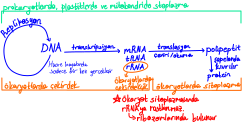

# Nükleik Asitlerin Keşfi ve Önemi
Çekirdekte (Yunanca adı nukleos) bulunması ve asit özellik göstermesi nedeniyle nükleik asit ismini almıştır.
1. Nükleik asitleri Friedrich Michel keşfetti.
2. DNA'nın kalıtsal materyal olduğunu Fredrick Griffith keşfetti.
3. Kapsülsüz pneumoniae'ları insandaki fagositik hücreler yer. Ancak kapsüllüleri fagositik hücreler yiyemez. Bu nedenle kapsüllü bakteriler patojendir. 

## DNA
ⅰ Bakteri: sitoplazma\
ⅱ Arkebakteri: sitoplazma\
ⅲ Mitokondri: matrix\
ⅳ Plastitlerde: sitoplazma\
ⅴ Ökaryot: çekirdek ve çekirdekçik
1. Çekirdekçik DNA'sı rRNA sentezler. 
2. Çekirdek DNA'sı mRNA ve tRNA sentezler.
3. Çekirdek DNA'sında gen varken çekirdekçik DNA'sında gen bulunmaz.

## RNA
1. 3 türü vardır.\
Ⅰ **mRNA** %5 (Mesajcı RNA, Elçi RNA)\
 Görevi tamamlandığında parçalanır.\
 Protein kalıbıdır.\
 Gendeki nükleotit kadar nüklleotit bulundurur.\
 Üzerinde bir aminoaside karşılık gelen üç nükleotitlik bölüm kodon adını alır.\
 Doğrusal, tek zincirli yapıdır.\
Ⅱ **tRNA** %15 (Taşıyıcı RNA)\
 Aminoasitleri protein sentezi için ribozoma taşır.\
 mRNA kodonu üzerine gelen üç nükleotitlik tRNA bölümü antikodon adını alır.\
 tRNA kıvrımlı yapıya sahip olsa da tek zincirlidir. Ancak karşılıklı nükleotitlerinde H bağı bulunur.\
Ⅲ **rRNA** %80 (Ribozomal RNA)\
 Ribozom yapısına katılır.\
 Sayısının çokluğu ribozom sayısıyla orantılıdır.\
 mRNA üzerindeki bilgiyi okuduğu sanılmaktadır.\
 Doğrusal, tek zincirli yapıdır. Ribozom içinde kıvrılarak H bağı oluşturabilir.
2. mRNA, tRNA ökaryot sitoplazması; rRNA çekirdekçik
3. Ökaryot stoplazmasında rRNA bulunmaz.
4. tRNA'nın kıvrımlı yapısı olsa da tek ipliklidir. Nükleotitleri A, G, S ve U'dur. 
5. DNA mölekülleri üzerinden sentezlenir.\

6. Bulunduğu yerler\
ⅰ Prokaryot: sitoplazma\
ⅱ Mitokondri: matrix\
ⅲ Plastitlerde: matrix\
ⅳ ribozomda
7. RNA sentezinde DNA'daki H bağları kopar. Anlamlı iplikteki nükleotitlerle RNA nükleotitleri arasında geçici H bağları kurulur. RNA sentezi tamamlandığında geçici H bağları kopar, DNA'nın iki ipliği arasında yeniden H bağları kurulur.\
mRNA protein sentezi için ribozoma tutunduğunda tRNA antikodonuyla mRNA kodonu arasında geçici H bağları kurulur.

## Nükleotitler
Fosforik asit hücre içine girdiğinde hidrojenlerini kaybeder ve fosfata dönüşür.\
Nükleik asitler polimer > nükleotir monomeri\

Nükleotitler sitoplazmada nükleosittrifosfatlar hâlinde serbest ve enerji taşıyan moleküller hâline bulunur.\

## Watson - Crick DNA Nükleotit Modeli
1. 5' → 3' şeklinde 5. karbondan 3. karbona doğru bağlanma olur. 
2. DNA ipliklari birbirine antiparaleldir.\

3. A = T sayısı, G = S. (A + T) / (G + S) oranı türe özgü sabit sayıdır. Bu oran ne kadar küçükse DNA'da oluşan 3'lü bağ sayısı o kadar çoktur yani mutasyonlara karşı dayanıklılık o kadar fazladır.
4. Histon proteininine sarılı DNA inaktif olur.\
\
DNA'nın en önemli özelliği kendini eşleyebilmesidir. DNA hücre bölünmesinden önce eşlenerek yeni nesillere aktarılmış olur.

## Santral Dogma
 

## DNA Replikasyonu

Deneylerde kullanılan izotoplar:\
 

 

 

DNA replikasyonunda görevli enzimler:\
Ⅰ Topoizomeraz\
Ⅱ Helikaz\
Ⅲ RNA Polimeraz\
Ⅳ DNA Polimeraz 1\
Ⅴ DNA Polimeraz 2

\
Topoizomeraz: İp merdiveni açar.\
Helikaz: H bağlarının kurulmasını protein yastık koyarak engeller.\
DNA Polimeraz: DNA'yı oluşuturur.\
Ligaz: DNA'daki kesintili uçları bağlar.
