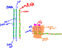
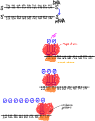

# Genetik Şifre ve Protein Sentezi
1. Protein polipeptidin şapelonda katlanmış şeklidir. Protein yapısal ve işlevsel (enzimler, antikorlar, hormonların bazıları olarak iki gruba ayrılır.
2. Bir amipin çekirdeği mikroenjeksiyonla çıkarılırsa çekirdeksiz amip ancak 20 dakika yaşar. Ölüm nedeni yeni mRNA sentezi için kalıp yokluğudur.
3. Hücrede protein sentezi süreklidir. Kesintiye uğrarsa hücrenin onarımı ya da tepkimelerinin işleyişi geriler ya da gerçekleşmez. Hücre ölür.

64 şifre (kod)\
ⅰ 1 tanesi başlatıcı (AUG, metiyonin)\
ⅱ 3 tanesi durdurucu (UAG, UGA, UAA)\
61 şifre aminoasitleri karşılar, 3 şifrenin aminoasit karşılığı yok\
Bir aminoasidin 1 ila 6 şifresi olabilir.

DNA 64, mRNA 64, tRNA 61 çeşit kod barındırır.

 
