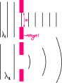

# Dalga Mekaniği

\
**Kırınım**: İkinci şekilde olduğu gibi doğrusal dalgaların bir engelden geçtikten sonra bükülerek dairesel dalgalar şeklinde yayılması olayına denir.

Kırının olayının olması için dalgaların dalga boyunun engel aralığından büyük ya da ona eşit olması gerekir.

*örnek 1*\
Dalgaların kırınıma uğramadığı bir ortamda dalgaların kırınıma uğraması isteniyor. Dalgaların kırınıma uğraması için\
Ⅰ. Kaynağın frekansının artılmalı\
Ⅱ. Suyun derinliği artırılmalı\
Ⅲ. Engel aralığı daraltılmalı\
işlemlerinen hangileri tek başına yapılabilir?\
```
V = λf, frekans artırılırsa λ azalır. Ⅰ uygulanamaz.
Derinliğin arttığı yerde hız artar. Hız artarsa salga boyu da artar. Ⅱ uygulanabilir.
Engel aralğı daraltılırsa λ engel aralığından fazla olabilir. Ⅲ uygulanabilir. 
Ⅱ ve Ⅲ
```

\
Dar engelden geçen ışık kırınıma uğrayabilir.
