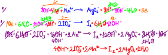

# İndirgenme ve Yükseltgenme Tepkimeleri
Kimyasal bir tepkimede bir atomun değerliği (yükü) artıyorsa bu taneciğe yükseltgeniyor denir. Yükseltgenme elektron verek gerçekleşir.\
Mg(k) → Mg²⁺(suda) + 2e (yükseltgenme yarı tepkimesi)\
Al(k) → Al³⁺(suda) + 3e (yükseltgenme yarı tepkimesi)

Kimyasal bir tepkimede bir atomun değerliği (yükü) azalıyorsa bu taneciğe indirgeniyor denir. İndirgenme elektron alarak gerçekleşir.\
Ca²⁺(suda) + 2e → Ca(k) (indirgenme yarı tepkimesi)\
O₂ + 4e → 2O⁻² (indirgenme yarı tepkimesi)

Kimyasal tepkimelerde yükseltgenme ve indirgenme eş zamanlı gerçekleşir. Buna göre indirgenme ve yükseltgenmenin izlendiği tepkimelere *indirgenme - yükseltgenme tepkimeleri* ya da *redoks tepkimeleri* denir. Redoks tepkimesinde kendisi yükseltgenirken karşısındakini indirgeyen maddeye *indirgen*, kendisi indirgenirken karşısındakini yükseltgeyen maddeye *yükseltgen* denir.

## Redoks Tepkimelerinin Denkleştirilmesi
Redoks tepkimeleri denkleştirilirken şunların bilinmesi önemlidir:
1. Elementlerin ve element moleküllerinin yükü sıfırdır.
2. Bileşiklerin toplam yükü sıfırdır.
3. En az iki farklı atomdan oluşan yüklü taneciklere kök denir. Kökün yükü kökü oluşturan atomların iyonların toplamına eşittir.
4. Hidrojen, metallerle yaptığı bileşiklerde -1 ametallerle +1 değerlik alır.
5. Oksijen, genelde -2 yüklü oksit hâlinde bulunur; fakat 1A ve 2A grubu elementleri oksijenle peroksit denilen özel bir bileşik yapar.\
Peroksit bileşiklerinde oksijen -1 yüklüdür. 1A grubu elementlerinin yaptığı peroksit bileşikleri X₂O₂ formunda, 2A grubu elementlerinin yaptığı bileşikleriyse XO₂ formundadır. H₂O₂ (hidrojen peroksit), CaO₂\
Oksijen sadece florla yaptığı bileşiğinde 2+ yüklüdür.
6. Flor, en kuvvetli ametal olduğundan tüm bileşiklerinde 1- yüklüdür. 
7. Flor dışındaki halojenler metallerle ya da hidrojenle yaptığı iki atomlu bileşiklerde 1- yüklüdür (NaCl, MgCl₂, HCl...), bunların dışındaki bileşiklerde -1 ile +7 arasındaki tek sayıları değerliklerini alabilir.
8. Alkali metaller (Li, Na, K, Rb, Cs, Fr) 1+\
Toprak alkali metaller (Be, Mg, Ca, Sr, Ba, Ra) 2+\
Al 3+, Zn 2+, Ag 1+

Redoks Tepkimeleri; asidik ortam, bazik ortam ve nötr ortam olmak üzere üç grupta incelenir. Değerlik yöntemi ve yarı tepkime yöntemi olarak iki yöntem redoks tepkimelerinin denkleştirilmesinde kullanabilir.

### Değerlik Yöntemi
1. Her bir atomun yükü bulunur.
2. Yükü değişen atomlar saptanıp sayıları geçici olarak eşitlenir.
3. Alınan ve verilen elektron sayıları eşitlenir.
4. Yük denkliği yapılır.\
Tepkime asidik ortamda gerçekleşiyorsa H⁺ (+1), bazik ortamda gerçekleşiyorsa OH⁻ ile yük denkliği sağlanır. Gerekli tarafa gerektiği kadar H⁺ (asitse) ya da OH⁻ (bazsa) eklenir.\
Hidrojen denkiğini sağlamak için gerekli tarafa gerektiği kadar H₂O eklenir.

*örnek 1* Asidik ortamda gerçekleşen\
Zn + NO₃⁻ → NH₃ + ZnO₂⁻²\
tepkimesi en küçük tam sayılarla denkleştirilirse suyun katsayısı kaçtır?\
 

*örnek 2* Bazik ortamda gerçekleşen\
PbO₂ + Cl⁻ → ClO₂ + Pb(OH)₃⁻\
tepkimesi en küçük tam sayılarla denkleştirilirse suyun katsayısı kaçtır?\
 

*örnek 3* Bazik ortamda gerçekleşen\
Fe²⁺ + MnO₄⁻ → Fe³⁺ + Mn²⁺\
tepkimesi en küçük tam sayılarla denkleştirilirse suyun katsayısı kaçtır?\
 

*örnek 4* Asidik ortamda gerçekleşen\
I⁻ + NO₂²⁻ → I₂ + NO₃\
tepkimesi en küçük tam sayılarla denkleştiriniz.\
 

*örnek 5* Bazik ortamda gerçekleşen\
P → PH₃ + H₂PO₂⁻\
tepkimesi en küçük tam sayılarla denkleştiriniz.\
 

*örnek 6* Bazik ortamda gerçekleşen\
Mn²⁺ + IO₃⁻ → MgO₄⁻ + I₂\
tepkimesi en küçük tam sayılarla denkleştiriniz.\
 

### Yarı Tepkime Yöntemi
1. Bu yöntemde atomların değerliklerinin bulunmasına gerek yoktur.
2. Aynı cins atomları içeren türler karşılıklı yazılır.
3. Her bir yarı tepkimeye sırasıyla şu işlemler uygulanır:\
ⅰ Eksik oksijen sayısı kadar H₂O, gerekli tarafa gerektiği kadar eklenir.\
ⅱ Hidrojen denkiği için gerektiği tarafa gerektiği kadar H⁺ eklenir.\
ⅲ Asidik ortamdaysa yük denkliğini sağlamak için elektron eklenir.\
Asidik ortamsa yukarıdaki basamaklar yeterlidir. Bazik ortamda gerçekleşiyorsa:\
ⅳ H⁺ kadar OH⁻ tepkimenin her iki tarafına yazılır.\
ⅴ Aynı taraftaki H⁺ ve OH⁻ yerine su yazılır.\
ⅵ Yük denkliği elektron ile sağlanır, yarı tepkimeler taraf tarafa toplanır.

*örnek 7* Bazik ortamda gerçekleşen\
Mn²⁺ + IO₃⁻ → MgO₄⁻ + I₂\
tepkimesi en küçük tam sayılarla denkleştiriniz.\
 

*örnek 8* Bazik ortamda gerçekleşen\
P₄ → PH₃ + H₂PO₂⁻\
tepkimesi en küçük tam sayılarla denkleştiriniz.\
 

## Nötr Ortam Redoksu
*örnek 9* Nötr ortamda gerçekleşen\
Cu + HNO₃ → Cu(NO₃)₂ + NO + H₂O\
tepkimesi en küçük tam sayılarla denkleştiriniz.\
 


# Redoks ve Elektrik
İndirgenme - yükseltgenme tepkimeleri elektron alışverişi sonucunda oluşmaktadır. Tepkimeye giren türler arasındaki elektron alışverişi, ya doğrudan temas yoluyla ya da dolaylı yolla olabilir.

Doğrudan temas yoluyla gerçekleşen redoks tepkimelerinde elektron alışverişi tepkimenin gerçekleşmesi sırasında taneciklerin çarpışmasıyla meydana gelir (Metal asit tepkimesi gibi.).

Dolaylı yolsan gerçekleşen redoks tepkimelerinde indirgen ve yükseltgen arasında iletken bir dış devre vardır. Elektron iletimi bu dış devreyle gerçekleşir. Elektronun bir iletken yardımıyla tek yönlü hareketi sonucunda elektrik akımı oluşur.

Doğada gerçekleşen olaylar istemli ve istemsiz olarak sınıflandırılır. Doğadaki herhângi bir olayın başlaması için bir dış etkiye ihtiyaç vardır. İstemli olaylarda olay başladıktan sonra devam etmek için herhângi bir etkiye ihtiyaç duymaz. İstemsiz olaylarda ise olayın devam edebilmesi için sürekli bir etki gerekir. Redoks tepkimeleri de istemli ve istemsiz olarak sınıflandırılabilir.

## Elektrot ve Elektrolit
Elektrokimya, kimyasal tepkimelerle elektrik enerjisi arasındaki ilişkiyi inceleyen bilim dalıdır. Elektrokimyasal tepkimeler aynı zamanda bir redoks tepkimesidir fakat her redoks tepkimesinden elektrik akımı oluşmadığı için her redoks tepkimesi elektrokimyasal tepkime değildir.

**Elektrolit**: Elektrokimyasal tepkimenin gerçekleşmesi için kullanılan iletken çözeltilere elektrolit denir. Sıvı tuzlar; asit, baz ve tuzların sulu çözeltileri elektrolittir.\
**Elektrot**: Elektrolit çözeltilere batırılan iletken çözeltilere elektrot denir. Elektrotlarda metaller kullanıldığı gibi grafit de kullanılabilir. Metal elektrotlarda elektrotun yapıldığı metal ile çözeltideki metal katyonu aynı ya da farklı olabilir.\
**Yarı Hücre**: Bir elektrolit ve buna batırılmış elektrottan oluşan sistemlere yarı hücre denir. Kimyasal bir pilde iki yarı hücre, bunları birbirine bağlayan bir iletken ve iki hücredeki metal katyonlarının dengesini sağlamak için içi doymuş tuz çözeltisiyle doldurulmuş U borusu gerekir.
 

İndirgenmenin olduğu elektrota katot, yükseltgenmenin olduğu elektrota anot nedir. Pil tepkimeleri ekzotermik denge tepkimeleridir. Tepkime başladıktan sonra akım üretimi dengeye ulaşıncaya kadar devam eder. Dengeye ulaşan pil bitmiştir.

Elektrot olarak genellikle metal kullanılır fakat bazı durumlarda *inört elektrot* denilen elektrotlar da tercih edilir. Bunlar altın, platin, hidrojen gazı ve karbonun allotropu olan grafittir. 

**Galvnik Hücre**: İki yarı hüceden oluşan sistemler akım ürettiği için *galvanik hücre* adını alır. Galvanik hücrelerdeki redoks tepkimeleri istemli redokslardır.

**Elektrolitik**: İstemsiz redoksların gerçekleşebilmesi için sürekli elektrik enerjisi verilmelidir. Bu tür sistemlere *elektrolitik sistemler* denir. 

Mg ve Cu elektrotların kullanıldığı galvanik bir hücre oluşturalım.\
ε⁰ = pil potansiyeli (25℃, 1 atm, 1M)\
Mg(k) → Mg²⁺(suda) + 2e⁻ ε⁰ = +2,38V\
Cu(k) → Cu²⁺(suda) + 2e⁻ ε⁰ = -0,34V\
Pil tepkimeleri redoks tepkimeleridir ve her redoks tepkimesinde mutlaka en az bir yükseltgenen ve en az bir indirgenen madde olmalıdır. Yukarıda verilen yarı tepkimelerde ε⁰ değeri büyük olan aynen kalırken küçük olan ters çevrilir. Bu sayede yükseltgenen ve indirgenen maddeler elde edilir.\
Yarı tepkime ters çevrilirse ε⁰ın işareti değişir fakat yarı tepkime herhângi bir sayı ile genişletilirse ε⁰ değişmez.
```js
               Mg(k) → Mg²⁺(suda) + 2e⁻   ε⁰ = +2,38V (anot yarı tepkimesi)
 +  Cu²⁺(suda) + 2e⁻ → Cu(k)              ε⁰ = +0,34V (katot yarı tepkimesi)
-----------------------------------------
 Cu²⁺(suda) + Mg(k) → Mg²⁺(suda) + Cu(k)   ε⁰ = +2,72V (pil tepkimesi)
```

Galvanik hücre çalışmaya başladığında anotta aşınma katotta birikim gözlenir. Elektronlar dış devrede anottan katoda, iç devrede ise katottan anoda doğru hareket eder.\
 

*örnek 10*\
Ni²⁺(suda) + 2e⁻ → Ni⁰(k) ε⁰ = -0,25V\
Ag⁺(suda) + 1e⁻ → Ag⁰(k) ε⁰ = +0,80V\
1. Anot ve katot yarı tepkimelerini yazarak anodu, katodu ve bunların yük denkliğini yazınız.
```js
              Ni⁰(k) → Ni²⁺(suda) + 2e⁻       ε⁰ = +0,25V (anot yarı tepkimesi)
 +  2Ag⁺(suda) + 2e⁻ → 2Ag⁰(k)                ε⁰ = +0,80V (katot yarı tepkimesi)
```
2. Pil tepkimelerinde yazarak pil potansiyelini hesaplayınız. Pilin çalışıp çalışmadığını belirtiniz.\
```js
2Ag⁺(suda) + Ni(k) 2e⁻ → 2Ag(k) + Ni²⁺ + 2e⁻  ε⁰ = +1,05V
ε⁰ > 0 ise pil kendiliğinden çalışır
ε⁰ < 0 ise pil çalışmaz
ε⁰ = 0 ise pil dengeye ulaşıştır
```
3. Pil şemasını yazınız.\
anottaki değişim//katottaki değişim\
Ni(k) / Ni²⁺(aq) // 2Ag⁺(aq) / 2Ag(k)
4. Galvanik hücreyi çizerek elektron hareket yönünü ve tuz köprüsünde anyon - katyon hareketini gösteriniz.
 


*örnek 11*\
Mg(k) → Mg²⁺ + 2e⁻ ε⁰ = +2,40V
Cu(k) → Cu²⁺ + 2e⁻ ε⁰ = -0,34V
1. Anot ve katot yarı tepkimelerini yazarak anodu, katodu ve bunların yük denkliğini yazınız.
```js
             Mg(k) → Mg²⁺(aq) + 2e⁻    ε⁰ = +2,40V  (katot yarı tepkimesi)
 +  Cu²⁺(aq) + 2e⁻ → Cu(k)             ε⁰ = +0,34V  (anot yarı tepkimesi)
-------------------------------------
 Mg(k) + Cu²⁺(aq) → Mg²⁺(aq) + Cu(k)   ε⁰ = +2.74V
```


## Standart Hidrojen Elektrotu
 

## Derişim Pilleri
Anot ve katodun aynı metalden yapıldığı, elektrolit olarak aynı metalik katyonunu içeren pillerdir. Pilin kendiliğinden çalışabilmesi için elektrolit derişimlerinin farklı olması gerekir. Bu tür çalışan pillerde derişimi küçük olan yarı hücre anot alınır.

\
Elektrolit derişimleri bir molardan farklı olduğu için pil potansiyeli Nerst denliğinden hasaplanır. Bu denkliğe göre:\
pil pil potansiyeli = Δε = Δε⁰ - logQ × 0,059 / n\
Δε⁰ = standart pil potansiyeli\
Δε = yeni pil potansiyeli\
n = alınan ya da verilen toplan elektron sayısı\
Q = denge kesri = \[anot iyon\] ^ n / \[katot iyon\] ^ m

*örnek 11*\
\
Δε kaçtır?\
(log2 = 0,3) (0,059 değerini 0,06 alınız)\
Ag⁺ (2M) ⇄ Ag⁺ (1M)\
Q = 1/2\
n = 1\
Δε⁰ = 0\
Δε = 0 - 0,06 × log(1/2) = 18e-3V


# Metallerde Aktiflik
Bir elementin kimyasal tepkimeye girme isteğine *aktiflik* denir. Metaller elektron verme, ametaller ise elektron alma eğilimindedir. Buna göre yükseltgenme eğilimi büyük olan metallere *aktif metal*, indirgenme eğilimi büyük olan ametallere *aktif ametal* denir.

ε⁰ potansiyeli pozitif olan metaller aktif, negatif olan metaller ise pasif metal olarak tanımlanır. Pasif metaller yarı soy ve soy metal olarak iki grupta incelenir.

*Yarı soy metaller*: Cu, Ag, Hg\
*Soy metaller*: Au, Pt

\
Kapta tepkime kendiliğinden gerçekleşiyor.\
Zn⁰(k) → Zn⁺² + 2e\
2H⁺(aq) + 2e → H₂⁰\
Yükseltgenme eğilimi büyük olan Zn'dir

\
Kapta herhângi bir tepkime gerçekleşmez. Zn'nun aktifliği Ag'ten büyüktür.

*Kapta tepkime gerçekleşiyorsa katı hâldeki metal, tepkime gerçekleşmiyorsa iyon hâldeki metal daha aktiftir.


# Elektroliz
1. Elektrokimyasal piller (galvanik hücreler) kimyasal enerjiyi elektrik enerjisine dönüştürür. Bu hücrelerdeki redoks tepkimeleri istemli redoks tepkimeleridir.
2. Elektrik akımı kullanılarak gerçekleştirilen istemsiz redoks tepkimeleri *elektroliz* olarak adlandırılır. Bu sistemlere *elektrolitik hücre* denir.
3. Elektroliz olayını bozabilmesi için katot ile anot arasına minimum bir gerilim uygulanması zorludur. Bu değere *ayrışma potansiyeli* denir. Bu değer aynı bileşenlerden galvanik hücre elde edildiğinde bulunan Δε⁰ değerinden büyük olmalıdır.
4. Elektroliz kimyasal bir ayrışma yöntemidir. Tek yönlü gerçekleşir ve endotermiktir. Tepkimenin tek yönlü olabilmesi için anyonlar ve katyonlar zıt elektrotlara doğru hareket etmelidir.

\
Elektrolizde önce pasif olanlar toplanır.

| K (-) | A (+) |
|-|-|
| Soy metaller (Pt, Au) | Halojenler (F hariç, I₂, Br₂, Cl₂...) |
| Yarı soy metaller (Cu, Ag, Hg) | Sudan gelen OH⁻ iyonu, 2O⁻² → O₂⁰ + 4e⁻ |
| Sudan gelen H⁺, 2H⁺ + 2e⁻ → H₂⁰(g) | F⁻ iyonu |
| B grupları | Kökler |

Elektrolit olarak kullanılan sıvılar incelendiğinde ya bir tür (+) ve bir tür (-)den oluşan elektrolit (Herhângi bir tuzun elektroliti gibi.) ya da birden fazla (+) ve (-) yük içeren elektrolitler (Farklı tuzların elektrolitlerinin karışımları gibi.) kullanılabilir.


*örnek 12*\
\
Katot ve anotta toplanacak iyonları yazınız.

| A (+) | K (-) |
|-|-|
| Cl⁻ | Na⁺ |
| I⁻ | Mg⁺ |
| OH⁻ | H⁺ |

Önce pasif elementler toplanır.\
Anotta toplanma sırası: I₂, Cl₂, O₂ \
Katotta toplanma sırası: H₂, Mg(k), Na(k)


*örnek 13*\
\
Toplanma sıralarını yazınız. (elektron verme eğilimi Mg > Zn > H₂ > Br₂ > Cl₂ > OH⁻)

Katotta toplananlar: Br₂ - Cl₂ - O₂ \
Anotta toplananlar: H₂ - Zn(k) - Mg(k)

## Elektrolizde Toplanan Madde Miktarının Hesaplanması
Q = I × t\
Q: yük (c), I: akım (A), t: elektroliz süresi (s)\
*Devreden bir mol elektron geçerse 96.500 coulomb yük oluşur.*

*örnek 14*\
0,3 mol elektron, erimiş XClₙ tuzundan 0,1 mol X açığa çıkartıyor. Buna göre n sayısı kaçtır?\
A (+): Cl⁻ \
K (-): Xⁿ⁺ \
Xⁿ⁺ + ne⁻ → X⁰(k)\
0,3 mol elektron 0,1 mol X açığa çıkarıyorsa n = 3


*örnek 15*\
\
Katodunda NK'da 2,24L H₂ gazı toplanıyor.\
Katodunda hangi maddeden kaç gram toplanır? (Ag: 108, Cl: 35,5)
```md
0,1 mol H₂ → 0,2 mol elektron
1 mol elektron → 1 mol Ag
0,2 mol elektron → x mol Ag
x = 0,2
toplam Ag kütlesi: 21,6
```

*örnek 16*\
Ⅰ. kapta Mg²⁺, Ⅱ. kapta X³⁺ iyonları çözünmüş hâldedir. Kaplar elektroliz ediliyor.\
Seri bağlı kaplardan bir süre akım geçirildiğinde 1. kapra 7,2 gram Mg metali, 2. kapta 5,2 gram X metali toplandığına göre X metalinin mol kütlesi kaçtır? (Mg: 24)
```md
0,3 mol Mg → 0,6 mol elektron
0,6 mol elektron → 0,2 mol X
X'in kütlesi: 5,2 / 0,2 = 27
```

*örnek 17*\
Erimiş FeCl₃ ve XCl₄ sıvıları seri bağlı elektroliz kaplarına elektroliz edilirken birinci kabın katodunda 0,2 mol Fe metali oluşurken ikinci kabın katoduna 17,7 gram x metali oluşuyor. X'in atom kütlesi kaçtır?
```md
1 mol Fe³⁺ → 3 mol elektron
0,2 mol Fe³⁺ → 0,6 mol elektron
1 mol elektron → 0,25 mol X⁴+ 
0,6 mol elektron → 0,15 mol X
0,15 mol X 17,7 gram ise X'in atom kütlesi: 118
```

*örnek 18*\
\
Birinci ve ikinci kaplar özdeştir. Devreden bir süre akım geçirildiğinde kapların katotlarında 0,2 mol Al, 0,3 mol X ve 0,1 mol Y toplanıyor. m ve n değerleri kaçtır?
```md
0,2 mol Al³⁺ → 0,6 mol elektron
0,6 mol elektron kollara sıfır tam onda üçer mol elektron olacak şekilde paylaşılacak.
m: 1
n: 3
```

*örnek 19*\
CuF₂ tuzunun sulu çözeltisi 19,3A akım ile 25 dakika elektroliz edildiğinde katotta kaç g madde toplanır? (H: 1, O: 16, F: 19, Cu: 64)
```md
60 × 25 × 19,3 / 96000 = 0,3 mol elektron
0,3 mol elektron 0,15 mol Cu = 9,6g
```

*örnek 20*\
Al³⁺ iyonlarını içeren bir çözeltiden 0,15 faradaylık elektrik yükü geçirildiğinde katotta kaç g Al metali toplanır? (Al: 27)
```md
1 faraday = 1 mol elektron yükü
0,15 mol elektron 0,05 mol Al
1,35g Al
```

*örnek 21*\
Saf su, Hoffman voltametresiyle elektroliz edildiğinde anot ve katotta toplam 120cm³ gaz toplanmaktadır. Buna göre anot ve katotta toplanan fazların türü ve hacimleri kaçtır?
```md
2H₂O → O₂ + 2H₂
Anotta O₂ 40cm³
Katotta H₂ 80cm³
```

# Pil Türleri
## a. Lityum İyon Pili
1. 1972'de keşfedilmiş fakat piyasaya 1991'de sürülmüştür.
2. Lityum iyon piller küçük fakat yüksek enerjili pillerdir. Fazla miktarda enerji üretebilirler.
3. Bu pilin çalışması sırasında grafit katmanları arasında lityum atomları elektron verip lityum iyonuna dönüşürken grafiti terk eder. Katotta kobalt ve kobalt oksitten oluşan katmanlı bir yapı vardır. Elektrolitten geçen lityum iyonları katotta lityum kobalt oksit bileşiğine dönüşür. Tüm lityum iyonları anodu anodu terk ettiğinde pil bitmiştir.

## b. Güneş Pili
1. Güneş enerjisinden elektrik elde etmek için fotovolteik hücreler kullanılır.
2. Fotovolteik hücreler yarı iletken malzemelerden üretilir ve Güneş ışığını doğrudan elektriğe çevirir.
3. Güneş pilleri N tipi ve P tipi katkılanma olmak üzere iki grupta incelenir.\
N tipinde Si eriğine cetvelin beşinci grup elementi olan F eklenir, silisyumun son yörüngesinde 4, fosforun son yörüngesinde 5 elektron olduğu için oluşan kristal yapıda elektron fazlalığı oluşur.\
P tipi katkılanmada ise silisyum eriğine 3. grup elementlerinden biri (Al, B, In...) eklenir. Burada oluşan kristal yapıda da elektron eksikliği meydana gelir.\
N ve P tipi katmanlar üst üste getirildiğinde fazla olan elektron eksik tarafa Güneş enerjisiyle geçerken akım üretilir.

## c. Yakıt Pilleri
1. Yakıt pilleri sürekli yakıtla beslendiğinden daima enerji üretir. Bu özelliklerinden dolayı da fosil yakıtların yerini alabilecek en iyi alternatif kaynaktır.
2. Yakıt pilinde elektronlar, katoda doğru dış devreden aktarılırken H⁺ iyonları da elektrolit yardımıyla elektroda geçer. Katotta oksijen ve hidrojen tepkimeye girerek su oluşturur. Elektronun hareketiyle elektrik akımı üretilir.


# Korozyon
1. Metal veya alaşımlarının çeşitli etkiler altında istemli kimyasal ya da elektrokimyasal tepkimeler sonucu aşınmasına ya da metalik özelliklerini kaybetmesine korozyon denir. 
2. Metallerin korozyona uğrama eğilimleri oksijen ile olan ilgilerine bağlıdır. Oksijen ilgisi çok olan metaller daha kolay korozyona uğrar.
3. Nem, sıcaklık, metale farklı metal teması ve metal üzerinde elektrolit toplanması korozyonu etkileyen faktörlerdir.
4. Nemli ortam, metalin korozyona uğramasını hızlandırır çünkü sudan oluşan ince bir katman elektrolit olarak metalin yüzeyini kaplar. Bu da metalin havadaki oksijenle etkileşimi hızlandırır. 
5. Eğer metal oksitlenme eğilimi (yükseltgenme eğilimi) düşük olan metallerle temas ettirilirse daha hızı korozyona uğrar.
6. Korozyondan korunma yolları:
  - Boyama\
  Metallerin boyanması, oksijen ve suyun metalle olan doğrudan temasını engelleyerek korozyonu önler fakat boya yüzeyi aşındığında korozyon tekrar başlar.
  - Elektro kaplama\
  Elektroliz sırasında katot görevi gören metal malzeme üzerine ikinci bir metal tabakasını elektrikle kaplamadır. Daha çok Zn, Sn ya da Cr metalleri tercih edilir. Çinko kullanılarak yapılan elektro kaplamaya *galvanizleme* denir.
  - Katodik koruma\
  Metalin üzerine kendisinden daha aktif bir metal tutturulmasına katodik koruma denir. Aktif metal yükseltgenerek kendi yapısını değiştirirken metali korur. Bu nedenle metale tutturulan aktif metale kurban elektrot denir.


