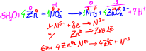
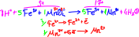
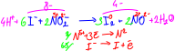

# Redoks
## İndirgenme ve Yükseltgenme Tepkimeleri
Kimyasal bir tepkimede bir atomun değerliği (yükü) artıyorsa bu taneciğe yükseltgeniyor denir. Yükseltgenme elektron verek gerçekleşir.\
Mg(k) → Mg²⁺(suda) + 2e (yükseltgenme yarı tepkimesi)\
Al(k) → Al³⁺(suda) + 3e (yükseltgenme yarı tepkimesi)

Kimyasal bir tepkimede bir atomun değerliği (yükü) azalıyorsa bu taneciğe indirgeniyor denir. İndirgenme elektron alarak gerçekleşir.\
Ca²⁺(suda) + 2e → Ca(k) (indirgenme yarı tepkimesi)\
O₂ + 4e → 2O⁻² (indirgenme yarı tepkimesi)

Kimyasal tepkimelerde yükseltgenme ve indirgenme eş zamanlı gerçekleşir. Buna göre indirgenme ve yükseltgenmenin izlendiği tepkimelere *indirgenme - yükseltgenme tepkimeleri* ya da *redoks tepkimeleri* denir. Redoks tepkimesinde kendisi yükseltgenirken karşısındakini indirgeyen maddeye *indirgen*, kendisi indirgenirken karşısındakini yükseltgeyen maddeye *yükseltgen* denir.

### Redoks Tepkimelerinin Denkleştirilmesi
Redoks tepkimeleri denkleştirilirken şunların bilinmesi önemlidir:
1. Elementlerin ve element moleküllerinin yükü sıfırdır.
2. Bileşiklerin toplam yükü sıfırdır.
3. En az iki farklı atomdan oluşan yüklü taneciklere kök denir. Kökün yükü kökü oluşturan atomların iyonların toplamına eşittir.
4. Hidrojen, metallerle yaptığı bileşiklerde -1 ametallerle +1 değerlik alır.
5. Oksijen, genelde -2 yüklü oksit hâlinde bulunur; fakat 1A ve 2A grubu elementleri oksijenle peroksit denilen özel bir bileşik yapar.\
Peroksit bileşiklerinde oksijen -1 yüklüdür. 1A grubu elementlerinin yaptığı peroksit bileşikleri X₂O₂ formunda, 2A grubu elementlerinin yaptığı bileşikleriyse XO₂ formundadır. H₂O₂ (hidrojen peroksit), CaO₂\
Oksijen sadece florla yaptığı bileşiğinde 2+ yüklüdür.
6. Flor, en kuvvetli ametal olduğundan tüm bileşiklerinde 1- yüklüdür. 
7. Flor dışındaki halojenler metallerle ya da hidrojenle yaptığı iki atomlu bileşiklerde 1- yüklüdür (NaCl, MgCl₂, HCl...), bunların dışındaki bileşiklerde -1 ile +7 arasındaki tek sayıları değerliklerini alabilir.
8. Alkali metaller (Li, Na, K, Rb, Cs, Fr) 1+\
Toprak alkali metaller (Be, Mg, Ca, Sr, Ba, Ra) 2+\
Al 3+, Zn 2+, Ag 1+

Redoks Tepkimeleri; asidik ortam, bazik ortam ve nötr ortam olmak üzere üç grupta incelenir. Değerlik yöntemi ve yarı tepkime yöntemi olarak iki yöntem redoks tepkimelerinin denkleştirilmesinde kullanabilir.

#### Değerlik Yöntemi
1. Her bir atomun yükü bulunur.
2. Yükü değişen atomlar saptanıp sayıları geçici olarak eşitlenir.
3. Alınan ve verilen elektron sayıları eşitlenir.
4. Yük denkliği yapılır.\
Tepkime asidik ortamda gerçekleşiyorsa H⁺ (+1), bazik ortamda gerçekleşiyorsa OH⁻ ile yük denkliği sağlanır. Gerekli tarafa gerektiği kadar H⁺ (asitse) ya da OH⁻ (bazsa) eklenir.\
Hidrojen denkiğini sağlamak için gerekli tarafa gerektiği kadar H₂O eklenir.

*örnek 1* Asidik ortamda gerçekleşen\
Zn + NO₃⁻ → NH₃ + ZnO₂⁻²\
tepkimesi en küçük tam sayılarla denkleştirilirse suyun katsayısı kaçtır?\
 

*örnek 2* Bazik ortamda gerçekleşen\
PbO₂ + Cl⁻ → ClO₂ + Pb(OH)₃⁻\
tepkimesi en küçük tam sayılarla denkleştirilirse suyun katsayısı kaçtır?\
 

*örnek 3* Bazik ortamda gerçekleşen\
Fe²⁺ + MnO₄⁻ → Fe³⁺ + Mn²⁺\
tepkimesi en küçük tam sayılarla denkleştirilirse suyun katsayısı kaçtır?\
 

*örnek 4* Asidik ortamda gerçekleşen\
I⁻ + NO₂²⁻ → I₂ + NO₃\
tepkimesi en küçük tam sayılarla denkleştiriniz.\
 

*örnek 5* Bazik ortamda gerçekleşen\
P → PH₃ + H₂PO₂⁻\
tepkimesi en küçük tam sayılarla denkleştiriniz.\
 
