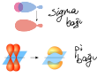
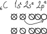
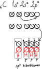
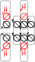
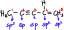

# Karbon Kimyasına Giriş
## Organik ve Anorganik Bileşikler
1. Temel kaynağı genelde canlı organizmalar olan ve yapılarında karbon atomu bulundar bileşikler *organik bileşiklerdir*. Karbonun yanında genellikle H, O, N ve S de bulunabilir.
2. Organik kelimesini ilk Berzelius kullanmış, Wöhler amonyum siyanattan (NH₄CN) çıkararak organik bileşik olan üreyi elde edip organik bileşiklerin sadece canlı organizmalardan sentezlenmediğini, laboratuvarda da sentezlenebildiğini göstermiştir.
3. CO, CO₂, CO₃²⁻, CN⁻, karbür bileşikleri karbon içermesine rağmen organik değildir.
4. Organik bileşiklerin çeşitlerinin fazla sayıda olma sebebi öncelikle karbon atomunun $ bağ yapabilmesidir. Ayrıca karbon atomları hem kendi aralarında hem de diğer atomlarla bağ yapabilir. Karbonların kendi arasında yaptığı bağlar oldukça sağlam apolar kovalent bağlardır. Bunun sonucunda uzun karbon zincirleri elde edilir.

## Organik ve Anorganik Bileşikler Arasındaki Farklılık
| Organik | Anorganik |
|--|--|
| Çeşitleri çok fazladır. | Çeşitleri oldukça azdır. |
| Genelde kovalent  bağ içerdikleri için moleküler yapıda bulunur. | İyonik ya da kovalent bağ içerebilir. |
| Tepkimeleri oldukça yavaş gerçekleşir. | Tepkimeleri çok hızlıdır. |
| Hâl değişim sıcaklıkları düşüktür. | Yüksek hâl değişim sıcaklıklarına sahiptir. |
| Kendilerine özgü kokuları vardır. | Genellikle kokusuzdur. |
| Genelde yanıcıdır. | Genellikle yanmaz. |

## Doğada Karbon
Aynı element atomlarının farklı şekillerde dizilmesi ile allotroplar oluşur.
- elmas, grafit, fulleren: karbonun allotropları
- kırmızı fosfor, beyaz fosfor: fosforun allotropları
- O₂, O₃: oksijenin allotropları
- rombik, monokin, emorf kükürt: kükürtün allotropları

Karbonun allotroplarından olan elmas ve grafit doğal iken fulleren sentetik allotroptur.

### Elmas
1. Karbonun doğal allotropudur.
2. Karbon bağları düzgün dört yüzlü geometrik bir şekil oluşturarak düzgün kristal yapı oluşturur. Bu da elmasa ışık geçirgenliği sağlar.
3. Karbon atomları arasında oluşan ağ örgülü kovalent bağ, elması bilinen en sert doğal madde yapmıştır.

### Grafit
1. Karbonun doğal allotropudur.
2. Karbon atomları halkalar şeklinde tabakalar oluşturmuştur. Tabakalar arasında zayıf etkileşimler vardır. Bu etkileşimler grafite elektrik iletkenliği ve yumuşaklık (kayganlık) sağlar.
3. Ağ örgülü kovalent bağlardan dolayı hâl değişirken sıcaklıkları çok yüksektir. Bu nedenle kalıp olarak kullanılırken hassas mekanik cihazların kayganlaştırılmasında da kullanılır.

### Fulleren
1. Karbonun sentetik allotropudur.
2. Nanometre boyutunda olup oldukça sağlamdır.
3. Bir fulleren taneciği C₆₀ ile gösterilir. C₆₀tan oluşan fulleren yalıtkandır.
4. Karbon sayısı değiştirilerek elde edilen bazı fulleren türleri süper iletken özellik taşır. Bu tür fullerenler elektronikte, tıpta, güneş pillerinde kullanılmaktadır. Fulleren, küresel bir yapıya sahip olan beşgen ve altıgen halkaların birleşmesinden oluşur. (20 altıgen, 12 beşgen)

### Nanotüp
1. Grafitten elde edilen nanometre boyutundaki tüplerdir.
2. Cep telefonları, televizyon ve bilgisayar gibi birçok aletin küçülmesini sağlamıştır. Çelikten daha hafif ve daha sağlamdır.
3. Üstün duyarlılıkta algılayıcıların yapımında kullanılır.

### Grafen
1. Grafitin lazer ile buharlaştırılmasıyla elde edilen sentetik maddelerdir. 
2. Grafitin tek katmanlı hâlidir.
3. Çelikten çok daha sağlamdır. Bilinen en ince iki boyutlu malzemedir.
4. Elektriği ve ısıyı iyi iletir, yüksek sıcaklıklara dayanabilir.
5. Ulaşım, tıp, elektronik, savuna sanayi gibi birçok alanda kullanılır.


## Organik Bileşiklerin Basit ve Molekül Formüllerinin Bulunması
1. Bir bileşikteki elementlerin türünü, atomlarını birbiri ile birleşme oranını gösteren formüllere *basit formül* denir. En küçük tam sayılarla oluşturulur.
2. Bileşikteki atomların türünü ve gerçek birleşme sayılarını gösteren formüllere *molekül formülü* denir.

(basit formül kütlesi) × k = molekül formül kütlesi\
k: tam sayı, sadeleştirme kat sayısı

*Molekül Formülü (Kapalı Formül)*: Atomların türünü ve gerçek bağlanma sayısını gösteren formüldür. (C₆H₁₄)\
*Basit Formülü*: Atomların birleşme oranlarını gösteren formüldür. (C₃H₇)\
*Yarı Açık Formül*: Atom gruplarının birbiri ile nasıl bağlandığını gösteren formüldür. (CH₃ ─ CH₂ ─ CH₂ ─ CH₂ ─ CH₂ ─ CH₃)\
*Açık Formül*: Atomların birbiri ile nasıl bağlandığını gösteren formüldür.
```c
   H H H H H H 
   │ │ │ │ │ │ 
 H─C─C─C─C─C─C─H
   │ │ │ │ │ │ 
   H H H H H H 
```
*İskelet Formülü*: Her bir köşenin bir karbon atomunu simgelediği, H atomlarının yazılmadığı fakat diğer atomların yazıldığı formüldür.\
 

## Sigma ve Pi Bağları
1. Değerlik bağ kuramına göre iki atomun yarı dolu orbitalleri örtüşerek bir bağ yapar.
2. İki orbitalin bağ ekseni botunca uç uca örtüşmesi ile sigma (σ) bağı oluşur. Yan yana olan orbitallerin örtüşmesi ile pi (π) bağı oluşur.

 

- Atomlar arasında oluşan ilk bağ sigma bağıdır. Sonrasında pi bağları oluşur.
- Sigma bağları pi bağlarından daha kuvvetlidir. Bu nedenle önce pi bağları kopar.
- Sigma bağları molekül geometrisine belirler.
- Bağ uzunlukları: - > = > ≡
- Bağ enerjileri: ≡ > = > -
- σ -, πσ =, ππσ ≡

### Hibrit Orbitalleri
1. Aynı enerji düzeninde hem dolu hem de boş orbital varsa bu tam dolu orbiralden 1 elektron boş orbitale sıçrar ve ve yarı dolu orbitaller oluşturur. Bu olaya hibritleşme, yeni oluşan orbitallere hibrit denir.

 

#### Orbital Örtüşme Türleri
s - s örtüşmesi: s hibritleşmesi\
s - p örtüşmesi: p hibritleşmesi\
p - p örtüşmesi: p hibritleşmesi

*örnek 1*\
CH₄ molekülü\


*örnek 2*\
C₂H₄ molekülü\


*örnek 3*\
\
Numaralandırılmış karbon atomlarının her birinin yaptığı hibritleşme türünü bulunuz.\


**Not**
1. Hibritleşmesi sorulan atomun kaç atomla bağlandığı bulunur. 
2. Bu atomun üzerinde elektron çifti varsa her çift bir atom kabul edilir. 
3. Bulunan toplam atom sayısının bir eksiği p'nin üssünü verir. (s sabittir)


### Molekül Geometrisi
*örnek 4*\
BeH₂ molekülü (₄Be, ₁H)\
\
Molekül geometrisi: Doğrusal\
Bağ açısı: 180°\
Hibritleşme: sp\
Molekül polarlığı: apolar

*örnek 5*\
BH₃ molekülü (₅B, ₁H)\
\
Molekül geometrisi: Düzlem üçgen\
Bağ açısı: 120°\
Hibritleşme: sp²\
Molekül polarlığı: apolar

*örnek 6*\
CH₄ molekülü (₆C, ₁H)\
\
Molekül geometrisi: Düzgün dört yüzlü\
Bağ açısı: 109,5°\
Hibritleşme: sp³\
Molekül polarlığı: apolar

*örnek 7*\
NH₃ molekülü (₇N, ₁H)\
\
Molekül geometrisi: Üçgen pramit\
Bağ açısı: 107°\
Hibritleşme: sp³\
Molekül polarlığı: polar

*örnek 8*\
H₂O molekülü (₈O, ₁H)\
\
Molekül geometrisi: Kırık doğru\
Bağ açısı: 104,5°\
Hibritleşme: sp³\
Molekül polarlığı: polar

----------
### VSEPR Gösterimi
Molekülde:\
Merkez atom: A\
Bağlanan atom: X\
Merkez atomdaki e⁻ çifti: E

CH₄ AX₄ \
NH₃ AX₃E\
H₂O AX₂E₂
