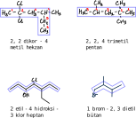

# Organik Bileşikler

# Hidrokarbonlar
Formüllerinde sadece hidrojen ve karbon içeren bileşiklerdir.


## Alkanlar
1. Moleküldeki karbon atomlarının birbirine tekli bağ ile bağlandığı düz, dallanmış ya da halkalı (siklo) hidrokarbonlardır.
2. Düz veya dallanmış alkanların genel formülü CₙH₂ₙ₊₂, halkalı alkanların genel formülleri CₙH₂ₙdir (n ≥ 3).
3. Parafinler olarak da adlandırılır.
4. Doymuş hidrokarbonlardır.
5. C atomları arasında tekli bağ bulunup tüm C atomları sp³ hibritleşmesi yapmıştır.
6. Tamamı apolardır. Yoğun fazda alkan molekülleri arasında London etkileşimleri görülür.
7. Doymuş olduklarından katılma tepkimesi vermezler, yer değiştirme tepkimesi verirler. Moleküldeki π bağının kopup yerine atom veya grupların girmesine katılma tepkimesi denir. Moleküldeki σ bağının kopup molekülden çıkan atom veya grup yerine yeni atom veya grupların geçmesine yer değiştirme tepkimesi denir.
8. Kapalı formülleri aynı, açık formülleri farklı olan maddeler izomerdir. İzomer maddelerde London bağ kuvveti temas yüzeyi ile doğru orantılıdır.
9. Karbon sayısı arttıkça homolog seri (homolog sıra) oluştururlar. Homolog sıra, iki molekül arasında CH₂ kadar fark olması durumudur.

### Alkanlarda Sınıflandırma
1. Alkanlar düz zincirli ve halkalı yapıda olabilir.
2. Düz zincirli alkanların genel formülü CₙH₂ₙ₊₂, halkalı yapıdaki alkanların genel formülü CₙH₂ₙ.

#### Düz Zincirli Alkanlar
İlk dört üyesinin kendine özgü adları vardır. 5 karbonlu alkandan itibaren karbon sayılarına karşılık gelen Latince sayının sonuna "an" eki getirilerek adlandırılır.

| sayı | Latincesi | bileşik | adlandırması |
|--|--|--|--|
| 1 | mono | CH₄ | metan |
| 2 | di | C₂H₆ | etan |
| 3 | tri | C₃H₈ | propan |
| 4 | tetra | C₄H₁₀ | bütan |
| 5 | penta | C₅H₁₂ | pentan |
| 6 | hekza | C₆H₁₄ | hekzan |
| 7 | hepta | C₇H₁₆ | heptan |
| 8 | okta | C₈H₁₈ | oktan |
| 9 | nona | C₉H₂₀ | nona |
| 9 | deka | C₁₀H₂₂ | dekan |

##### Alkil
Alkanlardan 1 H atomu çıkarılması ile oluşan bağ yapmaya elverişli gruplara *radikal* veya *aktif*  denir. Aklanın adındaki "an" eki çıkarılıp yerine "il" eki getirilerek adlandırılır.
| alkan | alkil | adlandırması |
|--|--|--|
| CH₄ | ─CH₃ | metil |
| C₂H₆ | ─C₂H₅ | propil |
| C₅H₁₂ | ─C₅H₁₁ | pentil |

Alkil grubuna bir halojen (7A) bağlanması ile oluşan bileşiklere "alkil halojenür" denir.
| halojen | alkin | bileşik | adlandırması |
|--|--|--|--|
| Cl | ─CH₃ | CH₃Cl | metil klorür |
| Br | ─C₂H₅ | C₂H₅Br | propil bromür |
| Cl | ─C₅H₁₁ | C₅H₁₁Cl | pentil klorür |

#### Halkalı Zincirli Alkanlar
1. Siklo alkanlar olarak da adlandırıl. 
2. En küçük üyesi 3 karbonludur.
3. Genel formülleri CₙH₂ₙdir. 
4. Toplam karbon sayısına karşılık gelen alkanın adına "siklo" eki getirilerek adlandırılır.

 

 

### Alkanlarda Adlandırma
#### 1. Sistematik (IUPAC) Adlandırma
1. Moleküldeki en uzun C zinciri seçilir. Bu zincirdeki toplam karbon sayısı molekülün esas adını veren alkanı gösterir.
2. En uzun zincire bağlanan atom veya gruplara dal denir. Ana zincirdeki karbonlara birden başlayarak numara verilir. Bunun için dallanmanın en yakın olduğu uç esas alınır.
3. Dallar eşit uzaklıkta ise dallanmanın çok olduğu taraf esas alınarak karbonlara numara verilir.
4. Dallar da eşit sayıda ise alfabetik sıra esas alınır.
5. Dalların yeri (hangi karbona bağlı olduğu), sayısı (birden fazla ise Latince belirtilmeli) ve adı yazılıp (alfabetik sıraya göre) en uzun C zincirine karşılık gelen alkan adı eklenir.

**Not**: ─C(CH₃)ₙ bir karbona bağlanmış n CH₃ü ifade etmektedir.\
**Not**: ─(CH₂)ₙ ⇒ ─ CH₂ ─ CH₂ ─ CH₂ ─ CH₂ ... n tane CH₂ ─


 

#### Sikloalkanlarda Adlandırma
1. Halkaya bir tane atom ya da grup bağlanırsa atom ya da grubun adından sonra siklo alkanın adı eklenir.\
 
2. Halkaya birden fazla atom ya da grup bağlı ise bağlanan atom veya grupların arasındaki mesafe en kısa olacak şekilde halkadaki karbonlara numara verilir. Dalların yeri belirtildikten sonra sikloalkan adı belirtilir.\
 

#### 2. Özel Adlandırma
##### a. Dallanmanın Zincirli Alkanlar
Normal anlamına gelen "n" harfinden sonra toplam karbon sayısına karşılık gelen alkanın adı yazılır.
```
 CH₃─CH₂─CH₂─CH₂─CH₃ n-pentan
```

İkinci karbona metil (CH₃) grubu bağlı ise "izo" ön ekinden sonra toplam karbon sayısına karşılık gelen alkanın adı eklenir.
```
 CH₃─CH─CH₂─CH₂─CH₃ izo-pentan
     │
     CH₃
```

İkinci karbona iki tane metik grubu bağlıysa "neo" ön ekinden sonra toplam karbon sayısına karşılık gelen alkanın adı eklenir.
```
     CH₃
     │
 CH₃─C─CH₂─CH₂─CH₃ neo-pentan
     │
     CH₃
```


##### b. Metanın Geometrik Formu Esas Alınarak Hidrojenler Yerine Atom veya Gruplar Bağlanabilir
Atom veya grupların sayısı ve adından sonra metan kelimesi eklenir.\
 

##### c. Karbon Atomuna Alkil Grubu Sayısına Göre Karbon İsimleri
1 tane: primer karbon\
2 tane: sekunder karbon\
3 tane: tersiyer karbon\


### Alkanların Özellikleri
1. Tamamı apolar olup doymuş hidrokarbondur.
2. Aralarındaki etken bağ London etkileşimi olup molekül kütlesi arttıkça hâl değişim sıcaklıkları da artar.
3. Karbon sayısı 1 ila 4 arasında olanlar gaz, 5 - 25 arasında olanlar sıvı, 26 ve üzeri olanlar da katı hâlde bulunur.
4. Yanma tepkimesi vererek karbondioksit ve su oluşturur.
5. Alkanlardaki karbonlar arası bağlar sigma bağlarıdır. Pi bağı içermedikleri için katılma tepkimesi vermezler, yer değiştirme tepkimesi verirler.

#### CH₃Cl (monoklor metan) (metil klorür)
Renksiz ve zehirli bir gazdır. Lokal anestezide kullanılır. Basınç altında kolayca sıvılaşır. Cilde püskürtüldüğünde cildi soğutarak anestezik etki yapar.

#### CH₂Cl₂ (diklor metan)
Oda koşullarında sıvıdır. Aerosellerde itici gaz, ilaç ve boyalarda çözücü olarak kullanılır. Kahveden kafeini uzaklaştırmak için kullanılır.

#### CHCl₃ (triklor metan) (kloroform)
Oda koşullarında sıvıdır. Tıpta anestezik olarak sanayide ise çözücü olarak kullanılır. Sıvı hâlde yanmazken buharı yanar.

#### CCl₄ (tetraklor metan)
Oda koşullarında sıvı hâldedir. Sıvı ya da gaz hâlde yanıcı değildir. Yangın söndürücüdür. Ayrıca çözücü olduğundan kuru temizlemede yağ çözücü olarak kullanılır. Yüksek dozu karaciğer, böbrek ve solunum sistemlerinde ciddi hasarlar yaratır.


## Alkenler
1. Oletinler olarak da adlandırılır. Karbon atomları arasında en az bir tane çift bağ bulunur.
2. Bir tane ikili bağ içeren alkenler monoalken olarak adlandırılır.
3. Monoalkenlerin düz zincirli olanlarının genel formülü CₙH₂ₙdir. (n ≥ 2)
4. Doymamış hidrokarbonlardır.
5. Molekülde birden fazla ikili bağ varsa ikili bağın sayısı Latince belirtilerek (-dien, -trien...) adlandırılır. Her ikili bağ oluştuğunda genel formülden iki H eksilir. (CₙH₂ₙ monoalken, CₙH₂ₙ₋₂ dialken)
6. İkili bağ, komşu karbonlar arasında sp² hibritleşmesi yaparlar, bağ açıları 120°dir.

### Alkenlerde Adlandırma
1. İkili bağ içeren karbon en uzun karbon zinciri seçilir.
2. İkili bağın en yakın olduğu uçtan başlayarak zincirdeki karbon atomlarına numara verilir.
3. İkili bağ her iki uca eşit uzaklıkta ise dallanmanın yakın olduğu uçtan başlayarak karbonlara numara verilir. Dallar da eşit uzaklıkta ise alfabetik sıra esas alınır.
4. Dalların yeri (hangi karbona bağlı olduğu), sayısı ve adı yazılır.
5. İkili bağın başladığı karbonun numarası belirtilenle en uzun zincire karşılık gelen alkan adının sonundaki -an ekinin yerine -en getirilerek adlandırma yapılır.

Birden fazla ikili bağ varsa en uzun zincirdeki ikili bağların başladığı karbonların numaraları belirtilerek 2 tane ikili bağ varsa alkadien, 3 tane ikili bağ varsa alkatrien yazılarak adlandırma yapılır.

```
 ₁   ₂  ₃   ₄   ₅   ₆
 CH₃─CH=CH₂─CH₂─CH₂─CH₃ 5-metil-2-hekzan
                │
                CH₃

         CH₃   CH₃ CH₃
         │     │   │
 CH₃─CH₂─C=CH₂─CH₂─CH₂─CH₃ 3,4,5-trimetil-3-heptan
 ¹   ²   ³ ⁴   ⁵   ⁶   ⁷


 CH₃=CH₂─C=CH₂─CH₂ 3,4-metil-1,3-hekzan
 ¹   ²   ³ │ 
           C₂H₅
           ₅,₆
```

Siklo alkanlar adlandırılırken ikili bağı en küçük sayıyı alacak şekilde halkadaki karbonlara numara verilir. Sayının devamı olacak şekilde karbonlara numara verilir. Sayının devamı, en yakın dala eoğrü olmalıdır. Eğer sikloalkanlarda tek dal bağlanmış ise ikili bağın başladığı karbonun numarası belirtilmez.

```
 ┌─┐
 │ │
 └=┘ siklobütan

 ┌─┬CH₃
 │ │
 └=┘ metil siklobütan
```

#### Alkenlerin Özellikleri
1. Apolardır.
2. Molekülleri arasındaki etkin bağ London kuvvetleridir.
3. Karbon sayısı arttıkça (molekül kütlesi arttıkça) kaynama sıcaklıkları yükselir.
4. Yandıklarında CO₂ ve su verir.
5. Monoalkenler, sikloalkenlerle yapı izomeri olur.
