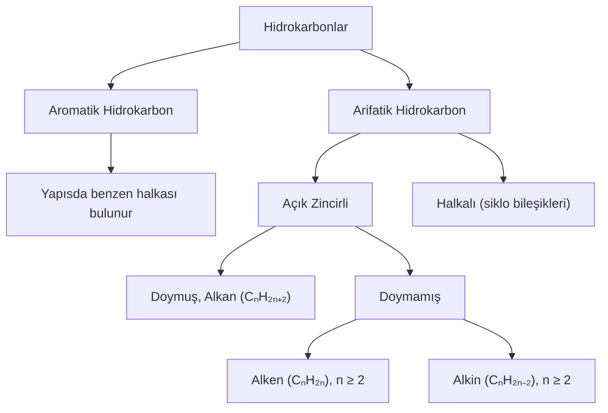

# Organik Bileşikler

# Hidrokarbonlar
Formüllerinde sadece hidrojen ve karbon içeren bileşiklerdir.

## Alkanlar
1. Parafinler olarak da adlandırılır.
2. Doymuş hidrokarbonlardır.
3. Genel formülleri: CₙH₂ₙ₊₂
4. C atomları arasında tekli bağ bulunup tüm C atomları sp³ hibritleşmesi yapmıştır.

### Alkanlarda Sınıflandırma
1. Alkanlar düz zincirli ve halkalı yapıda olabilir.
2. Düz zincirli alkanların genel formülü CₙH₂ₙ₊₂, halkalı yapıdaki alkanların genel formülü CₙH₂ₙ.

#### Düz Zincirli Alkanlar
İlk dört üyesinin kendine özgü adları vardır. 5 karbonlu alkandan itibaren karbon sayılarına karşılık gelen Latince sayının sonuna "an" eki getirilerek adlandırılır.

| sayı | Latincesi | bileşik | adlandırması |
|--|--|--|--|
| 1 | mono | CH₄ | metan |
| 2 | di | C₂H₆ | etan |
| 3 | tri | C₃H₈ | propan |
| 4 | tetra | C₄H₁₀ | bütan |
| 5 | penta | C₅H₁₂ | pentan |
| 6 | hekza | C₆H₁₄ | hekzan |
| 7 | hepta | C₇H₁₆ | heptan |
| 8 | okta | C₈H₁₈ | oktan |
| 9 | nona | C₉H₂₀ | nona |
| 9 | deka | C₁₀H₂₂ | dekan |

Her bir üyesi kendisinden sonara gelen üyeden sabit bir miktar farkı olan (─CH₂) ardışık serilere "homolog seri" denir.\
Alkanlardan 1 H atomu çıkarılması ile oluşan bağ yapmaya elverişli gruplara *radikal* veya *aktif*  denir. Aklanın adındaki "an" eki çıkarılıp yerine "il" eki getirilerek adlandırılır.

| alkan | alkin | adlandırması |
|--|--|--|
| CH₄ | ─CH₃ | metil |
| C₂H₆ | ─C₂H₅ | propil |
| C₅H₁₂ | ─C₅H₁₁ | pentil |

Alkil grubuna bir halojen (7A) bağlanması ile oluşan bileşiklere "alkil halojenür" denir.

| halojen | alkin | bileşik | adlandırması |
|--|--|--|--|
| Cl | ─CH₃ | CH₃Cl | metil klorür |
| Br | ─C₂H₅ | C₂H₅Br | propil bromür |
| Cl | ─C₅H₁₁ | C₅H₁₁Cl | pentil klorür |

#### Halkalı Zincirli Alkanlar
1. Siklo alkanlar olarak da adlandırıl. 
2. En küçük üyesi 3 karbonludur.
3. Genel formülleri CₙH₂ₙdir. 
4. Toplam karbon sayısına karşılık gelen alkanın adına "siklo" eki getirilerek adlandırılır.

 

### Alkanlarda Adlandırma
#### 1. Sistematik (IUPAC) Adlandırma
- En uzun C zinciri seçilir.
- Zincirdeki C atomlarına numara verilir. Bunun için dallanmanın en yakın olduğu uçtan başlayarak numara verilmelidir.
  - Dallar eşit uzaklıkta ise ve varsa 2. dallara bakılır. 2. dal olan taraftan başlayarak numara verilmelidir.
  - Bunlar da eşit uzaklıkta ise alfabetik sıra esas alınır.
- Dalın bağlı olduğu karbonun numarası, dal adı yazılır. Aynı dal birden fazla C atomuna bağlı ise numaraları belirtilip toplam sayıları Latince belirtilir.
- Adlandırma sonunda en uzun en uzun C zincirinde karşılık gelen alkan adı yazılır.
