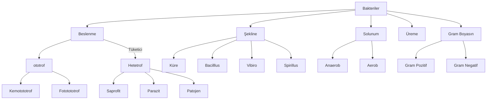

# Canlı Âlemleri ve Özellikleri

## 1. Bakteri
1. Prokaryot yepılıdır.
2. Genellikle küre (coccus), çubuk (bacillus), virgül (vibro) ya da sipiral (sprillus).
3. Hücre duvarı peptidoglikan yapıdadır. Duvar bakteriye şekil verir.
4. Bazı bakterilerde kapsül bununur. Kapsül daha çok hastalık yapan baterilerde bulunur.
5. DNA sitoplazmada  bulunur.
6. Tek organeli ribozomdur.
7. DNA histon molekküllerine sarılmamıştır. Buna çıplak DNA denir.
8. Haploit (n) kromozomludur.
9. Oksijenli solunum, oksijensiz solunum veya fermantasyon yapan türleri bulunur.
10. Bazı bakteriler aktif hareket edebilmelerini sağlayan kamçıya sahiptir, bazılarıysa pasif haraket eder.
11. Bazı bakteriler uygun koşullarda **endospor** oluşturabilir. Endospor, uygun olmayan koşullarda bakterilerin su kaybederek sitoplazmaları ile kalıtım materyallerinin bir yerde toplanmasını ve etrafının kalın bir zarla çevrilmesi ile meydana gelir.\
Antibiyotiklerde hapların bir kısmı bakteriyi öldürmek içindir, geri kalanıysa uyanacak endosporları öldürmek içindir. Mesela Augmentin'in ilk beş hapı bakterileri öldürur, son beş hapıysa uyanacak endosporları öldürür.
12. **Plazmit** adı verilen halkasal DNA bulunur.

### Bakterilerde Üreme
Bölünerek üreme ve konjugasyonla üreme olarak iki şekildedir.\
Konjugasyonla üremede plazmit DNA aktarılır.\
Bakterilerde hücre iskeleti vardır.

## 2. Arkeler
1. Ekstrem koşullarda yaşar.
2. Metan oluşturan tek canlı türüdür.

## 3. Protistler
1. Tek hücrelilikten çolk hücreliğe geçişte ara formdur. Koloni biçiminde yaşar.
2. Belirgin çekirdek ve zarlı organelleri bulunur.
3. Öglena, Tyrpanosoma, amip, plazmodyum, paramesyum, algler ve cıvık mantarlar örnekleridir.
4. Sil (paramesyum), kamçı (öglena) ve yalancı ayak (amip) bulundurabilir.
5. Tatlı su ve tuzlu su formları vardır. Kontraktif koful, tatlı su protistlerinde bulunur.\
Denizel amiplaer insande çıban oluşturabilir. Besinlerle alınan bazı amipler amipli dizanteri yapabilir.
