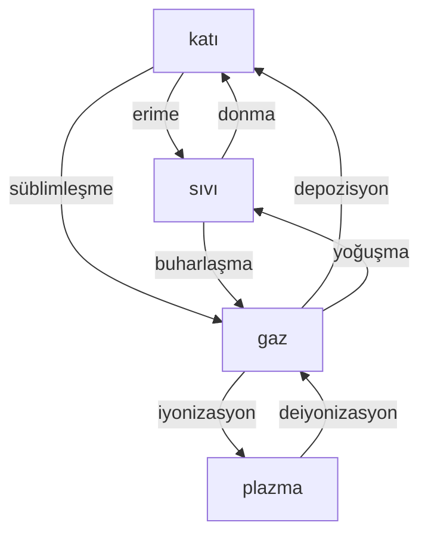

Madde doğada katı, sıvı, gaz ve plazma olmak üzere dört hâlde bulunur.

|katı|sıvı|gaz|plazma|
|-|-|-|-|
|Tanecikleri arasında boşluk yok denecek kadar azdır.|Tanecikler arasında boşluk katılardan fazla gazlardan azdır.|Tanecikler arası mesafe oldukça fazla.|Tanecikler arası boşluk katı ve sıvılardan fazla.|
|Su, antimon ve bizmut hariç maddenin en yoğun hâlidir. Yoğunluğu çok fazla.|Yoğunluğu fazla.|Yoğunluğu çok az.|Yoğunluğu az.|
|En düzenli haldir.|Düzenli değildir.|Maddenin en düzensiz hâlidir.|Maddenin enerjisi en yüksek hâlidir.|
|Sadece titreşim hareketi yapabilir.|Titreşim, öteleme ve dönme hareketi yapabilir.|Titreşim, öteleme ve dönme hareketi yapabilir.||
|Belirli hacimleri ve şekilleri vardır.|Belirli hacmi vardır ancak belirli şekli yoktur.|Belirli hacmi ve şekli yoktur.|Belirli hacmi ve şekli yoktur.|
|Sıkıştırılamaz|Sıkıştırılamaz|Sıkıştırılabilir|Sıkıştırılabilir|
|Akışkan değildir|Akışkandır|Akışkandır|Akışkandır|

# Suyun Farklı Hâllerde Bulunmasının Önemi
## Hâl Değişiminin Endüstri Açısından Önemi
**LPG - Sıvılaştırılmış Petrol Gazı**\
Gaz hâlindeyken: 200L -> Sıvılaştırılınca: 1L\
%70 bütan %30 propan\
Diğer yakıtlara göre çevrecidir. Sera gazı salınımı düşüktür.

**LNG - Sıvılaştırılmış Doğal Gaz**\
Gaz hâlindeyken: 600L -> Sıvılaştırılınca: 1L\
%90 metan; geri kalan kısmında propan, bütan gibi gazlar\
Sıvılaştırırken içinde bulunan bir safsızlık katılaştırılır. Böylece LNG daha çevreci bir yakıta dönüşür.

**İtici Gazlar**\
Aeresol formunda hazırlanmış olan boya, ilaç, deodorant gibi ürünlerin çelik tüpten dışarı taşınmasını sağlayan gazdır.

**Soğutucu Akışkanlar**\

