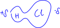
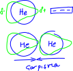
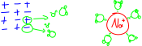

# Kimyasal Türler Arasında Oluşabilecek Etkileşimler
çekme kuvveti > itme kuvveti ⇒  güçlü etkileşim (kimyasal bağ)\
çekme kuvveti ≌ itme kuvveti ⇒  zayıf etkileşim (fiziksel bağ)\
çekme kuvveti < itme kuvveti ⇒  etkileşim oluşmaz


# Kimyasal Türler Arası Etkileşimler

1. Güçlü Etkileşimler (Kimyasal Bağ)
_Molekül içinde_ atomlar arasında oluşan etkileşimlerdir.

    ⅰ İyonik Bağ\
    ⅱ Kovalent Bağ\
    ⅲ Metalik Bağ


2. Zayıf Etkileşimler (Fiziksel Bağ)
_Moleküller arasında_ ya da _soygaz atomları arasında_ oluşan etkileşimlerdir.
**Not:** Sadece maddenin yoğun fazlarında (katı, sıvı) gözlenebilir.

    ⅰ Dipol - Dipol\
    ⅱ İyon - Dipol\
    ⅲ İndüklenmiş Dipol - Dipol\
    ⅳ İndüklenmiş Dipol - İyon\
    ⅴ İndüklenmiş Dipol - İndüklenmiş Dipol (London)


*örnek*\ 
ⅰ Etil alkol moleküllerinde etil alkol molekülleri arasında oluşan etkileşim\
ⅱ Bütün moleküllerde, o molekülü oluşturan atomlar arasındaki etkileşim\
ⅲ Maddenin katı fazında o maddeyi oluşturan moleküller arasındaki etkileşim\
Yukarıdaki etkileşim türlerinden hangileri zayıf etkileşim örneğidir?\
    ⅰ ve ⅲ


# Güçlü Etkileşimler

## 1. İyonik Bağ
Elektron alışverişi sonucu oluşan zıt yüklü iyonların birbirini elektrostatik çekim kuvvetiyle çekmesi sonucu oluşan bağa *iyonik bağ* denir.\
`katyon (+) (-) anyon`

*NaCl bileşiğinin oluşumu ve lewis yapısı:*\


### İyonik Bileşiklerin Özellikleri
1. Her iyonik bileşiğin *kendine özgü bir kristal örgü yapısı* vardır. Bu kristal örgü yapısı + yüklü iyonun etrafını belirli sayıda - yüklü iyon sarması ve - yüklü iyonun etrafıni belirli sayıda + yüklü iyonun sarmasıyla oluşur.
```js
-+-+-+-
+-+-+-+
-+-+-+-
+-+-+-+
```
2. İyonik bileşiklerde serbest molekül kavramı yoktur. Kristal örgü yapısı içerisinde düzenli olarak tekrar eden en küçük birime *birim hücre* denir. İyonik bileşikleri birim hücreler temsil eder.
3. İyonik bileşiklerin erime noktaları yüksektir. Oda koşullarında tüm iyonik bileşikler katı halde bulunur.
4. Sert ama kırılgan yapıya sahiptir.
5. İyonik yapılı bileşikler su gibi polar çözücülerde iyon dipol etkileşimi oluşturarak çözünürler.
6. Katı halde elektrik akımını iletmez. Eritilerek sıvı hale dönüştürüldüklerinde ya da suda çözündüklerinde elektriği iletir.

**Not:** Bileşiğin iyonik karakteri sorulursa bileşiği oluşturan elementler arası elektronegatiflik farkına bakılır.\
**Not:** İyonik bağın sağlamlığı önce iyonların yüküne sonra iyonlar arasındaki uzaklığa bakılır. 

|1+|2+|3+|4+|
|-|-|-|-|
|Cu⁺¹ Ⅰ|Cu²⁺ Ⅱ|Al|Pb⁴⁺ Ⅳ|
|Hg⁺¹ Ⅰ|Hg²⁺ Ⅱ|Fe³⁺ Ⅲ|Sn⁴⁺ Ⅳ|
|Ag|Zn|Cr³⁺ Ⅲ||
| |Fe²⁺ Ⅱ|||
| |Pb²⁺ Ⅱ|||

|1-|ismi|2-|ismi|3-|ismi|
|-|-|-|-|-|-|
|NH₄⁺|Amonyum|CO₂⁻²|Karbonat|PO₄⁻³|Fosfat|
|CH₃COO⁻|Asetat|SO₄⁻²|Sülfat|||
|ClO⁻|hipoklorit|MnO₄⁻²|Manganat|||
|ClO₂⁻|klorit|CrO₄⁻²|Kromat|||
|ClO₃⁻|klorat|Cr₂O₇⁻²|Dikromat|||
|ClO₄⁻|perklorat|||||
|MnO₄⁻|Permanganat|||||


### İyonik Bağlı Bileşiklerin Adlandırılması
|katyon|anyon|
|-|-|
|metal|ametal|
|metal|kök|
|kök|ametal|
|kök|kök|

Katyon Adı + Anyon Adı\
NaHSO₄ ⇒  Sodyum bisülfat\
(NH₄)₂S ⇒  Amonyum sülfür\
CH₃COONa ⇒  Sodyum asetat

**Not:** Katyon değişken değerlik alabilen bir metal ise (Fe, Cu, Pb, Hg, Cr, Sn, Mn) metalin değerliği mutlaka belirtilmelidir.\
Fe₃O₂ ⇒  Demir (II) oksit\
Cu₂S ⇒  Bakır (I) sülfür


## 2. Kovalent Bağ
Aynı ya da farklı ametal atomları arasında elektron ortaklaşması sonucu oluşan bağa kovalent bağ denir.\
Apolar: Aynı ametaller arasında\
Polar: Farklı ametaller arasında oluşur

**Not:** Bağın polarlığı sorulursa bağı oluşturan atomların polarlığına bakılır. Molekülün polarlığı sorulursa moleküle atomların dengeli bir şekilde dağılıp dağılmadığında bakılır.\
CH₂Cl₂ (düzgün dört yüzlü şeklinde) polar\
CCl₄ apolar\
CO₂ apolar

### Molekül Polarlığının Belirlenmesi
1. X₂ şeklindeki moleküller (O₂, H₂, Cl₂, I₂...) pollardır
2. XY şeklindeki moleküller (HCl, HBr, HF, NaF, NaCl...) polardır
3. XY₂, XY₃, XY₄ gibi çok atomlu moleküllerde merkez atom tüm değerlik elektronlarını bağ yapımında kullanılmışsa molekül genelde apolar (CO₂, CH₄, CCl₄, BF₃...), kullanmamışsa (NH₃, H₂O, S₂O...) polardır.

### Kovalent Bağlı Bileşiklerin Özellikleri
1. Kovalent bağlı bileşik ya da elementleri serbest *moleküller* temsil eder.
2. Erime kaynama noktası genelde düşüktür. Oda koşullarında katı, sıvı ve gaz örnekleri vardır. 
3. Moleküller arasındaki zayıf etkileşimler erime ve kaynama noktalarını belirler.\
P₄, S₈ ⇒  katı\
H₂O, Br₂ ⇒  sıvı\
H₂, N₂, F₂, Cl₂ ⇒  gaz
4. Kovalent bağlı maddelerin polar olanları asit veya baz değilse suda moleküler olarak çözünür.\
C₆H₁₂O₆ (katı) → C₆H₁₂O₆ (suda)
5. Suda çözündüğünde iyonlaşabilen (asit veya baz) türleri elektriği iletirken moleküler olarak çözünenler elektriği iletmez. 

### Kovalent Bağlı Bileşiklerin Adlandırılması
Latince sayılardan yararlanılır.\
|sayı|latincesi|
|-|-|
|1|mono|
|2|di|
|3|tri|
|4|tetra|
|5|penta|
|6|hekza|
|7|hepta|
|8|okta|
|9|nona|
|10|deka|

Ⅰ. ametalin Latince sayısı ve ismi + Ⅱ. ametalin latince sayısı ve ismi\
✓ Ⅰ. ametal pozitif değerlikli ametaldir\
✓ İlk ametal bir taneyse sayısı yazılmaz\
N₂O diazot monoksit\
NO azot monoksit\
NO₂ azot dioksit\
N₂O₃ diazot trioksit


## 3. Metalik Bağ
1. Metallerın değerlik elektron sayıları 1, 2 veya 3'tür.
2. Metalin itonlaşma enerjileri düşüktür.
3. Metallerin boş değerlik orbitalleri vardır ve değerlik elektronlarına uygulanan çekim kuvveti düşüktür. Bundan dolayı değerlik orbitallerinde gezintiye çıkarak elektronunu kaybetmiş bir katyon gibi davranmaya başlar. Değerlik elektronlarının oluşturduğu etrafında gezinen eletron denizindeki kendine ait olmayan elektronlara çekim kuvveti uygular.
4. Elektronunu kaybetmiş gibi davranan metal katyonunun elektron denizindeki elektronlara uyguladığı çekim kuvvetine metalik bağ denir.
5. Herhani bir metal atomunda ya da alaşımlarda gözlenir.


### Metalik Bağın Kazandırdığı Özellikler
1. Metalin yüzeyini parlak yapar.
2. Metallerin ısı ve elektriği iletmeleri.
3. Metallerin tel ve levha haline getirilebilmesi, işlenebilmesi.

**Not:** Metalik aktiflik ile metalik bağın sağlamlığı karıştırılmamalı.\
\
Metalik bağın sağlamlığı ↑ sertlik ↑ erime noktası ↑


# Zayıf Etkileşimler
**Dipol (Kalıcı Dipol):** Türkçesi iki kutuplu. Polar bir molekülün bir kutbunun sürekli kısmî pozitif (δ+) diğer katyonun kısmî negatif (δ-) olarak davranmasıdır.\


**İndüklenmiş Dipol (Geçici Dipol):** Polar ya da apolar moleküllere yüklü cisimler yaklaştırılması ya da moleküllerin çarpışması sonucunda kısa bir süreliğine molekülün bir kısmî pozitif diğer kısmı kısmî negatif olarak davranmasıdır. Apolar moleküller sadece indüklenmış dipol oluşturabilir.\
\
✓ Polar moleküller de indüklenebilir.\
✓ Soy gaz atomları sadece indüklenmiş dipol oluşturuabilir.\
✓ İndüklenmenin sebebi maddenin yapısında taşıdığı proton ve elektronlardır. Elektron veya proton sayısının artması indüklenebilme olasılığını artırır.

## Wan der Waals Bağları
### Dipol - Dipol Etkileşimleri
Polar moleküller (aynı veya farklı) arasında gözlemlenir. Moleküllerden birinin kısmî pozitif kısmı diğer molekülün kısmî negatif kutbuna yakınlaşarak ona çekim uygular.

### İyon - Dipol Etkileşimleri
İyonik bileşiklerde su gibi polar çözücülerde çözünmesi sırasında oluşan etkileşimdir. NaCl iyonik bileşiği suda çözünürken Na⁺ iyonu suyun kısmî negatif kutbu tarafından, Cl⁻ iyonu suyun kısmî pozitif tarafından çekilerek örgü yapısından dışarı çıkarılır ve daha sonra bu iyonların etrafı su molekülleri tarafından sarılır.\


### İndüklenmiş Dipol (London) Etkileşimleri
Tüm moleküllerl arasında oluşabilir fakat apolar moleküller ve soy gaz atomları arasında yalnız London kuvvetleri oluşur.
|7A grubu elementleri|toplam elektron sayısı|kaynama noktası ℃|
|-|-|-|
|F₂|18|-188|
|Cl₂|34|-34|
|Br₂|70|59|
|I₂|106|184|

Proton ve elektron sayısı, Mₐ ↑\
indüklenme olasılığı, London kuvveti, erime ve kaynama noktası ↑

Elektron sayısı eşit olan moleküllerde molekülün geometrik yapısına bakılır. Hacmi büyüdükçe indüklenme olasılığı artar. Dallanma arttıkça hacim alanı azalır.\
C₅H₁₂
```c
 CH₃ - CH₂ - CH₂ - CH₂ - CH₃
KN: 36,1 ℃


      CH₃
       |
 CH₃ - CH - CH₂ - CH₃
KN: 27,8 ℃

      CH₃
       |
 CH₃ - C - CH₃
       |
      CH₃
KN: 10 ℃

```

### Dipol - İndüklenmiş Dipol Etkileşimleri 
Polar molekül ile apolar molekül ya da soy gaz atomu arasında oluşan etkileşimlerdir.
