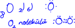

# Lewis Nokta Yapısı
Değerlik elektronlarının element sembolü etrafında noktalarla gösterilmesidir. Önce sembolün 4 tarafına birer elektron yazılır. Eğer 4'ten fazla elektron varsa bu elektronların yanına ikinci bir elektron yazılır.\

**Not:** Metaller kararlı katyonlarıni oluşturduğunda son katmanında elektron kalmaz, sadece sembol üzerine iyon yükü gelir.\
₁₂Mg  ₂) ₈) ₂) > Mg²⁺

Ametallerin kararlı iyon yapılarında son katmanında bulunan elektronlar gösterilir.\
\
**Not:** Elementlerin kararlı soygaz yapılarına benzemesine *oktet* veya *dublet kararlılığı* denir. 
