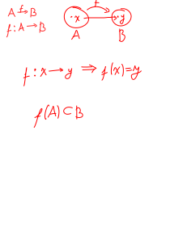
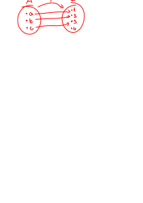

**Fonksiyon:** A ve B boş olmayan iki küme olmak üzere A'dan B'ye bir bağıntı tanımlansın. A'nın her bir x elemanını B'nın bir tek elemanına götüren bağıntılara A'dan B'ye fonksiyon denir.

## Fonksiyon Olma Şartları
1. A'da boş eleman kalmayacak
2. A'da iki eleman B'de bir eleman ile eşleşmeyecek

*örnek:* Aşağıdakilerden hangisi bir fonksiyon belirtir?
1. f: R → R     f(x) = √(x - 3)
2. f: N → N     f(x) = (x - 3)!
3. f: Z → N     f(x) = x + 3
4. f: R → R     |f(x)| = x
hiçbiri
