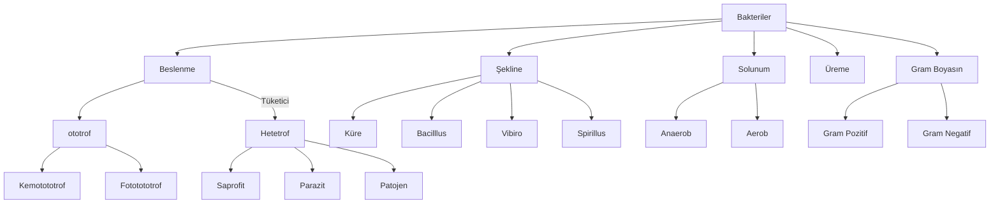
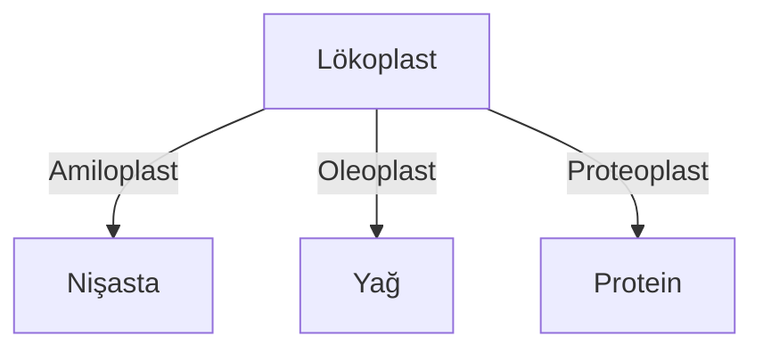
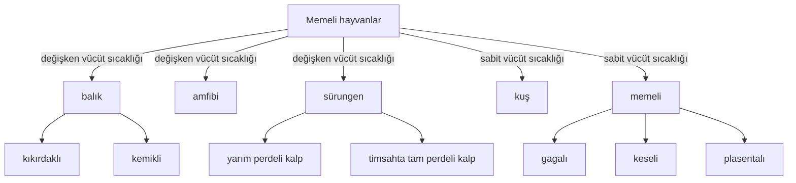

## 1. Bakteri
1. Prokaryot yapılıdır.
2. Genellikle küre (coccus), çubuk (bacillus), virgül (vibro) ya da sipiral (sprillus).
3. Hücre duvarı peptidoglikan yapıdadır. Duvar bakteriye şekil verir.
4. Bazı bakterilerde kapsül bulunur. Kapsül daha çok hastalık yapan baterilerde bulunur.
5. DNA sitoplazmada bulunur.
6. Tek organeli ribozomdur.
7. DNA histon moleküllerine sarılmamıştır. Buna çıplak DNA denir.
8. Haploit (n) kromozomludur.
9. Oksijenli solunum, oksijensiz solunum veya fermantasyon yapan türleri bulunur.
10. Bazı bakteriler aktif hareket edebilmelerini sağlayan kamçıya sahiptir, bazılarıysa pasif hareket eder.
11. Bazı bakteriler uygun koşullarda *endospor* oluşturabilir. Endospor, uygun olmayan koşullarda bakterilerin su kaybederek sitoplazmaları ile kalıtım materyallerinin bir yerde toplanmasını ve etrafının kalın bir zarla çevrilmesi ile meydana gelir.\
Antibiyotiklerde hapların bir kısmı bakteriyi öldürmek içindir, geri kalanıysa uyanacak endosporları öldürmek içindir. Mesela Augmentin'in ilk beş hapı bakterileri öldürür, son beş hapıysa uyanacak endosporları öldürür.
12. *Plazmit* adı verilen halkasal DNA bulunur.

### Bakterilerde Üreme
Bölünerek üreme ve konjugasyonla üreme olarak iki şekildedir.\
Konjugasyonla üremede plazmit DNA aktarılır.\
Bakterilerde hücre iskeleti vardır.

## 2. Arkeler
1. Ekstrem koşullarda yaşar.
2. Metan oluşturan tek canlı türüdür.
3. Çok sıcak ya da soğuk, yüksek ve düşük pH, aşırı tuzlu ortam gibi ortamlarda yaşayabilir aşırı tuzlu ortam gibi ortamlarda yaşayabilir aşırı tuzlu ortam gibi ortamlarda yaşayabilir.
4. Pseudoglikopeptidokglikan çeper bulundurur.

## 3. Protistler
1. Tek hücrelilikten çok hücreliliğe geçişte ara formdur. Koloni biçiminde yaşar.
2. Belirgin çekirdek ve zarlı organelleri bulunur.
3. Öglena, Tyrpanosoma, amip, plazmodyum, paramesyum, algler ve cıvık mantarlar örnekleridir.
4. Sil (paramesyum), kamçı (öglena) ve yalancı ayak (amip) bulundurabilir.
5. Tatlı su ve tuzlu su formları vardır. Kontraktif koful, tatlı su protistlerinde bulunur.\
Denizel amiplaer insanda çıban oluşturabilir. Besinlerle alınan bazı amipler amipli dizanteri yapabilir.

## 4. Bitkiler
1. Bağlı yaşam sürer.
2. Bitkilerin her hücresinde lökoplast bulunur.

Lökoplastta tüm organik bileşikler depolanır.
| |Nişasta|Yağ|Protein|
|-|-|-|-|
|ceviz|az|bol|bol|
|fındık|az|bol|bol|
|ıspanak|bol|az|bol|
|buğday|bol|az|az|
* Selüloz bitki hücrelerinde hidroliz edilemez.
3. CO₂ ve H₂O kullanarak organik besin sentezleyen ototrof canlılardır.
4. Klorofil pigmenti ışığı soğurur.
5. Selüloz duvar bulundurur.
6. Yaprak, meyve, çiçek, gövde, kök ve madde taşınımını sağlayan iletim demetlerini bulundurabilir.
7. Bitkiler suyu osmoz, mineralleri aktif taşıma ile alır. Bitkinin kök hücreleri de oksijenli solunum yapar.\
Bitkiye çok su dökülürse, sel olursa vs. su topraktaki O₂nin yerine geçer; kökler oksijensiz kalır. Bitki boğularak ölür, buna fizyolojik kuraklık denir.
8. Eşeyli veya eşeysiz üreme görülür.\
Kök, gövde ve yapraklar ile eşeysiz; çiçek, meyve ve tohum ile de eşeyli ürer.\
Hayvandaki kök hücrelerin eşdeğeri farklılaşmamış hücreler bitki organlarında da bulunabilir. Bu kök hücreler sayesinde bitki eşeysiz üreyebilir.
9. Genelde yaprakların alt yüzeyinde gaz alışverişini sağlayan açılıp kapanabilen *stoma* yapıları bulunur.
10. Aktif yer değiştirme gözlenmez. Yönelim (uyara bağlı) ve ılganım (uyarana bağlı değil) hareketleri gözlenir.
Laktoz bitkilerde yoktur. Sadece memeli hayvanların dışı bireylerinin süt bezlerinde bulunur. Ancak galaktoz kloroplast iç zarında vardır.
11. Çoğu kara bitkisinin kimi organlarının üzerinde kütikula adı verilen mumsu ve suda çözünmeyen bir tabaka bulunur. Bu tabaka su kaybını engellemeye yöneliktir. 

## 5. Mantarlar
1. Genellikle çok hücreli ototrof beslenemeyen canlılardır.
2. Üremeleri eşeyli ve eşeysiz üremenin birbirini takip ettiği metagenez şekildedir.
3. Ayrıştırıcı (saprofit) beslenirler.
4. Depo polisakkariti glikojendir, kitin yapılı hücre çeperi vardır.
5. Penisillum adlı mantar (küf) penisilin adlı antibiyotiği oluşturur.
6. Bazı mantarlar alglerle *liken* adı verilen yaşama birliğini oluşturur. Bu nitelik karşılıklı faydaya (mutualizm) yöneliktir.
7. Bitki köklerinde yerleşen bazı mantarlar bitkinin topraktan su ve fosfat gibi maddeleri almasını kolaylaştırırken (emilim yüzeyini genişletir) bitki de mantara organik besin sağlar. Bu birliğe *mikoliza* denir.
8. Azot içeren kitin, yapısal polisakkaritidir. Kitin, bütün mantarlarda bulunan çeper ham maddesidir.

## 6. Hayvanlar
1. En fazla çeşitliliğe sahip gruptur.
2. Tümü hetetroftur.

### a. Omurgasız Havanlar
1. Hayvanlar âleminin en geniş kısmını oluşturur.
2. Omurgaya (sırt sinir şeridine) sahip değildir.
3. Omurgasız hayvanların eklem bacaklılarında ve bunlardan gelişmiş olanlarında karın sinir şeridi vardır. 

#### Süngerler
1. Hayvanlar âleminin en basit canlısıdır.
2. Sistem gelişimi görülmez.

#### Sölenterler
1. İlk defa basit sinir sisteminin görüldüğü guruptur.
2. Tomurcuklanarak ya da metagenezle üreyebilir.

#### Solcanlar
1. Eşeyli ya da eşeysiz üreyebilir.
2. Genellikle yassı ve yuvarlak vücut yapısına sahip canlılardır.
3. Parazit yaşayan türleri vardır.
4. Planerya, tenya, kıl kurdu, toprak solucanı, kancalı kurt ve sülük bazı solucan türleridir.
5. Basitten karmaşığa doğru solucan türleri: yassı (tenya, planerya), yuvarlak (bağırsak solucanı), halkalı.

#### Yumuşakçalar
1. İkinci en büyük omurgasız hayvan grubudur.
2. Eşeyli ürer.
3. Ayaklarla aktif hareket görülür.
4. Genellikle açık kan dolaşımı görülür.

#### Eklem Bacaklılar
1. Karasal hayata uyum sağlamayla en geniş bölgelere yayılmış gruptur.
2. Dayanıklı dış iskelete sahiptir.
3. Açık dolaşım sistemine sahiptir. Trake solunumu yapar. 
4. Örümceklerinde kitapsı akciğer, denizlerde yaşayanlarında solungaç bulunur.

#### Derisi Diklenliler
1. Denizyıldızları, denizhıyarı, denizkestanesi

### b. Omurgalı Hayvanlar
1. Hemoglobin olarak adlandırılan solunum pigmenti bulunur.
2. Kıkırdak veya kemikten yapılmış bir iç iskelet ve bir sinir kordonu bulundurur.

#### Balıklar
1. Genellikle dış döllenme ve dış gelişme görülür.
2. Vücutları pullarla kaplıdır.
3. Boşaltım atıkları amonyaktır. NH₃ta su kaybı en çok, enerji kaybı en az olan azotlu atık maddesidir.

##### Kıkırdaklı Balıklar
1. **Kemiğe sahip olmayan tek omurgalı hayvan grubudur.**
2. Hava keseleri bulunmaz. Sürekli yüzmek zorundadırlar.
3. Köpek balıkları ve vatozlar 

##### Kemikli Balıklar
1. Hamsi, lüfer, çipura, alabalık, pirana, denizatı ve turna örnektir.

#### Amfibiler
1. Karasal hayata tam uyum sağlamıştır.
2. Akciğer ve deri solunumu yapar.
3. Embriyonik gelişimlerini tamamlamadan larva olarak yumurtadan çıkar. 
4. Değişken vücut sıcaklığına sahiptir.
5. Eşeyli ürer. Dış gelişme ve dış döllenme nedeniyle hayatlarında en az bir kez suya dönmek zorundadır.
6. Kış uykusuna yatar.
7. Amfibik solunum yaparlar. Hayatlarının farklı dönemlerinde farklı solunum türleri yapar.

#### Sürüngenler
1. Karasal yaşama uyum sağlayan ilk omurgalı türüdür.
2. Bazıları karada bazıları suda yaşar.
3. Akciğer solunumu yapar. 
4. Yumurtalarında kabuk bulunur.
5. Keratinli pullar bulunur. Pullu deri büyümeyi engellediğinden zaman zaman değiştirilir.
6. Yavru bakımı yoktur.
7. İç döllenme dış gelişme görülür. Bazı yılanlarda iç gelişme görülebilir.

#### Kuşlar
1. Kemik iliği yoktur. Kemiklerin içi boştur.
2. İç döllenme dış gelişim gösterir. Yavru bakımı vardır.
3. Akciğer solunumu yapar.
4. Dişleri bulunmaz. Ayaklarında pullar vardır.
5. Tane ile beslenenlerde taşlık; et ile beslenenlerdeyse mide ve bağırsak gelişir ve gaga özelleşir, keskin ve koparıcıdır.
6. Vücut sıcakları sabittir.
7. Ürik asit boşaltır, su içmez, yağ depo eder ve yağ yakarak oluşan suyu kullanır.
8. Vücut yüzeyleri keratin tüylerle kaplıdır.
9. Zarsı diyafram vardır.

#### Memeliler
1. Sucul memeliler dışında vücut yüzeyi kıllarla kaplıdır.
2. Yavrularını sütle besler. Sucul memeliler deniz suyuna sütlerini sağar, yavruları o sütü içer.
3. Ter, yağ, süt bezleri gibi salgı bezleri bulunur.
4. Memeliler dışında bütün omurgalılarda alyuvar çekirdeklidir.
5. Memelilerde göğüs kemikleri kaynaşmamıştır, kuşlardaysa göğüs kemiği kaynaşmıştır. Bu yüzden kuşlarda nefes alma memelilerde olduğunun aksine dışarıdan belli olmaz.
6. Çizgili kas yapıda diyafram vardır.
7. Vücut sıcaklıkları sabittir. İç döllenme iç gelişim görülür.
8. Gagalı memeliler kabuklu yumurtlar.

# Virüsler
1. Canlılar ile cansızlar arasında geçiş formudur. Tümü hastalık yapıcıdır.
2. Çok küçüktür. Porselen filtrelerden geçebilir. İşın mikroskobuyla görülemez, elektron mikroskobuyla anca görülebilir.
3. Tek çeşit nükleik asit bulundurur.
4. DNA Virüsleri: Çiçek, uçuk, bekteriyofaj\
RNA Virüsleri: Coronavirus, tütün mozaik, AIDS, çocuk felci, kuduz
5. Rus bilgin İvanovski tarafından tütün yapraklarında keşfedilmiştir.
6. Metabolik faaliyetleri ve enerji üretimi için gerekli olan enzimleri yoktur. Bu nedenle zorunlu parazittir, çoğalmak için canlı hücreye ihtiyaç duyar.
7. Kalıtım materyalleri dışında protein kılıf bulundurur. Bazılarında ise kılıfın üst kısmında glikolipit ve glikoproteinden meydana gelmiş zarf adı verilen ikinci kılıf bulunur.
8. Genetik çeşitlilik sadece mutasyonla oluşur.
9. Her virüsün hedef hücre veya doku vardır.
10. Konak hücre dışındayken kristalize hâldedir. Konağı 100 yıldan uzun süre kristalize halde bekleyebilir. Hiçbir canlı hücre kristalize hâlden tekrar yaşama döndürülemez.
11. Bakteriyofajlar kuyruklarıyla bakterinin reseptör bölgesine tutunur.\
Fajın kuyruğunda bulunan enzimler bakteri duvarının bir kısmını çözer. Böylece virüse ait nükleik asit bakterinin içine enjekte olur. Protein kılıf hücre dışında kalır.
12. Konağın ATP sentez mekanizmasını kendi hesabına kullanır.
13. Bakteriyofaj, hücreyi virüs üretim fabrikasına dönüştürür. Bakterinin içinde virüsün ürediği evreye litik evre denir. En sonunda virüs bakteriyi parçalar, buna lizis denir.
14. Bitki virüsleri genellikle DNA virüsü, hayvan virüsleriyse genellikle RNA virüsüdür.
