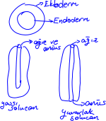
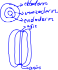

# Canlıların Sınıflandırılması
Taksonomi bilim dalının uğraş alanıdır.\
Dünya'da yaklaşık 250 milyon tür olduğu düşünülmektedir.

## Canlıların Sınıflandırılmasında Ölçütler
Canlıları sınıflandırma girişiminde bulunan ilk insan Aristodur. Aristo 2400 yıl önce yaşamıştır. Aristo canlıları yüzeysel özelliklerine göre sınıflandırmıştır.\
John Ray tür kavramını kullanan ilk bilim insanıdır. Linnaeus tür kavramını geliştirip biyolojiye kazandırmıştır, binominal adlandırmayı geliştirmiştir.
```
binominal adlandırma:
felis domesticus
----- ----------
    |          |
    |          tanımlayıcı ad
    cins adı

Ülkemizde 5 farklı çam türu vardır
pinus nigra        kara çam
pinus pinea        fıstık çam
pinus halepensis   halep çam
pinus brutia       kızıl çam
pinus sylvestris   sarı çam
----- ----------
    |          |
    |          tanımlayıcı ad
    cins adı
```

### Yapay Sınıflandırma
Aristo zamanında yapılan sınıflandırma. Canlıları dış görünüşlerine göre sınıflandırır. Bilimsel bir kıymeti yoktur. Analog (görevdeş) organlar dikkate alınarak yapılmıştır.\
Anolog organlar: sineğin kanadı, yarasanın kanadı

### Doğal Sınıflandırma \[Filogenetik (Akrabalık) Sınıflandırma\]
Canlıları anotomik ve evrimsel özelliklerine göre sınıflandırır. Bilimsel bir sınıflandırmadır. Homolog (kökendeş) organlar dikkate alınır.\
Homolog organlar: insanın kolu, balinanın yüzgeci

Sınıflandırmada temel unsur *türdür*. Ortak bir atadan gelen, çiftleştiklerinde verimli döl verebilen canlılar aynı türdendir.

Canlıların sınıflandırılmasında kullanılan basamaklar:\
Alem\
Şube\
Sınıf\
Takım\
Aile\
Cins\
Tür

Bilimsel sınıflandırma yapılırken canlıların\
⒈  hücre tipi (prokaryot, ökaryot),\
⒉  hücre sayısı (tek, çok),\
⒊  anotomik yapıları,\
⒋  protein benserliği (akrabalık),\
⒌  üreme yöntemler,\
⒍  kan ve doku benzerlikleri,\
⒎  embriyonik gelişim benzerliği,\
⒏  fizyolojik benzerlikler ve\
⒐  homolog organlar\
dikkate alınırken  
⒈  analog organlar,\
⒉  kromozom sayıları ve\
⒊  yaşadıkları ortam\
dikkate alınmaz


### Memeli Hayvanların Sindirim Fizyolojisi ve Anatomisi
```
@otçul {
    Ağız (
        Koparıcı dudak
        Azı dişleri
        Kesici dişler
        İşlevsiz köpek dişleri
        Dil
    )
    Yutak
    Yemek borusu

    @geviş_getimeyenler {
        Mide
        İnce bağırsak (10m)
        Kör bağırsak
        Kalın bağırsak (45m)
    }
    
    @geviş_getirenler {
```

```
        İnce bağırsak (35m)
        Kör bağırsak
        Kalın bağırsak (45m)
    }

    Anüs
}


@etçil {
    Ağız
    Yutak
    Yemek borusu
    Mide
    İnce bağırsak (7,5m)
    Kalın bağırsak (1,5m)
    anüs
}


@omnivor (hem etçil hem otçul) {
    etçillere benzer
}
```

### Embriyonik Gelişim Benzerliği ve Embriyonik Tabaka Sayısı
#### İki Tabakalı


#### Üç Tabakalı

