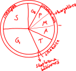

# Hücre Bölünmeleri

## Amiyoz
1. Mitoz olmayan mitoz.
2. İğ iplikleri yok.
3. Kromozom oluşmaz.
4. DNA çoğalır, hücre bölünür.

## Endomitoz
1. Mitozun aynısıdır.
2. Çekirdek bölünür.
3. Sitoplazma bölünmez.
4. Çok çekirdekli hücreler oluşur.
5. Çizgili kaslarda olmaz. Polen, haraciğer ve kemik hücrelerinde endomitoz gerçekleşir.

## Mitoz
1. DNA eşlenir, çekirdek ve sitoplazma bölünür.

## Mayoz
1. Gamet oluşur.
2. Krossing over, çesitlilik görülür.
3. Oluşturduğu varyasyonlarla (varyete) evrime yardımcı olur.

# Hücre Döngüsü
 
