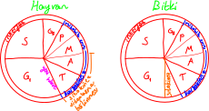

# Hücre Bölünmeleri

## Amitoz
1. Mitoz olmayan mitoz.
2. İğ iplikleri yok.
3. Kromozom oluşmaz.
4. DNA çoğalır, hücre bölünür.

## Endomitoz
1. Mitozun aynısıdır.
2. Çekirdek bölünür.
3. Sitoplazma bölünmez.
4. Çok çekirdekli hücreler oluşur.
5. Çizgili kaslarda olmaz. Polen, haraciğer ve kemik hücrelerinde endomitoz gerçekleşir.

## Mitoz
1. DNA eşlenir, çekirdek ve sitoplazma bölünür.

## Mayoz
1. Gamet oluşur.
2. Krossing over ve çesitlilik görülür.
3. Oluşturduğu varyasyonlarla (varyete) evrime yardımcı olur.
4. Üreme organlarındaki eşey ana hücrelerinde görülür.
5. Üreme ana hücreleri iki kromozomludur. Üreme ana hücrelerinde homolog kromozomlar bir arada bulunur.
6. Biri anneden biri babadan gelen şekil ve büyüklükleri aynı olan, karşılıklı lotuslarında aynı karakter genini taşıyan, kromozomlara homolog kromozomlar denir.
7. 2n kromozomlu ana hücreden n kromozomlu dört hücre oluşur.

# Hücre Döngüsü
 

*2024 yks* Bölünme sonucunda oluşan iki hücrenin\
Ⅰ genleri,\
Ⅱ DNA miktarı ve\
Ⅲ organel çeşidi\
birbirinin aynıdır;
Ⅰ hacmi ve\
Ⅱ organellerin sayısı\
farklı olabilir.

## İnterfaz
1. İki bölünme arasında geçen evredir.
2. Hücre büyür, organel sayısı artar.
3. Hücre çekirdeği hücrenin hacmini kontrol etmede yetersiz kalır.
4. Hücre bölünmesinin hızlı olduğu embriyo hücrelerinde G₁ evresi görülmez. S evresiyle DNA eşlenir ve G₂ evresiyle hücre büyür.

### Mitotik Evre 
1. n, 2n, 3n veya daha fazlası kromozomlu hücrelerde mitoz gerçekleşebilir.
2. Tek hücrelilerde üremeyi, çok hücrelilerde büyümeyi sağlar.
3. Genel olarak vücut hücrelerinde görülür.
4. Bölünme sonucunda kromozom sayısı değişmez.
5. İnterfaz ve mitotik evre tamamlandığında oluşan hücreler tekrar bölünebilir. Bazı hücrelerse farlılaşarak bölünme yeteneğini kaybeder.

#### Karyokinez (Sitoplazma Bölünmesi)
##### Profaz
1. Sonuna doğru çekirdek çözünmeye başlar.
2. Kromozomlar meydana gelir.
3. İğ iplikleri oluşur.
4. Çekirdek zarı ve ER çözünür.
5. İğ iplikleri kinetekorlara bağlanır.

##### Metafaz
1. Kromozomlar ekvator düzlemine dizilir.
2. Özdeş çift hâlinde olan kromozomların görüntülenmesine karyotip denir. Bu evrede kromozomlar net gözlenebilir.

##### Anafaz
1. Hücre boğumlanmaya başlar.
2. Kardeş kromotitler birbirinden ayrılarak kromozom adı alır.

##### Telofaz
1. Çekirdek zarı oluşmaya başlar.
2. Hayvan hücresinde sitokinezle eş zamanlı devam eder.
3. Çekirdek bölünme öncesindeki yapıları oluşturmaya başlar.

#### Sitokinez
1. Sitoplazma bölünmesi demektir.
2. Hayvan hücrelerinde anafazdan itibaren karyokinezle eş zamanlı olur.
3. Bitki hücrelerinde telofazdan sonra ayrı bir evre olarak gerçekleşir.

##### Bitki Hücrelerinde Sitokinez
1. Golgi cisimciği pektin isimli poisakkarit içeren kesecikler salgılar.
2. Pektinler motor proteinlerle hücrenin ortasına taşınır.
3. Hücrenin ortasında dizilmiş pektinler birleşerek hücreleri zarla ayırır.
4. Zarın oluşumundan sonra bitki zarında bulunan selülaz sentaz selüloz sentezleyerek hücre çeperini oluşturur.

## Hücre Döngüsünün Kontrolü
1. G₁, S, G₂ ve metafazda kontrol gerçekleşir.
2. Hücre döngüsünü kontrol eden proteinler *siklin* ve hücre döngüsü proteinleridir.
3. İnterfaz evresinde meydana gelebilecek mutasyonları engelleyen genlerde meydana gelen mutasyonlar kansere sebep olur.

# Eşeysiz Üreme
1. Oğul döller kalıtsal özellik bakımından hem birbiriyle hem de ata canlıyla aynıdır.
2. Var olan özellikler korunur.
3. Bireyler arası farklılık yalnız mutasyon ile gerçekleşir.
4. Birey sayısı hızlı artar.

## 1. Bölünerek Üreme
1. Hücre bölünmesiyle çoğalmadır.
2. Yeterli büyüklüğe ulaşan tek hücreli canlılar bölünür.

## 2. Tomurcuklanma
1. Ana bireyim mitozla oluşan çıkıntı gelişip yeni birey oluşturur.
2. Hidralar, mercanlar ve maya mantarlarında görülebilir.
3. Oluşan canlı ana canlıyla bir arada kalıp koloni oluşturabilir ya da ondan ayrılabilir.
4. Ana canlıdan ayrılıp yere bağlı yaşayan hidralara polip (T. bağlı yaşayan), yerden ayrı yaşayanlara medüz (T. serbest) denir.\
*2024 yks* Medüz tomurcuklanmaya üreyemez, rejenerasyon veya eşeyli üremeyle ürer.

## 3. Vejetatif Üreme
1. Yüksek yapılı bitkilerin sürgün, kök, yumru, gövde veya yaprak gibi büyüme bölgelerinden uygun koşullarda yeni bireylerin oluşması vejetatif üremedir.
2. Vejetasyon bitkilerin karadaki dağılımını inceleyen bilim dalıdır.
3. vejetatif: bitkisel
4. Bitkilerin vücudunda farklı farklı yerlerde embriyonik dönem özelliklerini kaybetmemiş (farklılaşmamış) hücreler bulunur. Bu hücreler farklılaşarak bitkilere ait çeşitli organları oluşturabilir. Bu hücreler kök hücrelere benzer. Bu hücreler yardımıyla üremeye vejetatif üreme denir.
5. Bu üreme tohum yapma yeteneği olmayan ya da tohum yapma yeteneğini kaybetmiş bitkilerde görülür.
6. Evrim her zaman basitten komplekse doğru işlese de bazen geri yönde de işleyebilir. Günümüz parazitlerinin ataları serbest yaşayan organizmalardır. Bu organizmaların sindirim enzimi sentez yetenekleri geri evrim mekanizmasıyla kaybolmuş ve bu organizmalar başka organizmaların sindirim kanalına bağlı yaşar hâle gelmiştir. Muz, kavak, söğüt gibi bitkiler geri evrim mekanizması sonucu tohum üretme yeteneklerini kaybetmiş ve vejetatif yoldan üreyebilir hâle gelmişlerdir.

Vejetatif Üreme Yöntemleri
1. Çelikle: Ağaç dallarından alınan gövdelerin nemli toprakta ya da özel bileşimli suda köklendirilmesi ile yeni bitki geliştirilmesidir. Muz
2. Sürünücü gövde ile: Çilek
3. Yumru ile: Patates
4. Soğan ile: Zambak, lale, yemeklik soğan
5. Rizom ile: Rizom toprak altı gövde. Ayrık otu
6. Daldırma ile: Dalın birini toprağa daldırıp oradan yeni bitki üretme. Nar
7. Aşılama ile: Kiraz, kayısı, vişne
8. Doku kültürü yöntemiyle ile: Bitkiden alınan bir hücreyle yeni bir bitki oluşması sağlanır. Nesli tükenmekte olan bitkiler bu yöntemle kurtarılabilir.

## 4. Sporla Üreme
1. Spor adı verilen özelleşmiş hücrelerle üremedir.
2. Üstleri sağlam yapılarla kaplanır. Bu spor uygun koşullarda yeni canlıyı oluşturur.
3. Metagenezle bir arada görülür.\
*Metagenez*: 2n kromozomlu sporlar oluşur. Bu ardışık mitozlarla bölünüp yeni canlıları oluşturur. Oluşan yeni canlılar n kromozomlu kamçılı gametler oluşturur, kamçılı gametler de döllenip yeni canlıları oluşturur.
4. Bazı mantarlarda, kara yosunlarında, bazı tek hücrelilerde görülebilir.

## 5. Rejenerasyon
1. Çok hücreli canlılarda değişik nedenlerle zarar görmüş yapıların onarılmasıdır.
2. Doku, organ veya vücut düzeyinde görülebilir.
3. Canlılarda 

| vücut düzeyinde | organ düzeyinde | doku düzeyinde |
|--|--|--|
| toprak solucanı yassı solucan yuvarlak solucan deniz yıldızı | kertenkele deniz yıldızı | insan

## 6. Partenogenez
1. Omurgalı hayvanlarda görülen partenogeneze deneysel partenogenez denir.
2. Arılar, karıncalar, yaprak bitleri ve su bitlerinde görülür.
 
