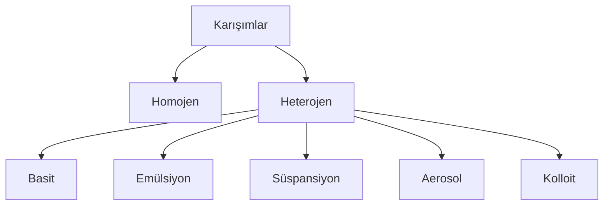

# Karışımlar
Farklı tür taneciklerin kimyasal reaksiyon olmaksızın rastgele oranlarda bir araya gelerek oluşturduğu madde topluluğudur.

## Karışımların Özellikleri
1. Homojen ya da heterojen olabilir.
2. Tek fazlı ya da çok fazlı olabilir.
3. Bileşenleri arasında belirli bir oran yoktur.
4. Bileşenleri kendi özelliklerini kaybetmez.
5. Fiziksel yöntemlerle daha basit maddelere ayrıştırılabilir.
6. Yoğunluk, erime ve kaynama noktası değerleri bileşenlerin karışımdaki oranına göre değişebilir.
7. Sembol ya da formülle gösterilmez.

**Bileşen**: Karışımı oluşturan maddelere denir.\
**Faz**: Renk, yoğunluk, iletkenlik, pH, fiziksel hâl gibi maddeye ait tüm özelliklerin aynı olduğu bölgelere denir.

| Dağılan tanecik boyutu | |
|--|--|
| <1nm | Çözelti |
| 1nm< <1000nm | Kolloit |
| 100nm< | Süspansiyon |

Çözeltiler üzerine düşürülen ışın demetini saçmaz. Kolloit ve süspansiyonlar üzerine düşürülen ışın demetini saçar.

## Homojen Karışımlar
1. Çözelti olarak adlandırılır.
2. Her yerde aynı özellik gösteren tek fazlı karışımlardır.
3. İki farklı maddenin birbiri içerisinde homojen olarak dağılmasına **çözünme** denir.
4. Çözelti, çözücü ve çözünen olmak üzere iki temel bileşenden oluşur.
5. Miktarı fazla olan madde genelde çözücüdür. Çözeltilerin fiziksel hâlini genelde çözücü belirler. Su miktarı az da olsa çözücü olarak kabul edilir.
6. Çözeltinin çözüneni çıplak gözle gözlenmez.
7. Çözeltilerde çözünen madde boyutu bir nanometreden (10⁻⁹ metre) küçüktür.
8. Doymamış çözeltilerde aynı şartlarda bekletildiğinde çökelme olmaz.

| Çözücü | Çözünen | Çözelti | Örnek |
|--|--|--|--|
| Sıvı | Katı Sıvı Gaz | Sıvı | Tuzlu su Kolonya, sirke Soda, gazoz |
| Katı | Katı Sıvı | Katı | Tunç, lehim Amalgam (Ag - Hg) |
| Gaz | Gaz | Gaz | Temiz hava, LPG, LNG |

## Heterojen Karışımlar
1. Her yerde aynı özellik göstermeyen, genelde çok fazlı karışımlara heterojen karışımlar denir. (Kolloitler tek fazlıdır.)
2. Bileşenlerinden miktarı fazla olana *dağıtıcı* ya da *dağıtan faz*, az olana *dağılan faz* denir.
3. Kolloitler dışında dağılan faz çıplak gözle gözlenebilir.
4. Katı faz içeren örnekleri bekletildiğinde çökelme gözlenebilir.
5. Dağılan tanecik boyutu 1nm'den daha büyüktür.

- **Adi (Basit) Karışım**
  - Katı - katı
  - Toprak, karışık kuru yemiş, meyve salatası, demir tozu - su
- **Emülsiyon Karışım**
  - Dağıtıcı fazı be dağılan fazı sıvı olan heterojen karışımlardır
- **Süspansiyon Karışım**
  - Dağıtıcı fazı sıvı, dağılan fazı katı olan heterojen karışımlardır.
  - Su - kum, su - odun talaşı, bazı şuruplar, Türk kahvesi, ayran, çorba, çorba
- **Aerosol Karışım**
  - Dağıtıcı fazı gaz, dağılan fazı katı ya da sıvı olan heterojen karışımlardır.
  - Tozlu hava, duman, deodorant, sprey boya, sprey ilaç, sis
- **Kolloit Karışım**
  - Çıplak gözle bakıldığında dağılan taneciklerin fark edilmediği tek fazlı gibi homojen gibi algılanan karışımlardır.
  - Çoğu aerosol ve emülsiyon aynı zamanda bir kolloit örneğidir.
