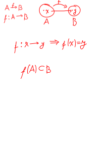

**Fonksiyon:** A ve B boş olmayan iki küme olmak üzere A'dan B'ye bir bağıntı tanımlansın. A'nın her bir x elemanını B'nın bir tek elemanına götüren bağıntılara A'dan B'ye fonksiyon denir.



## Fonksiyon Olma Şartları
1. A'da boş eleman kalmayacak
2. A'da iki eleman B'de bir eleman ile eşleşmeyecek


*örnek:* Aşağıdakilerden hangisi bir fonksiyon belirtir?
1. f: R → R     f(x) = √(x - 3)
2. f: N → N     f(x) = (x - 3)!
3. f: Z → N     f(x) = x + 3
4. f: R → R     |f(x)| = x
hiçbiri

## Fonksiyonlarda Dört İşlem
f: A → R, g: B → R\
A ∩ B ≠ ø olmak üzere\
ⅰ f + g: A ∩ B → R, (f + g)(x) = f(x) + g(x)\
ⅱ f - g: A ∩ B → R, (f - g)(x) = f(x) - g(x)\
ⅲ f × g: A ∩ B → R, (f + g)(x) = f(x) × g(x)\
ⅳ f / g: A ∩ B → R, (f + g)(x) = f(x) / g(x)\
ⅴ f: A → R, (c × f)(x) = c × f(x)\
ⅴ f: A → R, f²(x) = (f(x))²

## Fonksiyon Sayısı
s(A) = m ve s(B) = n olmak üzere\
A'dan B'ye tanımlanabilecek fonksiyon sayısı nᵐ


*örnek* A = {a₁, a₂, a₃, a₄}\
B = {b₁, b₂, b₃, b₄, b₅}\
A'dan B'ye tanımlanabilecek fonksiyon sayıları\
ⅰ f(a₁) = b₁ olmak üzere: 5³ = 125\
ⅱ f(a₁) ≠ b₁ olmak üzere: 4 × 5³ = 500\
ⅲ f(a₁) ≠ f(a₂) ≠ f(a₃) ≠ f(a₄) olmak üzere: 5!


*örnek* A = {0, 1, 2, 3, 4, 5, 6}\
∀ a ∈ A için a + f(a) ≤ 6, f: A → A\
Kaç f fonksiyonu tanımlanabilir?\
7!


*örnek* A = {0, 1, 2, 3, 4, 5}\
∀ a ∈ A için a - f(a) ∈ A, f: A → A\
Kaç f fonksiyonu tanımlanabilir?
```md
0 - f(0) ∈ A {0}
1 - f(1) ∈ A {0, 1}
2 - f(2) ∈ A {0, 1, 2}
...
5 - f(5) ∈ A {0, 1, 2, 3, 4, 5}
6!
```


*örnek* A = {-2, -1, 0, 1} ve B = {-1, 0, 1}\
∀ x ∈ A için x × f(x) ≤ 0, f: A → B\
Kaç f fonksiyonu tanımlanabilir?\
24


## Fonksiyonun Tanım Kümesi
**Polinom Fonksiyon:** ∈ N aₙ, aₙ₋₁ ... a₀\
f(x) = aₙxⁿ + aₙ₋₁xⁿ⁻¹ ... a₀

**Dercesi Çift Sayı Olan Köklü Fonksiyonlar:** g: A → B, g(x) = ²ⁿ√f(x), ∀ x ∈ A, f(x) ≥ 0

**Rasyonel fonksiyonlar:** Tanım kümesi R

**Sabit Fonksiyonlar:** f(x) = c


*örnek* f(x) = x / (x² + x + 1) fonksiyonunun tanım kümesi\
R


## Periyodik Fonksiyonlar
f: A → B fonksiyonunda ∀ x ∈ A, f(x + T) = f(x) olacak şekilde bir T ∈ R⁺ sayısı varsa T periyot, f periyodik fonksiyondur.


## Ters Fonksiyonlar
f: A → B fonksiyonu birebir ve örten olmak üzere\
f: A → B ve y = f(x) fonksiyonunun\
f⁻¹: A → B ve x = f⁻¹(y) şeklindeki gösterimine denir

