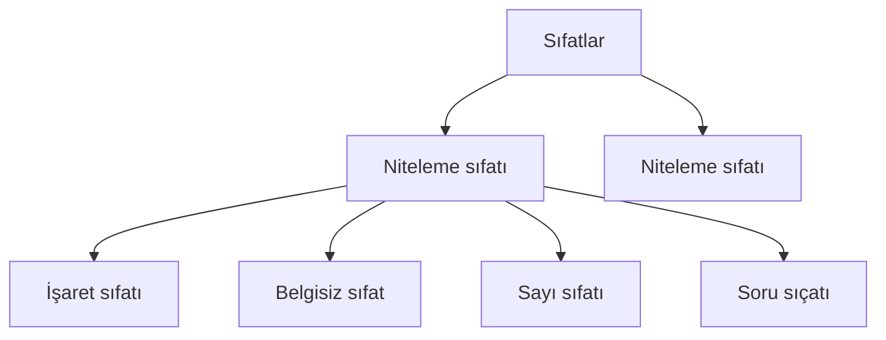

Tür ya da görev sorulursa isim, sıfat, zamir, zarf, edat, bağlaç, ünlem ya da fiil mi bakılır.\
Kelime kullanıldığı yere göre anlam ve görev kazanır.

Kökü sorulursa isim soylu mu, fiil soylu mu diye bakılır.\
Kelimenin kökünü at, köke bak; isim mi fiil mi diye değerlendir.

- Git, ara, bul, getir (bu kelimeler fiil)\
Saçlarını (isim) yol (fiil) getir (fiil)
- Biraz (sıfat) ara (isim) verdikten sonra (zarf)\
Gül (isim) saçtım (fiil) yollarına (isim)

## İsim / Ad
- Varlık ve kavramları karsılayan kelimelere denir.
- İsimler -ma / -me eki alamaz. Bu eki ancak fiiller alabilir.
  - Yemek *isim*, ye- *fiil*; çalışma *isim*, çalış- *fiil*

### Varlıklara Verilişlerine Göre İsimler
- *Cins isim (Tür ismi)*: insan, öğrenci, gezegen, şehir
- *Özel isim*: Mars, Ankara

### Maddelere Göre İsimler 
- *Somut*: masa, sıra, hava, Murat
- *Soyut*: aşk, neşe, dert, murat
  - Hava *soğuktu* (somut isim). × *Soğuk* (soyut sıfat) kanlı biriydi.

### Sayılarına Göre İsimler
- *Tekil*: (1) ağaç, asker, insan
- *Çoğu*: (≥2) ağaçlar, askerler, insanlar
- *Topluluk*: (tekil yapılı çoğul anlamlı) orman, tabur, aile

### İsimlerin Aldıkları Ekler
- *Çoğul Eki* (-ler / -lar)\
  - Ağaçlar: çoğul\
  - Acılar: abartma\
  - Türkler: yapım eki\
  - Yiğit Beyler: alay / saygı\
  - Ordular: topluluğun çoğulu
- *Hâl / Durum Eki* (-i, -e, -de, -den)
- *Tamlayan Eki* (İlgi Hâli) ve Tamlanan Eki (İyelik Eki)
  - çocuklar*ın* kitap*ları*\
  - çocuğ*un* kitaplar*ı*

### İsimlerin Yapıları
- *Basit İsim*: yol, yollardayım 
- *Türemiş İsim*: yolsuzluk, yollu, yolsuz
- *Birleşik İsim*: atasözü, zıpçıktı, gelgit, hacıyatmaz, cumartesi

## Zamir (Adıl)
- İsim olmadığı hâlde ismin yerini tutan kelimelerdir.
- Zamirler, isimlerin yaptığı bütün görevleri yapabilir; onların aldığı bütün ekleri alabilir.
  - Onu vurmuşlar: işaret
  - Neyi vurmuşlar: soru
  - Şeyi vurmuşlar: belgisiz
  - Şunu vurmuşlar: yakın, işaret
  - Birini vurmuşlar: çokluk, belgisiz

### 1. Kişi Zamiri
- Sadece kişiler için kullanılır.
- ben, sen, o, biz, siz, onlar
- "O" ve "onlar" insan için kullanılırsa kişi zamiridir. İnsan dışı kullanılırsa işaret zamiridir.

### 2. Dönüşlülük Zamiri
- Dönüşlülük ve pekiştirme anlamı katan *kendi* kelimesi dönüşlülük zamiridir.
- Bazı kaynaklarda dönüşlülük zamiri kişi zamiri olarak kabul edilir.
- Kendi kelimesi anlatım bozukluğuna yol açmaz.

### 3. İşaret Zamiri (Gösterme Adılı, İm Adılı)
- İsimlerin yerini göstererek tutan zamirlerdir.
- Şu, bu, o + ek; öteki, beriki, diğerleri...
- "O" ve "onlar" insan için kullanıldığında kişi zamiridir. Diğer durumlarda işaret zamiridir.
  - onu, bunlar, şura, şurada, şunun, o, onlar...
  - *Bunu* *sana* anlatmıştım. 
  - *Onu* (işaret zamiri) değil *diğerini* yedim.
  - *Onu* (kişi zamiri) ne kadar çekiştirdiysek çıkıp geldi.

### 4. Belgisiz Zamir
- İsmin yerini belgisizlik anlamıyla, yaklaşıklık anlamıyla tutan zamirlerdir.
- Bunlar tümünü ya da hiçbirini karşılasa bile net olmadığı için belgisizdir.
  - *Kimseye* güven olmuyor.
  - *Hepsini* sen mi yedin?
  - *Falanın* oğlu üniversiteyi kazanmış.
  - Soruların *çoğunu* çözemedim.
  - *Çoğu* gitti, *azı* kaldı.

### 5. Soru Zamiri
- İsimlerin yerini soru anlamıyla tutan zamirlerdir. 
- Kim, ne, nere, hangisi...
  - *Hangisine* güveneyim bunların?
  - *Kim* yolda kalana durmaz?
  - *Nerede* kaldı sizin insanlığınız?
  - *Kimin* kapısını çaldıysa kapılar kapandı yüzümüze.
  - *Ne* var cebinde?
  - *Kimin* *nesisin*?

### 6. Ek Hâlindeki Zamirler
#### a. İlgi Zamiri (-ki)
- İsim tamlamasında tamlananın yerini tutan ki'dir.
  - Kapının kolu > kapınınki
  - Çorbanın tuzu iyi fakat *mantınınki* eksik olmuş.

Üç türlü ki vardır:\
Ⅰ. bağlaç yapan ki (bağlayan ya da vurgulayan ki'dir),\
Ⅱ. sıfat yapan -ki (yer veya zaman bildiren kelimeleri sıfat yapan -ki'dir)\
Ⅲ. ilgi zamiri -ki.

#### b. İyelik Zamiri
- İsmin yerini tutan sahiplik ekidir.
- Evi*m* > benim evi*m*
  - Başarı*ları*nın sırrı nedir?
  - Hepinizin kısmet*i* açık olsun.
- **Uyarı**: Zamirden türemiş zamir olmayan kelimeler vardır.
  - *Benlik* (isim) algısı geliştirmiş.
  - *Bencillikten* (isim) kurtulmuş *onsuz* (zarf) yaşayamaz.

## Sıfat (Ön Ad)
- İsim ve zamiri niteleyen veya belirten kelimelerdir.
- İsmin anlamını çeşitli şekilde tamamlayan kelimelerdir.
- Sıfatlar tek başına kullanılmaz. Tek başına iken sıfat isim ya da zamir olur.
- Sıfatlar genelde yalın hâldedir. Ek alırsa isimleşir, zamirleşir.
- sıfat + (isim ya da zamir)

### 1. Niteleme Sıfatı
- Nasıl sorusunun cevabıdır.
- Renk, durum, biçim yönünden ismi ya da zamiri tamamlar.
  - *Güzel* manzaraya karşı oturduk, *soğuk* çay içiyoruz.
  - *Şişko*, *yağlı* ama *tatlı* bedenini sınıfa getir.
- Bir kelime birden çok niteleme sıfatı alabilir. Bir niteleme sıfatı birden çok ismi etkileyebilir.\
  - Ankara'nın *dar ve boğucu sokakları*... (İsmi niteleyen birden çok niteleme sıfatı var.)\
  - *Kimsesiz bedenime ve sokaklara* bir tek ben sahibim. (Sıfat birden çok ismi niteliyor.)
- Niteleme sıfatının nitelediği isim düşerse sıfat ismin görevini üslenerek adlaşır.
  - Zorları Nilsu'ya çözdürüyordu.
